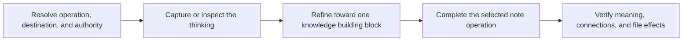

# PTLam Creating Atomic Notes

Turn an idea, source, or existing note into durable notes that each develop one
independently useful knowledge building block. This skill owns note meaning,
maturation, and connections. The user's knowledge system owns storage,
filenames, metadata, and link syntax.

## At a glance

| Operation | Result | Default file effect |
| --- | --- | --- |
| Create | One complete draft per independent building block | Return Markdown drafts |
| Mature | A work-in-progress note advanced to an explicit next stage | Return a Markdown draft |
| Review | A verdict with evidence and the smallest corrections | Read-only |
| Split | Self-contained drafts with distinct purposes and connections | Return Markdown drafts |
| Merge | One draft that preserves unique evidence, sources, and link context | Return a Markdown draft |

Change files only when the user explicitly requests it. Treat deletion,
archiving, redirects, and backlink rewrites as separate effects that need their
own authority.

## 1. Resolve the request and destination

Identify the requested operation, input, output, and note role. The input may be
an idea, source, quotation, highlight, rough capture, work in progress, or
existing note.

When the user supplies a vault, note directory, or target file, inspect only the
nearby notes and configuration needed to learn its conventions. Follow verified
local rules for filenames, frontmatter, headings, tags, links, and citations.
Keep authority over each destination and related file effect explicit.

Ask only when a missing choice would materially change the knowledge captured
or its destination. Otherwise make reversible presentation choices and
continue. Return Markdown in the response unless the user requested file
changes.

Complete this step when the operation, input, output, destination, local
conventions, and file authority are known.

## 2. Establish the note's role and maturity

Use the note's role to decide how durable and self-contained it should be:

| Role | Purpose | Treatment |
| --- | --- | --- |
| Fleeting capture | Preserve thinking before it disappears | Keep its provisional state and make continuation obvious. |
| Literature note | Record what a source contributes | Paraphrase faithfully and retain source context. |
| Permanent note | Add a reusable building block to the knowledge network | Make it independently understandable and meaningfully connected. |
| Structure note | Provide access to an area or a thinking canvas | Keep one navigational purpose rather than forcing one content atom. |

Unless the user requests another role, treat an atomic-note request as a draft
permanent note. “Permanent” means designed for durable reuse, not frozen or
finished forever. Accept unfinished notes in the knowledge system when their
state and next development path are clear; atomicity is a maturation direction,
not an admission test.

Complete this step when the note's role, maturity, and next state are explicit.

## 3. Refine toward one knowledge building block

Read [the atomicity model](references/atomicity-model.md) before evaluating or
rewriting content. It owns the definition of atomicity, the building-block
classification, the focus tests, maturation stages, and effort calibration.

For a new idea, capture the thought freely before editing it. For supplied
content, preserve the distinctions among the user's idea, source wording,
evidence, examples, and adjacent claims.

Apply the model in two passes:

1. Use the heuristic pass to expose unclear, incomplete, or mixed ideas.
2. Use the structural pass to identify the focal knowledge building block and
   decide which context belongs with it.

Keep a narrow focus with as much background as future understanding requires.

Preserve attribution separately from the paraphrased idea. Use an exact
quotation only when its wording matters, then mark it, attribute it, and explain
its relevance in fresh words.

Complete this step when the focal building block is identifiable, the retained
context serves it, the source status is clear, and the chosen effort matches the
idea's expected value.

## 4. Complete the selected operation

Read [note operations](references/note-operations.md) and follow only the
selected operation. That reference owns create, mature, review, split, and merge
actions, their fallback output shapes, and their completion criteria.

Search the available note collection before claiming that a linked target
exists. Use verified local link syntax only for verified targets. State why
every relationship matters. When no collection is available, use `Suggested
connections`, keep targets as plain titles, and do not imply that they are real
files.

Complete this step when the selected operation's result exists and every source,
connection, destination, and requested file effect has an explicit disposition.

## 5. Verify and hand off

Check every produced or revised note:

| Check | The note must |
| --- | --- |
| Focus | Have one focal knowledge building block, or one declared navigational purpose |
| Context | Carry the context that focus needs, and no independently useful adjacent block |
| Standalone | Make sense without the original chat or source |
| Attribution | Separate source claims, the user's interpretation, and established fact wherever that changes the meaning |
| Links | Explain why each link matters, and use verified local syntax |
| Honesty | Mark suggested connections apart from verified existing notes |
| Maturity | Expose its current state and next step while it remains unfinished |
| Conventions | Preserve local storage and metadata conventions |
| File effects | Account for every authorized file effect |

For a review, name each failed check and its evidence. For changed files,
report what changed, where, how it was checked, and what remains unresolved.

Complete the task when the output passes these criteria or the review identifies
each failure with a concrete correction.
