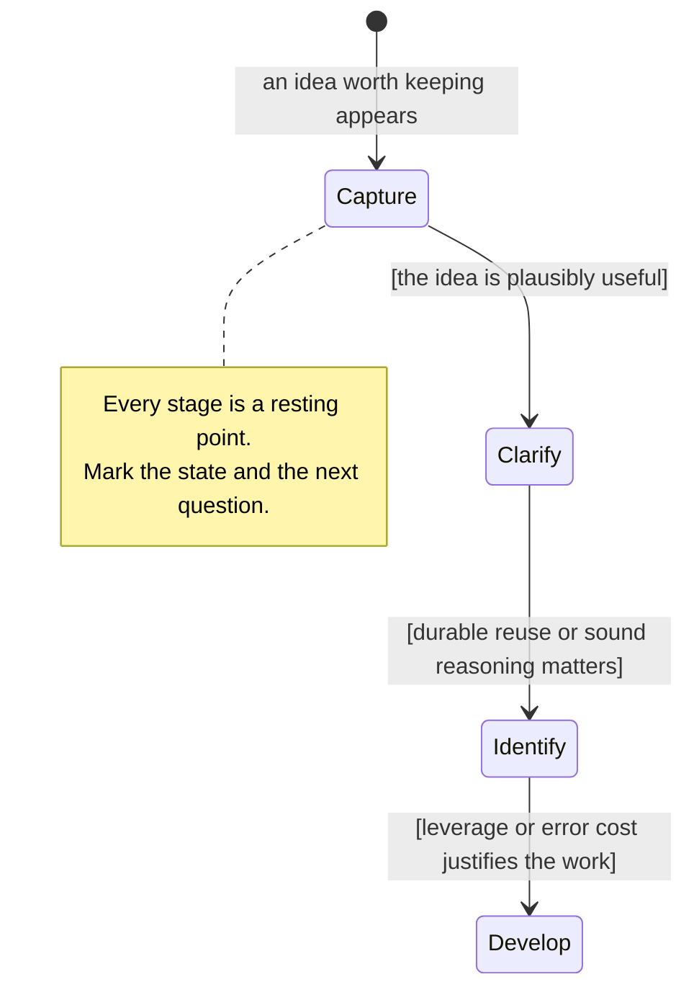

# Atomicity Model

This reference owns the definition of atomicity, the knowledge building blocks,
the tests that separate focus from background, the maturation stages, and the
rule for matching effort to expected value.

This model adapts Sascha's
[Complete Guide to Atomic Note-Taking](https://zettelkasten.de/atomicity/guide/),
retrieved on 2026-08-15. The source frames atomicity as a principle for thinking
rather than a rigid rule about note length. The link records attribution only;
the local model below is complete for this skill.

## Define the atom by function

Atomicity is a processing direction toward one independently addressable
knowledge building block per note. A building block is the complete unit that a
future reader would reuse, test, or connect for one reason.

Classify the focal building block before declaring a note atomic:

| Building block        | Identifying question                                                                                                                     |
| --------------------- | ---------------------------------------------------------------------------------------------------------------------------------------- |
| Concept               | Which part of the world does this define or distinguish?                                                                                 |
| Argument              | Which premises are meant to support which conclusion?                                                                                    |
| Counterargument       | Which inference or conclusion does this challenge, and how?                                                                              |
| Model                 | Which entities and part-to-part or part-to-whole relationships does this represent?                                                      |
| Hypothesis or theory  | Which claim about reality could evidence support or disconfirm, and does it belong to a connected explanatory and methodological system? |
| Empirical observation | What was observed, under which relevant conditions?                                                                                      |

Use this classification as an inspection tool, not as mandatory metadata. A
problem-and-solution pair, mechanism, comparison, or other coherent unit may
remain together when separating it would destroy the function a future reader
needs.

## Separate focus from background

Judge atomicity by focus, not word count. A note may need examples, definitions,
evidence, boundaries, or a description of related parts to make its focal
building block understandable. That material is background when readers would
not reuse it independently from the focus.

Use these tests together:

1. **Naming:** Can a precise declarative title or concept name the focus?
2. **Completeness:** Is every part needed for the building block present?
3. **Removal:** Can any passage disappear without weakening the focus?
4. **Independent reuse:** Would a reader link to one passage for a reason that
   does not depend on the focus?
5. **Forward motion:** Would a future reader know how to use or continue the
   idea?

A title containing `and` or `with` is only a warning. Keep a relational claim
together when the relationship is itself the building block. Split when two
parts pass the completeness and independent-reuse tests on their own.

## Refine in four stages

A note climbs this ladder only as far as its expected value carries it:

1. **Capture:** Write the thought freely enough to preserve it. Do not require
   atomicity before the thinking exists.
2. **Clarify:** Improve the title and content together. Add missing context,
   remove unrelated material, and write a one-sentence summary when it exposes
   the focus.
3. **Identify:** Classify the focal knowledge building block. Check its internal
   parts and their relationships instead of relying on brevity or intuition.
4. **Develop:** Add evidence, implications, perspectives, or connections when
   the idea warrants deeper treatment. Extract any independently useful building
   block revealed by this work as a new note starting at capture.

The stages describe maturation, not separate storage areas.

## Match effort to expected value

Choose the current stopping point from the best available evidence about:

- relevance to an active project or responsibility;
- expected reuse across future work;
- consequence of being wrong or incomplete;
- strength and availability of supporting evidence; and
- the user's interest in developing the idea.

Stop at the last stage whose guard the evidence supports, and preserve the
provisional status of anything captured cheaply. Revisit the choice when later
writing or new connections reveal more value.
