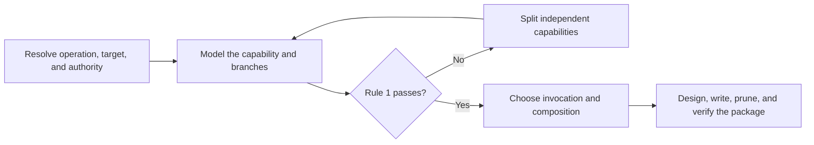

# PTLam Creating Skills

Create, review, or refactor one agent-skill package so its capability boundary,
normal workflow, composition contract, and acceptance state are clear to a
human maintainer and executable by a future agent.

## Rule 1: Make one skill one reusable capability

Treat a skill as an atomic capability building block: the smallest independently
useful behavior contract with one responsibility, lifecycle branches that serve
the same primary artifact and acceptance standard, and a complete path from
invocation to verified outcome.

Self-contained means complete under declared inputs and dependencies, not
dependency-free. Composable means another skill can reuse the capability through
an explicit invocation or dependency contract without copying its instructions.
Atomicity outranks package convenience, shared tooling, and topical similarity.

Read [skill atomicity and composition](references/skill-atomicity.md) when
defining or challenging the boundary. It owns the capability tests, keep-or-split
decisions, self-contained contract, and foundation-specialization composition
rules.

## At a glance

| Concern | Boundary |
| --- | --- |
| Atomicity | One skill owns one independently useful capability; lifecycle branches share its primary artifact and acceptance standard. |
| Operation | Review is read-only. Create and refactor may change the target package. |
| Audience | A maintainer reads the package before any agent runs it. A package only an agent can follow is not finished. |
| Authority | Target instructions and host schemas own mechanics; authored sources own generated surfaces. |
| Composition | A foundation owns its complete universal contract; a specialization owns only its independently useful delta. |
| File effect | Change only owned package files and required generated surfaces; preserve unrelated work. |
| Done | Rule 1, invocation, composition, reading order, and validation agree; the handoff names every remaining limit. |

## 1. Resolve the task and authority

1. Identify whether the user wants to create, change, or review a skill.
2. Resolve the target repository, skill root, and host from explicit context and
   filesystem evidence. The current directory and this skill's installation
   directory are not automatically the target.
3. Read the target's repository instructions, adjacent skills, host
   documentation, schemas, generators, and static validators.
4. Identify the authored sources, generated surfaces, supported resource
   directories, metadata owner, and permitted side effects. Preserve foreign and
   in-progress changes.

Complete this step when the operation, target, authority, authored surface,
metadata owner, and available static checks are unambiguous.

## 2. Prove the atomic capability

Extract available evidence before asking questions. Define the target's
capability contract:

- the single responsibility and independently useful outcome family;
- the primary artifact or decision it creates, changes, or evaluates;
- each branch's trigger, inputs, output, and side effects;
- the acceptance standard shared by all branches;
- the boundary against adjacent capabilities; and
- the declared dependencies that make the normal path complete.

Apply Rule 1 and the referenced atomicity tests. Keep create, review, repair, or
other lifecycle branches together only when they operate on the same primary
artifact and apply the same acceptance standard. Split a branch when another
consumer would invoke it independently for a different responsibility, outcome
family, or acceptance standard.

Use examples to discover the general contract, not as cases to optimize around.
Ask only when an undiscoverable answer would materially change compatibility,
scope, authority, or behavior.

When Rule 1 fails, produce a split map that names each proposed skill's
capability, trigger, output, boundary, and composition edge. Apply the rest of
this workflow to each authorized skill separately.

Complete this step when Rule 1 passes for one capability or an explicit split
map accounts for every independent capability without duplicated ownership.

## 3. Choose invocation and composition

Resolve the target's invocation and dependency mechanics instead of assuming one
host's fields. Where the target distinguishes them:

- choose model invocation when an agent or another skill must discover the
  capability autonomously, accepting its permanent description cost;
- choose user invocation when only the human should begin the capability,
  accepting the human discovery cost; and
- add a router only when routing is itself one independently useful capability
  and several user-invoked skills are genuinely difficult to remember.

When another skill will compose this capability, define the contract before
package design:

1. Keep this foundation independently invocable and complete for its own
   responsibility.
2. Let the consuming specialization own only domain- or host-specific behavior.
3. Declare execution order, inputs, outputs, authority, and conflict precedence
   through the host's verified dependency mechanism.
4. Keep each rule with one owner; reference or require it instead of copying it.

Complete this step when invocation, discoverability, every composition edge, and
every proposed router carry an explicit capability and context-cost rationale.

## 4. Design the package and reading order

Read [skill authoring best practices](references/skill-best-practices.md) before
reviewing, designing, or materially revising the package. It owns package
anatomy, naming, progressive disclosure, document craft, workflow structure,
resources, pruning, and the static quality checklist.

Produce the package tree and reading order before writing detailed instructions.
Scale the structure to the skill: add a directory, reference, or hierarchy rung
only when it removes real ambiguity for the reader. A file is an internal
resource, not another capability; promote independently invocable behavior to a
composed skill instead.

Complete this step when every content item has one owner and one hierarchy rung,
every disclosed file has a precise context pointer from `SKILL.md`, and a
maintainer can predict which file owns a rule from the tree and headings alone.

## 5. Write discovery metadata

Use a compact leading word already present in user prompts, the domain, or the
repository when it accurately anchors the capability. Write one trigger for each
distinct lifecycle branch. Collapse synonymous triggers that only rename the
same branch.

For model invocation, make the description a precise model-facing context
pointer. For user invocation, keep its human-facing summary compact. Add a reach
clause when another skill should compose this capability. Follow the resolved
target schema instead of generic examples.

When the target uses Claude-style inline YAML, read
[skill frontmatter specification](references/skill-frontmatter-spec.md). It owns
the field names, limits, and host mechanics. Do not apply that host-specific
schema when a manifest, generator, or another host owns metadata.

Complete this step when the target accepts the metadata and each description
phrase identifies one lifecycle branch, boundary, or composition reach rule.

## 6. Write the instructions

Shape `SKILL.md` and every prose reference with
[human-first document craft](references/skill-best-practices.md#human-first-document-craft).
It owns the reading order, visual choice, and sentence shape that keep a
first-time maintainer on the path, and it holds a reference to the same standard
as `SKILL.md`.

Read [prompting best practices](references/prompting-best-practices.md) when the
skill must steer non-trivial reasoning, tool use, output shape, long context, or
agentic behavior. Apply only the sections relevant to the target and branch.

Keep the entire normal path in `SKILL.md`. Put conditional mechanics behind
one-hop context pointers. Write the positive target behavior first. Use a
prohibition only for a hard guardrail that cannot be expressed positively, and
pair it with the permitted behavior.

Keep tests, evals, baselines, benchmarks, graders, comparison viewers, and
trigger optimization outside this skill's static authoring scope.

Complete this step when every branch can be followed without hidden context, no
step depends on a term or artifact introduced later, every action stays within
the resolved authority, and every ordered step ends in a checkable completion
criterion.

## 7. Prune the package

Apply the
[content-maintenance rules](references/skill-best-practices.md#content-maintenance)
after instructions and resources exist. Remove any adjacent capability bundled
for convenience and replace copied prerequisite behavior with an explicit
composition edge.

Complete this step when every retained line changes this capability's behavior,
defines a needed concept, routes context, or establishes a completion criterion.

## 8. Verify and hand off

1. Reapply Rule 1 to the finished package. Confirm that new detail did not hide
   a second independently useful capability or an undeclared prerequisite.
2. Inspect the final tree and diff for unintended or generated-file edits.
3. Apply the
   [static quality checklist](references/skill-best-practices.md#static-quality-checklist)
   to `SKILL.md` and every changed resource, including its human-readability
   read-back. Correct every violation.
4. Report what changed, where it changed, the exact checks and results,
   unavailable checks, generated effects, and remaining uncertainty. Do not
   claim unmeasured behavioral effectiveness.

Complete the task when the package is one atomic, self-contained, composable
capability; its authored and generated surfaces are current; a maintainer can
follow it on one pass; and the handoff accounts for every verification boundary.
