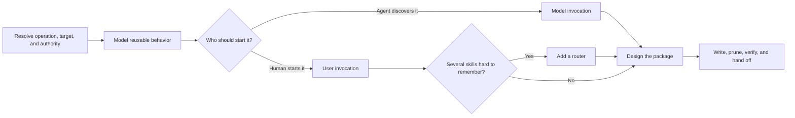

# PTLam Creating Skills

Create, review, or refactor a skill so a human maintainer understands the
package on one pass and a future agent follows one predictable, complete
workflow. Keep the normal path in `SKILL.md`, give each supporting resource one
owner, and disclose branch detail only when that branch needs it.

## At a glance

| Concern | Boundary |
| --- | --- |
| Operation | Review is read-only. Create and refactor may change the target package. |
| Audience | A maintainer reads the package before any agent runs it. A package only an agent can follow is not finished. |
| Authority | Target instructions and host schemas own mechanics; authored sources own generated surfaces. |
| File effect | Change only owned package files and required generated surfaces; preserve unrelated work. |
| Done | Invocation, boundaries, reading order, and validation agree; a maintainer can name the outcome and normal path from the headings alone; the handoff names any remaining limit. |

## 1. Resolve the task and authority

1. Identify whether the user wants to create, change, or review a skill.
2. Resolve the target repository, skill root, and host from explicit context and
   filesystem evidence. The current directory and this skill's installation
   directory are not automatically the target.
3. Read the target's repository instructions, adjacent skills, host
   documentation, schemas, generators, and static validators.
4. Identify the authored sources, generated surfaces, supported resource
   directories, metadata owner, and permitted side effects. Preserve foreign and
   in-progress changes.

Complete this step when the operation, target, authority, authored surface,
metadata owner, and available static checks are unambiguous.

## 2. Model the reusable behavior

Extract available evidence before asking questions. Define:

- the capability and observable outcome;
- each distinct invocation branch;
- the inputs, outputs, tools, dependencies, and side effects of each branch;
- the boundary against adjacent work; and
- the decisions a future agent should not need to rediscover.

Use examples to discover the general workflow, not as cases to optimize around.
Ask only when an undiscoverable answer would materially change compatibility,
scope, authority, or behavior.

Complete this step when every branch has one distinct trigger, one observable
outcome, and no unresolved material choice.

## 3. Choose invocation and skill boundaries

Resolve the target's invocation mechanics instead of assuming one host's
fields. Where the target distinguishes them:

- choose model invocation when the agent or another skill must discover the
  skill autonomously, accepting its permanent description cost;
- choose user invocation when only the human should start the workflow,
  accepting the human discovery cost; and
- add a router only when several user-invoked skills are genuinely difficult to
  remember.

Split a branch into another skill only when it needs independent invocation or
when later steps repeatedly cause premature completion. First make the current
stage's action and output explicit. Split by sequence only if that does not
solve the problem.

Complete this step when invocation, skill boundaries, and every proposed split
carry an explicit context-cost or completion rationale.

## 4. Design the package and reading order

Read [skill authoring best practices](references/skill-best-practices.md) before
reviewing, designing, or materially revising the package. Its contents table maps
each authoring decision to the section that owns it, from package anatomy and
naming through document craft, workflow design, resources, pruning, and the
static quality checklist.

Produce the package tree and reading order before writing detailed instructions.
Scale the structure to the skill: add a directory, reference, or hierarchy rung
only when it removes real ambiguity for the reader.

Complete this step when every content item has one owner and one hierarchy rung,
every disclosed file has a precise context pointer from `SKILL.md`, and a
maintainer can predict which file owns a rule from the tree and headings alone.

## 5. Write discovery metadata

Use a compact leading word already present in user prompts, the domain, or the
repository when it accurately anchors the skill. Write one trigger for each
distinct branch; collapse synonymous triggers that only rename the same branch.

For model invocation, make the description a precise model-facing context
pointer. For user invocation, keep its human-facing summary compact. Follow the
resolved target schema instead of generic examples.

When the target uses Claude-style inline YAML, read
[skill frontmatter specification](references/skill-frontmatter-spec.md). It owns
the field names, limits, and host mechanics. Do not apply that host-specific
schema when a manifest, generator, or another host owns metadata.

Complete this step when the target accepts the metadata and each description
phrase identifies a distinct branch or reach rule.

## 6. Write the instructions

Shape `SKILL.md` and every prose reference with
[human-first document craft](references/skill-best-practices.md#human-first-document-craft).
It owns the reading order, visual choice, and sentence shape that keep a
first-time maintainer on the path, and it holds a reference to the same standard
as `SKILL.md`.

Read [prompting best practices](references/prompting-best-practices.md) when the
skill must steer non-trivial reasoning, tool use, output shape, long context, or
agentic behavior. Apply only the sections relevant to the target and branch.

Write the positive target behavior first. Use a prohibition only for a hard
guardrail that cannot be expressed positively, and pair it with the permitted
behavior. Explain non-obvious reasons, calibrate specificity to risk, and use an
example only when direct prose leaves the desired behavior ambiguous.

Keep tests, evals, baselines, benchmarks, graders, comparison viewers, and
trigger optimization outside this skill's static authoring scope.

Complete this step when every branch can be followed without hidden context, no
step depends on a term or artifact introduced later, every action stays within
the resolved authority, and every ordered step ends in a checkable completion
criterion.

## 7. Prune the package

Apply the
[content-maintenance rules](references/skill-best-practices.md#content-maintenance)
after instructions and resources exist. They own the complete removal list for
both prose and prompts.

Complete this step when every retained line changes behavior, defines a needed
concept, routes context, or establishes a completion criterion.

## 8. Verify and hand off

1. Inspect the final tree and diff for unintended or generated-file edits.
2. Apply the
   [static quality checklist](references/skill-best-practices.md#static-quality-checklist)
   to `SKILL.md` and every changed resource, including its human-readability
   read-back. Correct every violation.
3. Report what changed, where it changed, the exact checks and results,
   unavailable checks, generated effects, and remaining uncertainty. Do not
   claim unmeasured behavioral effectiveness.

Complete the task when the authored package is structurally valid and readable
on one pass, generated outputs are current, foreign work remains preserved, and
the handoff accounts for every changed surface and verification boundary.
