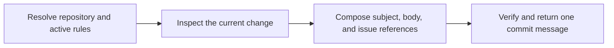

# PTLam Writing a Commit Message

Create or revise one repository commit message that describes the current
change and follows current user instructions, applicable `AGENTS.md` rules, and
the portable defaults bundled here. This skill changes no Git state.

## At a glance

## 1. Resolve the repository and active rules

Resolve one target repository from the user's paths and current worktree. Read
the current user instructions and every applicable `AGENTS.md` from the
repository root to the changed files. Treat these as the only sources of
repository-specific message preferences unless the user explicitly points to
another policy file.

Complete this step when one repository, the intended change scope, and every
applicable user or `AGENTS.md` rule are known.

## 2. Inspect the current change

Read the staged diff when present, otherwise the intended unstaged diff. Do not
infer the change from filenames alone or discover preferences from neighboring
commit history.

Identify the single outcome the commit delivers, its scope, whether a body is
needed, and any issue the change resolves or relates to.

Complete this step when the subject can name why the change exists and every
body or issue-reference need is supported by the actual change.

## 3. Compose and verify the message

Read [commit message preferences](references/commit-message-preferences.md). It
owns preference precedence and portable subject, body, and issue-reference
defaults.

Apply sources in this order: current user instructions, applicable `AGENTS.md`
rules, then portable defaults for unconstrained choices. Report a conflict
instead of silently choosing a lower-precedence preference.

Write one message for the inspected change. Keep one coherent outcome per
commit. Use a body only when it adds necessary rationale, impact, or issue
closure that the subject cannot carry.

Read the subject in isolation. Confirm that it names the outcome rather than
only implementation mechanics, satisfies the active length and style rules,
and agrees with the body and diff. Verify every issue reference against the
user's request or repository evidence.

Return the exact subject and body with real line breaks. State which user or
`AGENTS.md` rule changed the portable default and disclose anything not fully
verified.

Complete the task when one message accurately represents the current change and
passes every active user, `AGENTS.md`, and portable preference.
