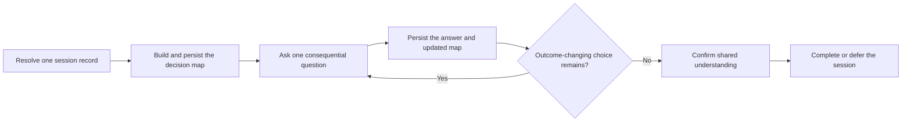

# PTLam Grilling

Stress-test a plan, decision, or idea through one consequential user-owned
choice at a time. The agent resolves discoverable facts and recommends an
answer; the user owns each outcome-changing decision.

Every session has one persisted record so another agent can resume from the
latest decision map without relying on chat history.

## At a glance



| Concern | Boundary |
| --- | --- |
| Decision | The agent recommends; the user owns every outcome-changing choice. |
| File effect | This invocation may write only the selected session record and its canonical directory. |
| Later action | Implementation, Git operations, and publication require separate authority. |
| Done | The user confirms the persisted decision map, or the record names each deferred choice and consequence. |

## Session record contract

Capture the task's initial workspace root and keep it fixed for the session. Do
not replace it with a discovered repository root or a later shell directory.
When the host exposes several workspace roots and ownership is ambiguous, ask
which root should contain the record.

Create new records at:

```text
<workspace-root>/.ptlam-agent-plugin/skills/productivity/ptlam-grilling/<YYYY-MM-DD>_<title>.md
```

Use the session's creation date and a short, filesystem-safe title that names
the decision. Prefer the base filename when it is available; otherwise append
the first free suffix before `.md`, such as `_2` or `_3`. Never overwrite or
truncate a record.

Invocation authorizes writes only to this session directory and the selected
record. Obtain separate authority before staging, committing, publishing, or
changing unrelated project files. The record stores conclusions and evidence,
not hidden reasoning, a turn transcript, secrets, credentials, or unrelated
personal data.

## 1. Resolve the session record

1. Inspect the canonical directory, candidate path, and same-topic records.
2. Resume one clear non-complete match unless the user asks to start fresh. If
   several records plausibly match, ask which one to continue.
3. Treat records under the earlier flat
   `.ptlam-agent-plugin/skills/ptlam-grilling/` directory, including its
   `sessions/` subdirectory, as resumable in place. Create new records only in
   the canonical categorized directory.
4. Read a resumed record completely. Recheck drift-prone evidence and continue
   from its next unresolved decision without repeating settled questions.
5. Read and follow the canonical
   [grilling session schema](references/grilling-session-schema.md) before the
   first write. It owns the record structure and status meanings.

Complete this step when the fixed workspace root, schema, one unique new or
resumable path, prior state, and write authority are known.

## 2. Build the decision map and write the checkpoint

1. State the intended outcome, known constraints, non-goals, and the artifact or
   action the discussion would eventually enable.
2. Inspect repository files, tools, prior decisions, and other available
   evidence. Do not ask the user to retrieve facts that can be checked safely.
3. Map prerequisites, downstream effects, assumptions, conflicts, resolved
   branches, and open user-owned decisions.
4. Separate consequential choices from reversible implementation mechanics.
   Choose and state a reasonable default for low-impact mechanics.
5. Create or update the session record with the current map. For a new session,
   write the initial checkpoint before asking the first substantive question.
   Tell the user the record path after the write succeeds.

If persistence fails, report the path and reason. Do not claim the session is
resumable.

Complete this step when the map contains the outcome, non-goals, constraints,
evidence, prerequisites, assumptions, conflicts, and known choices; the
highest-impact answerable decision is identifiable; and the persisted record
matches that state.

## 3. Interview one decision at a time

1. Select the highest-impact unresolved decision whose prerequisites are known.
2. Ask exactly one question. State why it matters now, the recommended answer
   and rationale, the strongest material alternative, and the main trade-off.
3. Wait for the user's answer before asking another question.
4. Record the answer, then update the map to show what it resolves, changes, or
   invalidates downstream.
5. Challenge contradictions with evidence. Reopen an earlier branch when a new
   answer makes it inconsistent.
6. Persist the checkpoint before yielding with the next substantive question.
7. Continue until every outcome-changing branch is resolved or explicitly
   deferred with an owner and consequence.

Use concrete scenarios and counterexamples when an abstract answer could hide
different interpretations. Recommend decisively, but never present the
recommendation as the user's decision.

Complete this step when no answerable outcome-changing decision remains and the
record reflects every resolved, invalidated, deferred, or open branch.

## 4. Keep the record current

Do not let the file lag behind a materially changed decision map. Update it:

- after a consequential answer or new evidence changes the map;
- before yielding with the next substantive question;
- before a summary or handoff; and
- when the session becomes confirmation-pending, deferred, blocked, or
  complete.

Keep it concise and understandable without chat history. Replace stale state
with current conclusions instead of appending a transcript.

Complete this step whenever the record's status, evidence, decisions, open
question, and resume instruction match the live session.

## 5. Confirm shared understanding

Summarize the outcome, non-goals, resolved decisions, accepted assumptions,
risks, deferred decisions, and next authorized action. Persist that summary,
ask whether it represents the shared understanding, and wait.

If the user corrects it, update the map and resume from the highest-impact open
decision. If the user asks to stop or act before confirmation, persist the
session as `deferred` and report the unresolved decisions and consequences. An
early action request is not confirmation. Treat later implementation as a
separate task with new authority.

Act on the result only after explicit confirmation. Complete the session when
every outcome-changing decision is resolved or explicitly deferred, the user
has confirmed the shared understanding, the confirmation is persisted, and the
status is `complete`.
