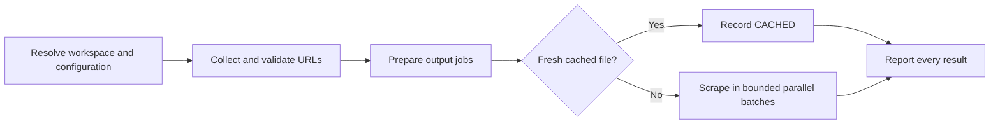

# PTLam Scraping URLs

Batch-scrape HTTP and HTTPS pages into local Markdown files. Accept URLs pasted
in the prompt, a text file containing URLs, or both. Preserve partial success:
one failed page never aborts the remaining queue.

Invocation authorizes creation of the workspace-local configuration, output
directory, and scraped Markdown files. It does not authorize Git operations,
publication, credential changes, or writes outside those resolved paths.

## At a glance



| Concern | Owner |
| --- | --- |
| Saved defaults | Workspace-local `CONFIG.yml` |
| One-run overrides | The current user prompt |
| Page retrieval | The best available scraper, then the host's web-fetch fallback |
| File creation | This invocation, limited to the resolved config and output paths |
| Done | Every supplied URL has a reported status and every successful file exists |

## Configuration contract

Fix the invocation's workspace root before resolving paths. Use the initial
workspace root rather than a nested repository discovered later. When the host
exposes several workspace roots and the user's intended root is unclear, ask
which root owns the run.

The canonical configuration path is:

```text
<workspace-root>/.ptlam-agent-plugin/skills/productivity/ptlam-scrapping-urls/CONFIG.yml
```

On the first invocation, create the parent directory and copy
[the default configuration](assets/CONFIG.yml) to that path. On later
invocations, preserve manual edits. Read the file on every run before resolving
the effective values.

| Key | Meaning | Valid value |
| --- | --- | --- |
| `OUTPUT_DIRECTORY` | Destination for scraped Markdown files | Non-empty absolute path, or path relative to the workspace root |
| `MAX_PARALLEL_TASKS` | Maximum simultaneous scrape jobs | Positive integer |
| `CACHE_TTL_HOURS` | Age below which an existing output is reused | Non-negative number; `0` disables reuse |

The prompt may override any or all keys with assignments, a YAML block, or an
unambiguous natural-language instruction. Resolve each key independently:

1. Use the prompt value when the user supplies one.
2. Otherwise, use the value read from `CONFIG.yml`.

Prompt overrides apply only to the current run. Change `CONFIG.yml` only when
the user explicitly asks to save new defaults. Report an invalid effective
value and stop before creating the output directory; never silently replace a
manually edited configuration.

For example, this prompt overrides every saved value:

```text
OUTPUT_DIRECTORY=docs/archive MAX_PARALLEL_TASKS=3 CACHE_TTL_HOURS=24
https://docs.example.com/start
https://docs.example.com/api
```

Complete configuration when the canonical file exists and all three effective
values are valid and attributable to either the prompt or the saved file.

## 1. Collect the URL inputs

Accept either input form without requiring positional arguments:

- **Prompt URLs:** Extract URLs the user clearly identifies as scrape inputs.
  Accept absolute `http://` and `https://` URLs in prose, lists, or Markdown
  links. Do not treat incidental citations in surrounding instructions as
  scrape inputs.
- **Input file:** Resolve the user-supplied path from the workspace root unless
  it is absolute. Read one candidate URL per line. Trim whitespace and ignore
  blank lines and lines whose first non-whitespace character is `#`.

When both forms are present, combine them in prompt-then-file order and remove
exact duplicates after trimming. Stop with the path and reason when an explicit
input file is missing, unreadable, or empty after filtering. Record malformed
or unsupported candidates as `SKIPPED`; do not turn them into guessed URLs.

Stop when no valid HTTP or HTTPS URL remains. Complete collection when every
candidate is either one normalized input URL or one recorded `SKIPPED` result.

## 2. Prepare the output jobs

Resolve a relative `OUTPUT_DIRECTORY` from the fixed workspace root. Create the
directory before starting any retrieval and stop with the filesystem error if
creation fails.

Derive the base filename for each valid URL:

1. Remove the `http://` or `https://` prefix.
2. Remove trailing slashes.
3. Replace `/`, `?`, `&`, `=`, `#`, and `:` with `-`.
4. Replace characters unsafe in a local filename with `-`.
5. Collapse repeated hyphens and append `.md`.

For example, `https://docs.example.com/api/auth` becomes
`docs.example.com-api-auth.md`. If different URLs produce the same filename,
append the first eight hexadecimal characters of that URL's SHA-256 digest
before `.md`. Keep the mapping stable across runs so cache checks address the
same file.

Complete preparation when the output directory exists and every valid URL maps
to one unique target path inside it.

## 3. Reuse fresh output

For each target file, inspect its modification time and size. On macOS, the
mtime command is `stat -f %m <file>`; on Linux, it is
`stat -c %Y <file>`. A file is fresh when its age is less than
`CACHE_TTL_HOURS` and its size is greater than zero.

Record fresh files as `CACHED` with their size and remove them from the scrape
queue. When `CACHE_TTL_HOURS` is `0`, queue every URL. Queue missing, empty,
expired, or unreadable files for retrieval.

Complete the cache check when every valid URL is either `CACHED` or queued once.

## 4. Scrape the queue

Process independent URLs concurrently without exceeding
`MAX_PARALLEL_TASKS`. When the host supports subagents, delegate one resolved
URL and target path per task, launch at most the configured number together,
and wait for that batch before launching the next. When subagents are
unavailable, run the same jobs with the host's available bounded concurrency or
sequentially.

Give each task this outcome and fallback order:

1. Retrieve the page with an available purpose-built page-to-Markdown scraper,
   such as Firecrawl's scrape operation with Markdown output.
2. If that tool is unavailable or fails, use the host's URL-fetch or web-open
   tool with this instruction:

   ```text
   Extract the full page content as Markdown. Preserve headings, paragraphs,
   code blocks, lists, tables, and document order. Return page content rather
   than a summary.
   ```

3. Treat access blocks, authentication requirements, empty results, and content
   that is only an error page as failures. Never invent missing page content.
4. Write a successful result to a temporary file beside the target, verify it
   is non-empty, then replace the target. This preserves an expired prior file
   when retrieval fails.
5. Return exactly one machine-readable result line:

   ```text
   OK|<url>|<filename>|<size_bytes>
   FAILED|<url>|-|-|<short_reason>
   ```

If a task fails, record it and continue through the remaining batches. Complete
retrieval when every queued URL has one `OK` or `FAILED` result and every `OK`
target exists with the reported non-zero size.

## 5. Report the run

Print one row for every supplied candidate in original order:

```markdown
| # | URL | Status | File | Size | Detail |
|---|-----|--------|------|------|--------|
```

Use `OK`, `FAILED`, `CACHED`, or `SKIPPED`. Put a concise failure or skip reason
in `Detail`; leave it empty for successful and cached rows. Then report totals
as: `X succeeded, Y failed, Z cached, W skipped, N supplied.`

Finish only after the table accounts for every candidate, the totals match its
rows, and each `OK` or `CACHED` path and size has been verified.
