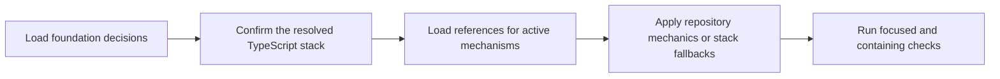

# PTLam Testing TypeScript

Apply `ptlam-testing` first, then use this specialization for framework-free,
browser-free TypeScript libraries, Node.js code, CLIs, and tooling built with
Vite, Vitest, and Vitest V8 coverage. The foundation owns behavioral testing;
this skill owns only stack mechanics left open by current repository evidence.

## Required skills

### `ptlam-testing`

**Reason:** Provides the universal testing workflow and mandatory rules.

**Instructions:** Read and apply ptlam-testing first.
Let it own mode, write authority, scope, level, public seam, behavior,
doubles, TDD, audit, diagnosis, and verification depth.
Consume the environment and toolchain decision carried by the
foundation; do not select replacement tools or versions here.
Use the repository's established test layout when one exists;
otherwise use this skill's source-adjacent fallback.
Apply it only to framework-free, browser-free TypeScript, Vite, Vitest,
and coverage mechanics left open by the foundation.

Read [ptlam-testing](skills/ptlam-testing/SKILL.md).

## At a glance

## 1. Start from the foundation decisions

1. Read the required `ptlam-testing` skill before applying configuration,
   placement, or test-code mechanics.
2. Follow it to resolve the project root, mode, write authority, and branch
   inputs. In a testing mode, also consume its behavior, public seam, primary
   level, test-double boundary, TDD activation, audit or diagnosis authority,
   and verification depth.
3. Preserve every foundation invariant. Let an established repository layout
   own placement; use this specialization's source-adjacent rule only when the
   repository and user leave placement open.

Complete this step when all applicable foundation decisions and
higher-precedence project mechanics are explicit, leaving only
TypeScript-stack choices unresolved.

## 2. Confirm the resolved TypeScript stack

1. Confirm the target is framework-free and browser-free TypeScript. For a web
   framework, DOM API, or browser runtime, return to the foundation and use a
   scope-specific specialization.
2. Inspect the package manifest, lockfile, package-manager declaration, Vite and
   Vitest configuration, TypeScript configuration, scripts, CI, and neighboring
   tests.
3. Consume the environment and toolchain decision resolved by the foundation's
   `ptlam-testing-resolving-environment` dependency when that branch ran. Confirm that the
   installed Vite, Vitest, TypeScript, runtime, and coverage versions match it.
   Return an absent or incompatible decision to that owner instead of selecting
   replacement tools or versions here.
4. Treat the installed Vitest version and matching official documentation as
   the syntax authority. Verify version-sensitive options against that version.
5. Read
   [TypeScript and Vitest stack](references/typescript-vitest-stack.md) whenever
   configuring, writing, running, auditing, or diagnosing Vitest tests. It owns
   stack defaults, placement fallback, API preferences, coverage rules, and
   proof commands.

Complete this step when the scope, package manager, runtime, resolved and
installed versions, configuration owner, Node environment, and applicable stack
preferences agree or one conflict has been returned to its decision owner.

## 3. Load references for active mechanisms

| Concern | Required Vitest references |
| --- | --- |
| Configuration, options, or scripts | [Configuration](references/vitest/core-config.md) and [CLI](references/vitest/core-cli.md) |
| Monorepos or several Node test groups | [Projects](references/vitest/advanced-projects.md) |
| Test and suite definitions | [Test API](references/vitest/core-test-api.md) and [describe API](references/vitest/core-describe.md) |
| Setup, teardown, or resource lifetime | [Lifecycle hooks](references/vitest/core-hooks.md) |
| Assertions, async expectations, custom matchers, or narrowing | [Expect API](references/vitest/core-expect.md) |
| Compile-time contracts | [Type testing](references/vitest/advanced-type-testing.md) |
| Mocks, spies, fake timers, module replacement, globals, or environment stubs | The foundation's test-double reference, then [mocking](references/vitest/features-mocking.md) and [`vi` utilities](references/vitest/advanced-vi.md) |
| Reusable fixtures or test context | [Test context and fixtures](references/vitest/features-context.md) |
| Worker pools, isolation, sharding, or concurrent tests | [Concurrency and parallelism](references/vitest/features-concurrency.md) |
| Selecting or listing tests | [Filtering](references/vitest/features-filtering.md) |
| Semantic test tags | [Test tags](references/vitest/features-test-tags.md) |
| Coverage | [Coverage](references/vitest/features-coverage.md) |
| CI or machine-readable output | [Reporters](references/vitest/features-reporters.md) |
| Snapshots | [Snapshot testing](references/vitest/features-snapshots.md) |

Load every reference required by an active mechanism and no unrelated API
reference. The bundled snapshot supplies versioned context; the installed
version's official documentation remains authoritative when they differ.

Complete this step when each active Vitest mechanism has one loaded source for
its implementation rules.

## 4. Apply the owned TypeScript stack contract

Apply the repository mechanics resolved in step 2, then the
[TypeScript and Vitest stack](references/typescript-vitest-stack.md) fallbacks
for every choice the repository leaves open. Apply each mechanism-specific
reference selected in step 3 only to its named concern. Do not recreate stack
defaults or API rules in this file; those references own them.

Complete this step when every stack choice follows current repository evidence
or this skill's fallback, and each deviation has a concrete compatibility or
project-convention reason.

## 5. Verify and hand off

1. Apply the selected foundation branch's verification sequence and authority.
2. After test, configuration, or production changes, run the smallest focused
   Vitest command in non-watch mode after each meaningful change.
3. Run the containing package or project suite, the repository's TypeScript
   check, and coverage when the selected branch, risk, or repository requires
   them.
4. State the resolved Vite, Vitest, coverage provider, TypeScript, runtime, and
   package-manager versions; exact commands and results; placement owner; and
   every skipped or unavailable check.

Complete the task when the selected foundation branch has one outcome,
proportional TypeScript-stack checks are complete, TypeScript analysis is
accounted for when applicable, and the handoff does not imply that unrun
coverage or type checks passed.
