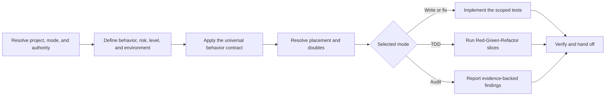

# PTLam Testing

Test observable behavior through the smallest public seam that can establish
the risk. This foundation owns testing scope, level, behavior, test-double
boundaries, TDD activation, audit authority, verification depth, and the
fallback placement model. Project evidence and active stack specializations own
the mechanics they define more specifically.

## At a glance



## Decision ownership

| Decision | Source of truth |
| --- | --- |
| Scope, behavior, level, doubles, TDD, audit, verification depth | This foundation skill |
| Repository policy, supported environments, established commands and layout | Current repository evidence |
| Stack-specific mechanics left open by the repository | Active specialization skill |
| API syntax, lifecycle, and version-sensitive options | Installed tool's official documentation |

Universal behavior rules in this skill remain mandatory. Resolve mechanics that
those rules leave open in this order: explicit user instructions, repository
policy and established conventions, active specialization, this skill's
fallbacks, then current official tool guidance. Report unresolved conflicts
instead of choosing silently.

## 1. Resolve the project, mode, and authority

1. Resolve every project root from explicit task and repository evidence. Do
   not assume the current directory or this skill's installation directory is
   the target.
2. Choose one mode:

   | Mode | Authority |
   | --- | --- |
   | Write or fix | Create or change tests and make only authorized production changes |
   | Audit | Inspect and report; remain read-only unless the user requests fixes |
   | TDD | Follow Red-Green-Refactor only when the user explicitly requests test-first work, TDD, or Red-Green-Refactor |

3. For every project-tied task, read
   [resolve project testing context](references/workflows/resolve-project-testing-context.md).
   It owns the canonical `CONTEXT.md` path, freshness, write rules, legacy
   layouts, and reporting.
4. Read repository instructions, relevant context and decision records,
   manifests, test configuration, neighboring production code, existing tests,
   and CI. Treat live repository evidence as authoritative over cached context.

Complete this step when every project root, task mode, change authority,
relevant context state, and governing repository source is known.

## 2. Define the behavior, risk, and environment

1. State the observable behavior or failure risk in repository domain language.
2. Choose the smallest clear public seam. Ask only when materially different
   seams would change behavior, cost, or confidence.
3. Select exactly one primary level:
   [unit](references/test-levels/unit.md),
   [integration](references/test-levels/integration.md), or
   [end-to-end](references/test-levels/e2e.md). Load more than one only when each
   covers a distinct risk without duplicating assertions.
4. Identify the execution environment, existing test tools, supported
   platforms, commands, and configuration owner.
5. Read
   [resolve testing environment](references/workflows/resolve-testing-environment.md)
   when the environment or toolchain is ambiguous, unverified, incompatible, or
   being added, replaced, evaluated, or recommended. Skip it only when current
   repository evidence makes both the environment and established toolchain
   unambiguous and viable.

Complete this step when the behavior, public seam, primary level, environment,
toolchain, and configuration owner are supported by current evidence.

## 3. Apply the universal behavior contract

Every test must:

- verify behavior through a public interface rather than private methods,
  internal calls, or incidental structure;
- use Given-When-Then. Prefer the tool's native API; otherwise add explicit
  `Given`, `When`, and `Then` comments rather than Arrange-Act-Assert;
- read as a behavior specification in repository domain language;
- derive expected values independently from a specification, worked example,
  or known literal rather than the production algorithm;
- cover one coherent behavior or risk, using several assertions only when they
  jointly describe that outcome;
- prefer real collaborators inside the selected seam and replace only a
  justified boundary;
- remain deterministic and isolated by controlling time, randomness, external
  services, and mutable global state at their boundaries; and
- clean up every resource it creates.

Use higher levels only for risks lower levels cannot establish. Do not repeat
the same assertion across levels or turn a coverage percentage into a substitute
for behavior-based design.

The following rules are invariant: Given-When-Then, public-seam behavior,
independent expectations, deterministic cleanup, nearest-scope reusable doubles,
read-only audit mode, and explicit-only TDD activation. Repository conventions,
specializations, and tool documentation may refine mechanics but cannot remove
these rules.

Complete this step when every planned test states one observable risk and
satisfies the universal contract before stack-specific mechanics are chosen.

## 4. Resolve placement and test doubles

Use the placement owner selected by the precedence above. An established
repository layout wins over a specialization fallback. A specialization may
define a stack default when repository evidence is silent.

When no higher-precedence source defines placement, use this foundation
fallback: map the production root to the repository's test root, preserve the
production or capability scope, then add the test-level segment.

```text
<production-root>/<capability-scope>/<source-file>
-> <test-root>/<capability-scope>/<test-level>/<test-file>
```

Use repository names for the roots, capability directories, level directories,
and test filenames. Mirror remaining source directories and filenames when one
test corresponds to one production file. For a user journey or capability with
no single source file, organize by that capability before its level. Do not
reorganize unrelated legacy tests as a side effect.

When a touched test violates the active placement owner, tell the user. Move it
only when relocation is already in scope or separately authorized; then remove
the old location, update imports and configuration, and rerun the relevant
tests.

Whenever a double is present or proposed, read
[test doubles](references/patterns/test-doubles.md). Place a reusable double at
the nearest common scope within the resolved test layout; keep one-off setup in
the test. The double reference owns semantic roles, dependency selection,
placement, lifecycle, and false-confidence safeguards.

Complete this step when one source owns test placement, every new test has an
unambiguous location, and every double has a justified boundary and nearest
common owner.

## 5. Execute the selected mode

### Write or fix

Create or change tests freely within scope. In a testing-only task, make only
small behavior-preserving production refactors needed to expose a clean seam.
Change observable production behavior only when the request includes feature or
bug-fix implementation or the user confirms that expansion.

Establish whether the test, implementation, expectation, or environment is
wrong before changing an assertion. Never weaken a valid assertion merely to
make a failure pass.

### TDD

Read [test-driven development](references/workflows/test-driven-development.md)
and follow it one vertical behavior slice at a time. Do not activate this branch
for an ordinary request to add tests or integration coverage.

### Audit

Keep the audit and project testing context read-only unless the user explicitly
requests fixes.

1. Define the reviewed scope and load every applicable reference.
2. Inspect production code when needed to judge behavior, seams, placement, and
   implementation coupling.
3. Identify mandatory violations and material missing scenarios at the public
   seam. Tie each gap to expected behavior, a failure mode, or a concrete risk.
4. Separate static findings from behavior verified by executed tests.
5. Report each finding with location, violated rule, evidence, impact, smallest
   useful correction, and uncertainty or trade-off. Include compliant aspects
   and areas that could not be verified.
6. Assign one scoped verdict: `Compliant`, `Compliant with recommendations`,
   `Non-compliant`, or `Not fully verified`.
7. Classify findings as `Critical` for false confidence or concealed severe
   breakage, `Major` for a mandatory violation or missing material behavior, and
   `Minor` for readability or maintenance harm.

Do not demand tests for every line, branch, or method, and do not impose a
numeric coverage threshold unless the user or repository defines one.

Complete this step when the requested write, fix, TDD cycle, or audit has one
clear outcome and stays within its authority.

## 6. Verify and hand off

1. Run the smallest focused test after each meaningful change.
2. In TDD, prove that Red fails for the expected reason before implementing
   Green.
3. Run the containing package or module suite after focused tests pass.
4. Run environment-specific and repository-wide checks in proportion to risk
   and repository policy.
5. Report the selected level, environment, tools, relevant `CONTEXT.md` state,
   changed behavior and files, exact commands and results, and every skipped or
   unavailable check.
6. Disclose remaining risks, migrations, conflicts, stale or provisional
   context, and unresolved decisions.

Complete the task when proportional checks pass, the result is supported by
observable evidence, and the handoff does not imply that an unrun check passed.
