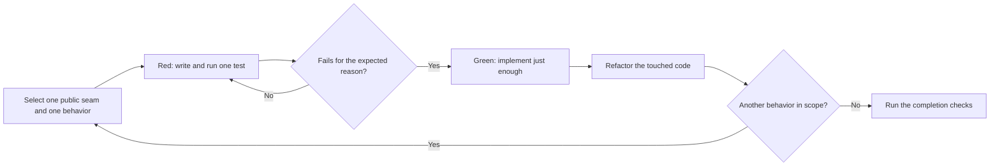

# Test-Driven Development

Use this workflow only when the user explicitly requests TDD, test-first work,
or Red-Green-Refactor. A request for tests or integration testing alone does not
activate it.

## Work in vertical slices

Each cycle carries its own constraint:

- **Select.** Choose an obvious seam directly. Ask only when the alternatives
  materially change scope or design.
- **Red.** A compile failure counts only when the missing interface is the
  behavior you are introducing right now.
- **Green.** Do not anticipate future cases, and do not write a horizontal
  batch of tests first.
- **Refactor.** Preserve behavior, keep the change local and low-risk, and
  rerun the focused tests after each one.
- **Repeat.** Let the previous cycle inform which behavior comes next.

## Guardrails

- Treat each test as a tracer bullet through a real public seam.
- Keep expected values independent from the implementation.
- Do not mock internal implementation structure to manufacture a Red state.
- Do not weaken the test during Green.
- Defer broad architectural refactors until the behavioral slices pass, then
  review and verify them separately.
- Preserve a readable Given-When-Then specification in every cycle.

## Completion

Run the focused test, containing suite, and proportionate repository checks.
Report the observed Red failure, the Green result, refactoring performed, and
any check not run.
