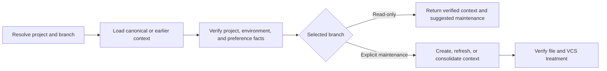

# PTLam Managing Testing Context

Resolve or maintain one project's `CONTEXT.md` containing durable testing facts
and preferences. Read-only and maintenance branches evaluate the same context
artifact against current repository evidence.

## At a glance



## Context contract

| Concern | Boundary |
| --- | --- |
| Primary artifact | `<project-root>/.ptlam-agent-plugin/skills/engineering/ptlam-testing-managing-context/CONTEXT.md` |
| Read-only trigger | Another testing workflow needs verified project facts or preferences |
| Maintenance trigger | The user explicitly asks to create, refresh, review, or consolidate testing context |
| Authority | Context maintenance changes only canonical context and explicitly authorized replaced context files; it never grants dependency, test, production, staging, commit, or publication authority |
| Acceptance | Every returned or stored entry is durable, current, scoped, and supported by live project evidence |

## 1. Resolve the project and branch

1. Prefer project paths, files, workspace selections, and repository evidence
   supplied by the task.
2. Walk upward to the governing Git or build workspace root. Do not stop at a
   package directory governed by a higher workspace.
3. When the current directory is above several projects, inspect only explicit
   task paths and a bounded set of nearby candidates. Never scan an entire home
   directory.
4. Keep context for multiple projects separate. Ask which project is in scope
   only when several roots remain plausible and the choice changes the result.
5. Select read-only mode unless the user explicitly requests context
   maintenance.

Complete this step when every project has one root and the context operation is
explicitly read-only or writable.

## 2. Load canonical or earlier context

Use this canonical path:

```text
<project-root>/.ptlam-agent-plugin/skills/engineering/ptlam-testing-managing-context/CONTEXT.md
```

Load the canonical file when it exists. Treat repository instructions,
manifests, lockfiles, build and test configuration, CI, and existing tests as
the sources of truth. The context is a verified cache, not authority over live
evidence.

When the canonical file is absent, check these earlier layouts in order:

```text
.ptlam-agent-plugin/skills/engineering/ptlam-managing-testing-context/CONTEXT.md
.ptlam-agent-plugin/skills/engineering/ptlam-testing/CONTEXT.md
.ptlam-agent-plugin/skills/ptlam-testing/CONTEXT.md
.ptlam-agent-plugin/skills/ptlam-testing/profile.md
.ptlam-agent-plugin/skills/engineering/ptlam-testing/profile.md
```

Load relevant facts in place and report every earlier file. In maintenance mode,
consolidate only verified current content into the canonical file. Remove a
replaced file only when deletion is explicitly authorized.

Complete this step when current information has one canonical destination and
every retained earlier-layout file is known.

## 3. Keep one durable context artifact

Use compact identity and freshness frontmatter:

```yaml
---
schema_version: 1
skill: ptlam-testing-managing-context
canonical_path: skills/engineering/ptlam-testing-managing-context
updated_at: YYYY-MM-DD
---
```

Use one file with these sections. Omit an empty optional section rather than
creating sibling profile, research, or decision files.

### Project profile

Record testing-relevant project and package boundaries, languages, frameworks,
runtimes, supported platforms, repository testing policy, authoritative
configuration entrypoints, and evidence or invalidation signals.

### Project testing contexts

Create one capability-oriented subsection per independently testable execution
environment. Split only when environment, toolchain, test roots, commands, CI,
platforms, lifecycle infrastructure, or material version constraints differ.
Do not split solely because packages or languages differ.

For each context, record relative scope paths, environments, tools and roles,
material version constraints, commands, roots, naming conventions, supported
test levels, integration infrastructure, and freshness evidence.

### Testing preferences

Record durable user or project testing preferences with their scope. Do not
copy universal testing rules or store permission grants.

Never store secrets, transient logs, machine-specific absolute paths, research
notes, alternatives, rationale, or decision history. Preserve unknown fields
and require an explicit migration before changing an unsupported schema.

Complete this step when every retained item is a durable project fact,
testing-context fact, or explicitly supported scoped preference.

## 4. Verify freshness and complete the branch

Compare every task-relevant entry with current instructions, manifests,
lockfiles, build and test configuration, CI, and existing tests. Recheck an
entry when its evidence changes, a recorded command fails, or current versions
and maintenance status matter. Treat dates as freshness signals rather than
proof.

### Read-only

Leave every context file unchanged. Return verified entries and report material
new, changed, or stale durable knowledge as suggested maintenance.

### Explicit maintenance

Create the canonical file only after current evidence establishes at least one
durable fact or preference. Update content in place, remove stale entries only
when replacements are verified, and change `updated_at` only when stored content
changes.

Preserve existing VCS treatment. If the file is tracked, update it as ordinary
project state. If ignored, keep it local. If untracked and not ignored, leave it
untracked and report that state. Never edit `.gitignore`, stage, commit, or
publish merely because context changed.

Complete this step when the read-only branch has no file effect or the
maintenance branch has one verified canonical file with preserved VCS
treatment.

## 5. Return the context result

Return the project root, canonical path, selected branch, file state, selected
testing context, verified task-relevant facts and preferences, stale or
provisional entries, suggested maintenance, retained earlier files, and
tracked, ignored, or untracked status.

Complete the task when another testing workflow can consume the result without
rediscovering project context and every file effect stays within the explicit
context authority.
