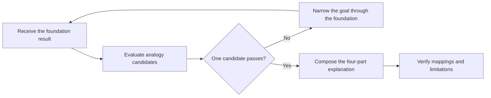

# PTLam Explaining with Analogy

Turn the learning goal and literal model produced by the required
`ptlam-explaining` foundation into one vivid, structurally faithful real-life
analogy.

This skill returns an explanation and changes no files. When another skill
calls it, that caller owns the rendering.

## Required skills

### `ptlam-explaining`

**Reason:** Provides the learning goal, literal model, and verification the analogy is built on.

**Instructions:** Read and apply ptlam-explaining first.
Let it own the learning goal, depth, literal answer, literal model,
overall composition order, and reconstruction verification. Start the
analogy workflow from those outputs instead of resolving them again.
Enter this skill only when the learner explicitly asked for an
analogy, and apply it only to analogy selection, the mapping gate, the
story, and the stated limits.

Read [ptlam-explaining](skills/ptlam-explaining/SKILL.md).

## At a glance



## 1. Start from the foundation result

Use the required foundation's resolved learning goal, learner background,
confusing mechanism, depth, language, output constraints, literal answer,
literal model, and stated limits. Extract any analogy domain the learner
supplied, required, or ruled out from that result.

Do not resolve a competing learning goal or rebuild the literal model. When a
material input is missing, return that gap to the foundation. Ask the learner
only when the foundation cannot safely resolve it from available evidence.

Complete this step when the foundation's learning goal, literal answer, and
literal model supply everything needed to evaluate an analogy.

## 2. Choose one faithful analogy

For each candidate, build an internal mapping ledger:

```text
literal concept -> analogy counterpart -> preserved behavior -> known limit
```

A candidate passes only when it meets the complete mapping gate:

1. Every essential literal concept maps to one stable analogy counterpart.
2. Ownership, direction, order, state, cardinality, lifetime, and causality are
   preserved wherever they matter.
3. No analogy element represents unrelated concepts.
4. Exact facts and constraints remain literal.
5. No material rule requires a misleading mapping, unexplained exception, or
   second metaphor.

Treat a learner-supplied domain as the first candidate. Use it when it passes.
When it fails, name the material mismatch and offer passing alternatives instead
of silently replacing it.

When no supplied domain passes, generate several candidates internally. Prefer
an everyday domain the learner can picture, one coherent world, strong
relationship fidelity, broad coverage, and low explanation cost.

These familiar domains are starting points, not defaults:

| Concept pattern | Possible analogy domain |
| --- | --- |
| Ordered sequential work | Recipe or assembly line |
| Fast storage and retrieval | Library or filing cabinet |
| Broadcasting to unknown listeners | Radio station or newsletter |
| Complexity behind a simple surface | Restaurant menu |
| Concurrent work | Multiple cooks in one kitchen |
| Agreed communication rules | Introductions or phone etiquette |
| Adjustment from observed output | Thermostat |
| Work distributed across resources | Traffic control |

Use the strongest passing candidate without adding a selection turn unless the
learner asks to choose, rejects the current analogy, or the candidates expose
meaningfully different teaching trade-offs.

When selection helps, present at most three passing candidates. For each, give a
short domain name, one sentence about the structural similarity, and the
material teaching trade-off. Mark the strongest **(Recommended)**, ask which to
use, and wait. Never offer a candidate that failed the mapping gate.

If no coherent candidate passes, ask the learner to narrow the goal instead of
forcing a weak analogy.

Complete this step when one passing analogy is selected, every learner-supplied
domain is honored or rejected for a named mismatch, and any required user choice
is settled.

## 3. Compose the explanation

Lock the selected analogy domain and use it throughout. Calibrate vocabulary
and depth to the learner. Be vivid without weakening precision.

Follow [the explanation shape](references/explanation-shape.md). It owns the
four components — the literal sentence, the map, the story, and the limitations
— their order, their finish condition, and the Markdown a direct answer uses.

## 4. Verify the analogy

Reapply the step 2 mapping gate to the drafted explanation. Then confirm that:

- the story demonstrates the mechanism instead of decorating it;
- exact facts stayed literal, in the map or in the limitations; and
- the learner can reconstruct the foundation's literal model from the map
  alone, without the story.

If drafting reveals a failed mapping, do not return it. For an automatically
selected analogy, use the next strongest passing candidate. For a
learner-supplied one, follow step 2's rule for a failed supplied domain.

Complete this step when these checks pass and the foundation's literal answer,
composition order, and limits remain intact.

## 5. Handle follow-ups

| Learner asks for | Response |
| --- | --- |
| A different analogy | Offer at most three fresh passing candidates, excluding the analogy just used. |
| More depth | Return to the foundation to expand the literal model, then revalidate the analogy. Keep it only if it still passes. |
| A simpler version | Return to the foundation to narrow the learning goal, then choose a more everyday candidate that passes. |
| A related concept | Return to the foundation for a new literal model, then link back only where useful. |
| A challenge to the analogy | Name the limitation and structural rationale; offer fresh candidates when needed. |

Complete a follow-up when the foundation has verified any changed literal scope
and the result passes steps 2 through 4 again.
