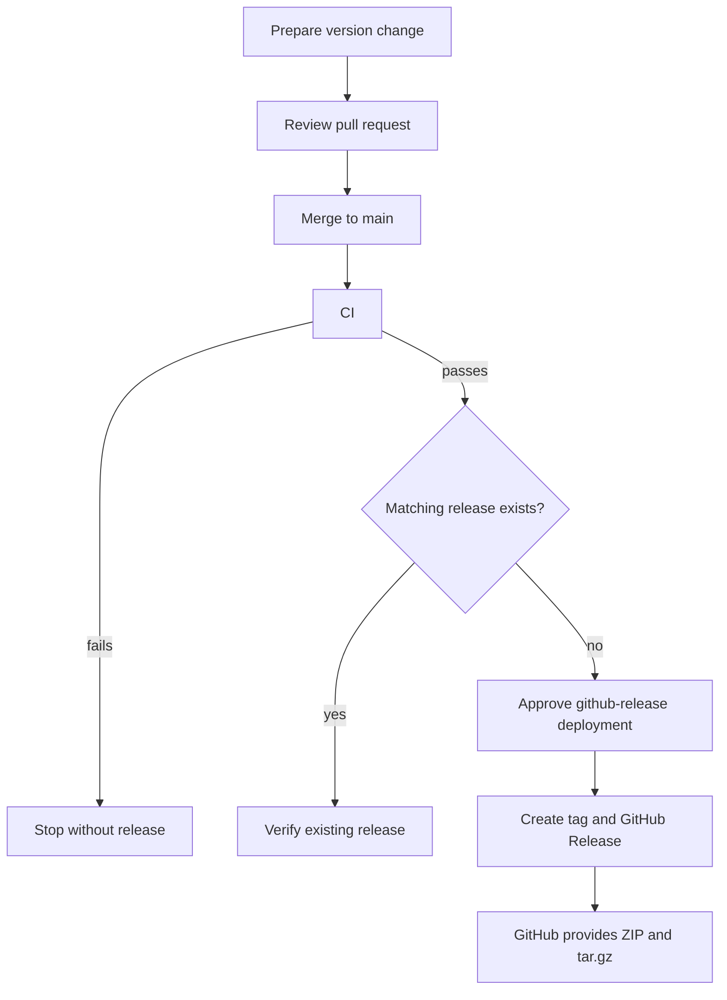

# Release guide

CI validates every pull request and every push to `main`. After a successful
`main` CI run, CD creates a GitHub Release only when the current plugin version
does not already have a matching release.



The version is the release signal. Normal feature, fix, and documentation work
must leave it unchanged.

## Configure manual approval

The release job targets the `github-release` GitHub environment. Before relying
on that gate, a repository administrator must create the environment under
[Settings > Environments](https://github.com/fam-tung-lam/ptlam-agent-plugin/settings/environments),
enable **Required reviewers**, and add at least one release approver. A workflow
reference to an environment with no required reviewer does not pause for manual
approval.

Leave **Prevent self-review** disabled when the person who merges a release may
also approve it. Enable it only when another required reviewer is available. If
approval must never be bypassed, disable administrator bypass for the
environment as well.

## Prepare a release

1. Create a focused branch from current `main`.
2. Choose a new [Semantic Version](https://semver.org/). Prerelease versions
   such as `0.1.0-alpha.2` become GitHub prereleases.
3. Update `package.json` and `package-lock.json` without creating a local tag:

   ```bash
   npm version <version> --no-git-tag-version
   ```

4. Set the same version in `plugin/plugin.yml` and regenerate compiler-owned
   plugin artifacts:

   ```bash
   npm run plugin:compile
   ```

5. Move the pending notes from `Unreleased` into a dated `[<version>]` section
   in `CHANGELOG.md`. Leave `Unreleased` empty and update its comparison link to
   start at `v<version>`.
6. Add the new version comparison link from the previous tag to `v<version>`.
7. Run the complete quality gates, including `npm run release:check`.
8. Open and merge a pull request after `CI Required` passes.

CI rejects inconsistent package, lockfile, authored plugin, or generated host
versions. When a version changes, it must have greater SemVer precedence than
the version on the pull request base or previous `main` commit. CI also rejects
a version change when its changelog section is missing, undated, empty, or
paired with stale comparison links.

## Automated release result

After the merge commit passes CI, `.github/workflows/cd.yml` checks whether the
version already has a matching release. If it does not, GitHub pauses the
`Create GitHub Release` job for approval on the protected `github-release`
environment. After approval, CD:

- creates the annotated `v<version>` tag at the exact validated commit;
- creates a release titled `PTLam Agent Plugin v<version>`;
- uses the matching version section from `CHANGELOG.md` as the exact release
  notes;
- marks SemVer prereleases as GitHub prereleases; and
- verifies and skips an already matching release on a safe rerun.

GitHub automatically adds **Source code (zip)** and **Source code (tar.gz)** to
every release. This project does not publish an npm package and does not upload
a second copy of either source archive.

If CD reports that an existing tag points to another commit or that existing
release metadata is incompatible, do not move or overwrite it. Prepare a new
version in a new pull request.
