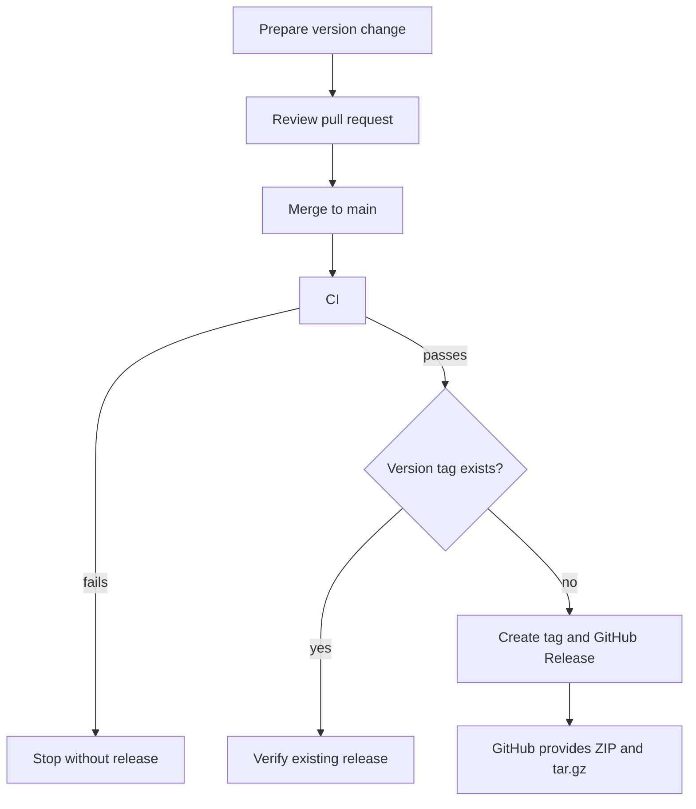

# Release guide

CI validates every pull request and every push to `main`. After a successful
`main` CI run, CD creates a GitHub Release only when the current plugin version
does not already have a matching release.



The version is the release signal. Normal feature, fix, and documentation work
must leave it unchanged.

## Prepare a release

1. Create a focused branch from current `main`.
2. Choose a new [Semantic Version](https://semver.org/). Prerelease versions
   such as `0.1.0-alpha.2` become GitHub prereleases.
3. Update `package.json` and `package-lock.json` without creating a local tag:

   ```bash
   npm version <version> --no-git-tag-version
   ```

4. Set the same version in `plugin/plugin.yml` and regenerate compiler-owned
   plugin artifacts:

   ```bash
   npm run plugin:compile
   ```

5. Run the complete quality gates, including `npm run release:check`.
6. Open and merge a pull request after `CI Required` passes.

CI rejects inconsistent package, lockfile, authored plugin, or generated host
versions. When a version changes, it must have greater SemVer precedence than
the version on the pull request base or previous `main` commit.

## Automated release result

After the merge commit passes CI, `.github/workflows/cd.yml`:

- creates the annotated `v<version>` tag at the exact validated commit;
- creates a release titled `PTLam Agent Plugin v<version>`;
- generates changelog notes from merged pull requests using
  `.github/release.yml`;
- marks SemVer prereleases as GitHub prereleases; and
- verifies and skips an already matching release on a safe rerun.

GitHub automatically adds **Source code (zip)** and **Source code (tar.gz)** to
every release. This project does not publish an npm package and does not upload
a second copy of either source archive.

If CD reports that an existing tag points to another commit or that existing
release metadata is incompatible, do not move or overwrite it. Prepare a new
version in a new pull request.
