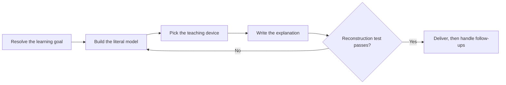

# PTLam Explaining

Build the learner's mental model of one concept, then check that they can use
it.

<!-- PLUGIN-COMPILER:REQUIRED-SKILLS -->

## How does one concept become a usable mental model?

## 1. Resolve the learning goal

Find out:

- the concept to explain;
- what the learner already knows that you can build on;
- the exact part that confuses them;
- the depth, language, and output limits; and
- any device the learner asked for or ruled out.

Ask only when the concept is missing or too vague to explain correctly. Infer
ordinary presentation choices and continue.

Done when these are known or safely inferred.

## 2. Build the literal model

Capture the real structure before choosing how to present it:

- the essential actors, objects, and boundaries;
- ownership, containment, dependencies, and how many of each;
- inputs, outputs, order, handoffs, and cause-and-effect rules;
- the states, transitions, lifetimes, and failure behavior that matter; and
- the exact facts, names, and limits that must stay literal.

Cover only the mechanism the requested depth needs. Verify a claim when the
request or the risk requires it. Leave out an uncertain detail rather than
inventing one that makes the story tidier.

Done when every material relationship in scope is captured and uncertain claims
are verified or left out.

## 3. Pick the teaching device

Choose from what the learner cannot do, not from the subject:

| The learner cannot                                                   | Device                                                             |
| -------------------------------------------------------------------- | ------------------------------------------------------------------ |
| Picture the mechanism                                                | One concrete example, then the general rule                        |
| Tell two neighboring concepts apart                                  | Contrast them on the one dimension that separates them             |
| Follow or operate the process                                        | Walk the chain of causes in execution order                        |
| See why it is built this way                                         | Name the constraint that forced it and the alternative it rejected |
| Hold the whole system in mind                                        | The whole first, then one level of parts at a time                 |
| Connect it to anything familiar, and explicitly asked for an analogy | One real-life analogy, mapped element by element                   |

Honor a learner-requested device when it keeps the literal model intact. When it
would distort a material relationship, name the mismatch and pick a faithful
alternative. Combine two devices only when the first leaves a named gap the
second closes.

Use the analogy device only when the learner explicitly asked for an analogy.
"Explain", "define", "simplify", or "break down" is not that ask. Then follow
[the analogy device](references/analogy-device.md); it owns candidates, the
mapping gate, the choice turn, and its own checks. Without that ask, start from
one concrete example and generalize.

Done when one device is selected and every learner-supplied or excluded device
is honored or refused for a named reason.

## 4. Write the explanation

Order the material so every sentence makes sense from what came before it:

- Open with the one-sentence literal answer, before any device.
- Build from what the learner knows toward what they do not.
- Introduce one new idea at a time, and name it where it is first needed.
- Give the simple version first and the precise qualifier right after it.
- Keep exact facts, names, and limits literal even where the device pulls toward
  paraphrase.
- End with what the explanation does not cover.

When the analogy device was selected, follow
[the analogy explanation shape](references/analogy-explanation-shape.md)
instead. It owns the four parts, their order, and their finish condition.

When another skill calls this one, return one explanation package:

| Field        | Content                                                  |
| ------------ | -------------------------------------------------------- |
| Goal         | Learning goal, learner background, confusing part, depth |
| Presentation | Language and the selected device                         |
| Model        | Literal answer, literal relationships, verified limits   |
| Explanation  | The body, in teaching order                              |
| Limits       | Uncertainty, exclusions, caveats                         |

The caller renders these fields without changing their meaning.

Done when the explanation has no forward reference, every term is defined where
it first appears, and its limits are stated.

## 5. Check the explanation

Run the reconstruction test: name a case the explanation did not cover, then
check whether its own content predicts the behavior. When it does not, the model
is incomplete; go back to step 2 instead of adding words.

Then confirm that the exact facts survived the device, and that step 4's finish
condition still holds.

Done when the reconstruction test passes and both checks hold.

## 6. Handle follow-ups

| The learner asks for           | Do this                                                                        |
| ------------------------------ | ------------------------------------------------------------------------------ |
| More depth                     | Extend the literal model first, then re-pick the device for the new depth      |
| A simpler version              | Narrow the learning goal; do not drop the qualifiers                           |
| A different device             | Re-enter step 3 with the used device excluded                                  |
| A different analogy            | Re-enter the analogy device with the used domain excluded                      |
| A related concept              | Build a new literal model; link back only where the mechanism is shared        |
| A challenge to the explanation | Name the limit and its structural reason, then offer the device that closes it |

Finish when the follow-up's new scope passes steps 2 through 5.
