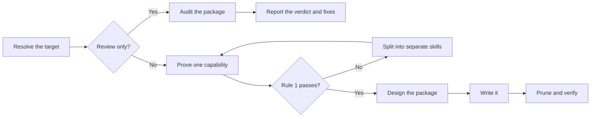

# PTLam Creating Skills

Create, review, or refactor one agent-skill package that a maintainer can read
once and a future agent can run.

<!-- PLUGIN-COMPILER:REQUIRED-SKILLS -->

## Two rules

**Rule 1: one skill, one capability.** A skill owns one responsibility, one kind
of result, and one standard for being done. Keep create, review, and repair
branches together only when all three match.

**Rule 2: the maintainer reads it first.** Someone has to understand the package
well enough to change it later. A package only an agent can follow is not
finished.

## How does a skill reach a verdict or a finished package?

## 1. Resolve the target

1. Name the operation: create, refactor, or review.
2. Find the target repository, skill folder, and host. The current folder is not
   automatically the target.
3. Read the target's repository instructions, its neighboring skills, and its
   host schema, generator, and validators.
4. Write down which files you author, which a generator owns, who owns the
   metadata, and which side effects you may cause.

Done when the operation, the files you may change, and the available checks are
named.

For a review, read [reviewing skills](references/reviewing-skills.md), do step
2, skip steps 3 and 4, then finish with the review branch of step 5.

## 2. Prove it is one capability

Read [skill atomicity and composition](references/skill-atomicity.md). It owns
the capability tests, the keep-or-split decision, and how a foundation and a
specialization share ownership.

Write one line for each: the responsibility, the result the skill produces or
judges, its branches, its inputs, its standard for being done, and the skills it
depends on. Then apply Rule 1 to what you wrote.

If Rule 1 fails, list each resulting skill with its capability, trigger, output,
and edges. A review reports that split. A change continues only with the skills
the user approves.

Done when Rule 1 passes for one capability, or the split map covers every
capability you found.

## 3. Design the package

Read [package layout](references/skill-package-layout.md). It owns what each
folder holds, the file-length limit, and when detail leaves `SKILL.md`. Read
[self-contained documentation](references/self-contained-documentation.md) when
the package uses links, sources, or outside material.

Give each tool, service, package, or source to the workflow that uses it. Keep
guidance the normal path shares in `SKILL.md`; put conditional guidance in the
reference that owns that workflow and point there.

Write each dependency's name, load order, ownership boundary, and precedence
rule only in the host metadata that generates the `SKILL.md` dependency block.
In this repository that is `plugin/plugin.yml`. No `SKILL.md` body or reference
may name, link to, or restate a required skill; say what is outside this skill
instead.

Done when the file tree and reading order exist, the package runs without
external URLs, and every dependency lives in the metadata.

## 4. Write the package

Read [writing for maintainers](references/writing-for-maintainers.md) before any
prose. It owns the file template, reading order, sentence shape, the order to
try visual forms in, and what to cut.

Read [prompting best practices](references/prompting-best-practices.md) when the
skill steers non-trivial reasoning, tool use, output shape, or autonomy.

Say what to do before what to avoid. Use a prohibition only for a guardrail with
no positive form, and name the permitted behavior beside it.

Write the metadata against the target's schema and its metadata owner: one
trigger per branch, no synonyms, and a reach clause when another skill should
compose this one. Read
[frontmatter specification](references/skill-frontmatter-spec.md) when the
target uses Claude-style inline YAML.

Tests, evals, benchmarks, graders, and trigger tuning stay outside this skill.

Done when every branch runs without hidden context, every step ends in something
someone can check, and the target accepts the metadata.

## 5. Prune and verify

Read [verifying skills](references/verifying-skills.md). It owns pruning,
package checks, and the final report for every operation.

Finish when both rules hold, every check in that file passes or the review
accounts for each failure, and the report names the checks run and anything left
unverified.
