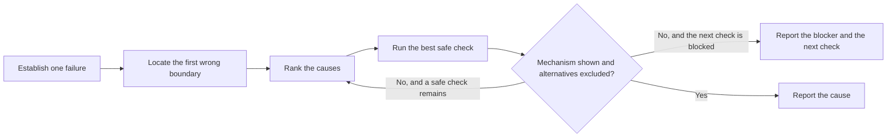

# PTLam Diagnosing

Find the cause of one failing software behavior and report it with evidence. The
report either names a cause whose mechanism at the first wrong boundary is shown
by observations or a deciding check, with every other supported alternative
ruled out, or it names the exact evidence blocker and one next check.

A diagnosis is read-only. It allows inspection and scoped diagnostic checks. It
does not allow a fix or any other intentional change to source, configuration,
dependencies, data, or external state.

<!-- PLUGIN-COMPILER:REQUIRED-SKILLS -->

## How does a failure become a demonstrated cause?

## 1. Establish one failure

1. Name one observable failure: expected behavior, actual behavior, environment,
   the smallest reproduction you have, and the repository sources that apply.
2. Keep the original failure intact before turning on diagnostics or narrowing
   inputs. Use the narrowest safe reproduction, or existing evidence when you
   cannot reproduce it.
3. Label every material claim:

| Label       | Meaning                                                   |
| ----------- | --------------------------------------------------------- |
| Observation | Seen directly in output, logs, tests, source, or state    |
| Inference   | A conclusion supported by named observations              |
| Assumption  | An unverified condition the diagnosis currently relies on |

Done when the symptom is repeatable or the missing evidence is explicit, and a
reader can tell what was seen from what was concluded or assumed.

## 2. Locate the first wrong boundary

Trace the path from the caller toward the symptom. At each boundary, compare the
input, output, side effect, completion, and failure mapping that matter to the
expected behavior. Record the last boundary that is still correct and the first
that is wrong or loses evidence.

Done when the failure is narrowed to the smallest boundary you can support, or
one missing observation stops you from narrowing further.

## 3. Rank and test the causes

1. List the plausible causes at that boundary. Rank them by supporting evidence,
   then by how cheaply and decisively a safe check can rule them out.
2. Run the most valuable check you are allowed to run. Update the labels and the
   ranking before trying another cause.
3. Accept a cause only when observations or a deciding check show its mechanism
   at the first wrong boundary and rule out every other supported alternative.

Stop exploring and report a cause only when it meets that bar. When the next
deciding check is unavailable or needs new permission, stop with the exact
blocker and that next check. Never turn a plausible fix into a verified one.

Done when a cause meets the bar, or the blocker and next check are named.

## 4. Report and stop

| Field        | Content                                                                                                                                                                                                                                                                                                   |
| ------------ | --------------------------------------------------------------------------------------------------------------------------------------------------------------------------------------------------------------------------------------------------------------------------------------------------------- |
| Scope        | Expected behavior, actual behavior, environment, reproduction status                                                                                                                                                                                                                                      |
| Observations | Runtime and source evidence with commands or locations                                                                                                                                                                                                                                                    |
| Boundary     | Last correct boundary and first wrong or unobserved boundary                                                                                                                                                                                                                                              |
| Diagnosis    | The cause, the evidence for its mechanism, and the excluded alternatives; or the blocker and the next check                                                                                                                                                                                               |
| Inferences   | Conclusions drawn from the observations                                                                                                                                                                                                                                                                   |
| Assumptions  | Unverified conditions that could change the diagnosis                                                                                                                                                                                                                                                     |
| Limits       | Checks not run, unreachable evidence, remaining doubt                                                                                                                                                                                                                                                     |
| Handoff      | Which kind of work should follow: an architecture judgment when the cause is a component, runtime, or store boundary in the wrong place, a missing or shared owner of state, or a published contract that cannot hold; the code-style boundary rules for a module-level boundary or owner; otherwise none |

Finish after this report. Never present an unrun check or a guessed fix as an
observation.
