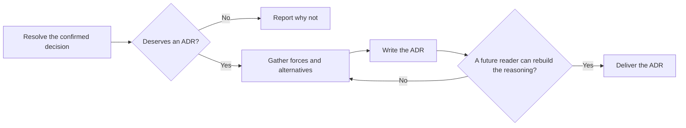

# PTLam Creating Architecture Decision Records

Decide whether one confirmed architecture choice deserves a durable record, and
write that record (an ADR) when it does. This skill owns the yes-or-no verdict
and the ADR. It does not interview, implement, or touch Git history; send an
open decision back to the caller.

<!-- PLUGIN-COMPILER:REQUIRED-SKILLS -->

## When does a choice become an ADR?

Apply this skill after a choice is confirmed. It records the decision; it does
not reopen it. When an architecture judgment exists, use it as the source.

## 1. Resolve the decision and destination

Name the accepted choice, its owner, its evidence, and the future constraint it
creates. Stop when the choice is still open, contradicts itself, or is missing a
real alternative.

Read the applicable `AGENTS.md` files and any existing ADR convention. Use their
location and numbering; otherwise use the next free four-digit number at
`<project-root>/docs/adr/<NNNN>-<slug>.md`.

A direct request or a parent skill allows creating one new ADR and its missing
parent folders. Never overwrite an ADR. Changing code, superseding another
record, staging, committing, or publishing needs separate permission.

Done when the decision, evidence, convention, unique destination, and write
permission are explicit.

## 2. Apply the qualification gate

Write an ADR when the choice does at least one of these:

- splits or merges a component, runtime, or data store;
- publishes or changes a surface such as an API, SDK, CLI, schema, file format,
  or plugin interface;
- moves where the true copy of state lives;
- commits to a platform such as an OS, store, device, or offline use;
- binds other teams, releases, or a shared dependency beyond this task; or
- rejects a plausible alternative for a reason that is not obvious.

The first four bullets repeat the architecture skill's trigger on purpose, so
this gate works when that skill is not loaded.

A local name, a private helper, routine library use, or a cheaply reversible
choice earns no ADR. When the gate fails, return the verdict and the reason
without creating a file. The parent workflow keeps that disposition in its own
record.

Done when the qualifying consequence, or the reason for no ADR, is explicit and
backed by evidence.

## 3. Gather the decision evidence

Read the confirmed record, the relevant product or feature specification,
existing ADRs, repository constraints, and the evidence for each alternative.
When an architecture judgment exists, map its fields:

| Judgment field                | ADR section               |
| ----------------------------- | ------------------------- |
| Question                      | Context                   |
| Constraints                   | Decision drivers          |
| Frame                         | Options considered        |
| Recommendation                | Decision                  |
| Assumptions                   | Context                   |
| Trade-offs                    | Consequences              |
| Deferred and redesign trigger | Reversal and supersession |

Keep decision drivers, assumptions, rejected alternatives, consequences, and
unknowns apart. Do not invent a tidy reason after the fact. When the evidence
cannot explain why the choice won, stop and name the missing input.

Done when a future reader can compare the accepted choice with each real
alternative using the evidence available at decision time.

## 4. Write the ADR

Read [the ADR schema](references/adr-schema.md). It owns the file shape, status,
where the visual goes, and the completion checks. Keep the decision statement
short; put the explanation around the forces, alternatives, and consequences.

Done when the destination holds one accepted ADR and every schema section has an
explicit disposition.

## 5. Verify and deliver

Check the record against its sources and the existing ADR convention. Confirm
the explanation predicts the consequences and each visual keeps the real
relationships.

Report the verdict, the file when created, its status, sources, checks, and any
open risk.

Finish when the no-ADR verdict is supported, or the ADR lets a future reader
rebuild what was chosen, why, and what it costs.
