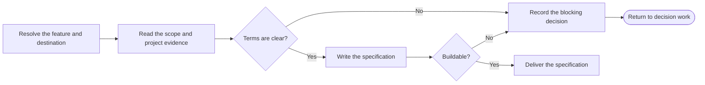

# PTLam Creating Feature Specifications

Turn one confirmed feature scope into one buildable feature specification. The
spec owns the feature's behavior and constraints. It does not own product
discovery, market framing, success metrics, ticket slicing, or implementation.

<!-- PLUGIN-COMPILER:REQUIRED-SKILLS -->

## How does confirmed scope become a buildable spec?

This skill does not interview. It writes from confirmed evidence and never
re-asks a settled question. When an unknown would change the outcome, send it
back to decision work instead of choosing quietly.

## 1. Resolve the feature and destination

Name the one feature this run specifies. A PRD scope item is the normal source.
A confirmed feature brief may replace it for a feature inside an existing
product. A new product or large epic starts at the PRD. A small fix skips this
pipeline.

Read the applicable `AGENTS.md` files before choosing paths. Use their spec
location when defined; otherwise write to
`<project-root>/docs/specs/<feature>/spec.md`.

Running this skill allows creating that one file and its missing parent folders.
It does not allow overwriting an existing spec, changing source evidence,
creating tickets, changing code, or Git operations. Update an existing spec only
when the user asked for that.

Done when the feature, confirmed source, project root, destination, and write
permission are explicit.

## 2. Read the evidence

Read the whole confirmed source and the repository evidence needed to make the
feature buildable. Record the exact source path and heading. For a feature
brief, record its file or the user-approved statement and why no PRD applies.

Find the project glossary through `AGENTS.md`; otherwise look for
`<project-root>/CONTEXT.md`. Without a glossary, mark it unavailable and keep
business terms exactly as the source and repository use them. A missing glossary
alone does not block the spec; a conflicting or unclear term does.

Treat the PRD as product evidence, not a draft spec. Never push solution
mechanics back into it.

Done when each requirement and constraint has a source, and every material term
is clear or recorded as a blocker.

## 3. Model the feature contract

Describe what an outside observer can see before any solution detail:

- actors, permissions, entry conditions, and boundaries;
- successful behavior in the order it happens;
- validation, failure, recovery, repeat-safety, and concurrency behavior;
- data ownership, lifecycle, privacy, and retention;
- interfaces and compatibility promises;
- operational signals, rollout, migration, and rollback constraints;
- structures that are expensive to reverse, judged by the loaded architecture
  skill and recorded as architecture constraints with their trade-offs, deferred
  concerns, and redesign trigger; and
- behaviors that evidence must prove.

Add a mechanic only when it removes an implementation decision or protects a
contract. Leave deliberate implementation freedom in place. Leave test levels,
test placement, test doubles, and tool choices to the implementer's code-style
rules.

Done when an implementer can tell required behavior from permitted choice.

## 4. Write the specification

Read
[the feature specification schema](references/feature-specification-schema.md).
It owns the file shape, status rules, and readiness checks. Keep source facts,
repository evidence, assumptions, and open decisions as distinct kinds of
information.

Do no discovery to fill a gap. When a missing decision changes behavior, scope,
data, structure, compatibility, or rollout, save the spec with status `blocked`
and name the decision owner and consequence.

Done when the destination holds one self-contained spec and every schema section
has an explicit disposition.

## 5. Verify and deliver

Check the spec against the schema's readiness checks and its cited evidence.
Report the file, status, source scope, glossary state, checks performed, and any
blocking decision.

Finish when the file matches its evidence and is either ready for ticket
planning or blocked with the exact missing decision named.
