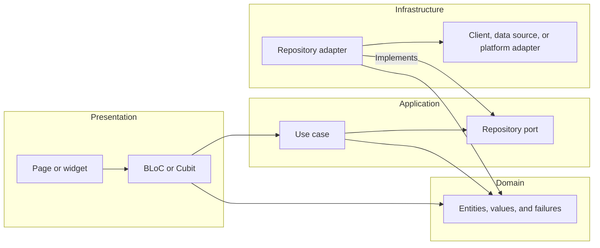

# Architecture

The Flutter feature-layer map, application ports, infrastructure adapters, and
dependency composition.

## Which way do feature dependencies point?

BLoCs and Cubits are presentation state holders. They turn user intent into
use-case calls and expose renderable state without owning widget or I/O
mechanics.

## Make dependencies point inward

| Layer             | Owns                                                         | May depend on                                           | Never touches                                   |
| ----------------- | ------------------------------------------------------------ | ------------------------------------------------------- | ----------------------------------------------- |
| `presentation/`   | Pages, widgets, routes, UI effects, BLoCs, and Cubits        | Application use cases and domain values                 | Ports, repositories, data sources, Dio, plugins |
| `application/`    | DTOs, use cases, and ports                                   | Domain types and serialization annotations              | Widgets, `BuildContext`, HTTP or storage APIs   |
| `domain/`         | Entities, value objects, business rules, and stable failures | Nothing outside the domain                              | Flutter, application, persistence, or plugins   |
| `infrastructure/` | Port implementations, clients, data sources, and SDK bridges | Application DTOs and ports, domain types, external APIs | Presentation or application orchestration       |

Widgets dispatch intent to one state holder. The state holder calls use cases,
and use cases depend on application ports. Infrastructure adapters implement
those ports and map external values to domain values.

Keep a layer when it names a real boundary. A use case that only forwards to a
port is valid when the operation carries product meaning; one that exists only
to fill the tree should be inlined.

## One repository port per concern

Put the contract under `application/ports/` and its implementation under
`infrastructure/adapters/`. The adapter composes clients, data sources, and
platform adapters for one concern and presents one domain-shaped API.

The adapter owns infrastructure policy the layers above must not know: which
source answers first and what happens when it fails, what a missing stored value
falls back to, and when a local change is mirrored remotely. A use case calls
the port; it never chooses between a cache and a network call. The adapter
converts boundary exceptions into the domain failures [models.md](models.md)
owns.

## Compose dependencies at the application root

`app/di.dart` holds every [`get_it`](https://pub.dev/packages/get_it)
registration and nothing else. Register adapters under their port types, then
build use cases and state holders.

Feature code receives dependencies through constructors. Resolving from the
locator inside a BLoC, use case, adapter, or widget hides the edge and makes the
class untestable without the container.

| Edge                     | Input                          | Output                       | May and may not                                              |
| ------------------------ | ------------------------------ | ---------------------------- | ------------------------------------------------------------ |
| Widget to state holder   | User intent and view lifecycle | Renderable state             | Dispatches intent; cannot select data sources                |
| State holder to use case | Domain command or query        | Domain result or failure     | Coordinates presentation state; cannot perform I/O           |
| Use case to port         | Domain-shaped request          | Domain entity or failure     | Applies product policy; cannot select transport              |
| Adapter to boundary      | DTO or boundary parameters     | Boundary result or exception | Selects sources and converts failures; cannot update widgets |

Wrap platform permissions behind a feature-owned infrastructure adapter built
with [`permission_handler`](https://pub.dev/packages/permission_handler).
Application and domain code depend on the port, never the package.

Finish when every feature dependency points inward, BLoCs and Cubits live in
`presentation/`, presentation reaches infrastructure only through use cases,
infrastructure implements application ports, and domain code imports no Flutter
or external-system mechanic.
