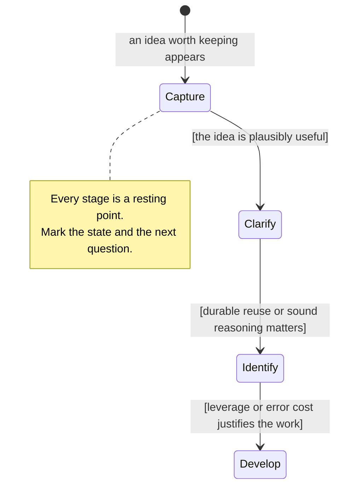

# Atomicity Model

This file covers the definition of atomicity, the kinds of building block, the
tests that separate focus from background, the growth stages, and how much
effort an idea deserves.

This model adapts Sascha's
[Complete Guide to Atomic Note-Taking](https://zettelkasten.de/atomicity/guide/),
retrieved on 2026-08-15. The link records attribution only; the model below is
complete.

## Define the atom by its job

Atomicity is a direction of work toward one independently addressable building
block per note. A building block is the complete unit a future reader would
reuse, test, or connect for one reason.

Classify the focal building block before calling a note atomic:

| Building block        | Question that identifies it                                                                                    |
| --------------------- | -------------------------------------------------------------------------------------------------------------- |
| Concept               | Which part of the world does this define or set apart?                                                         |
| Argument              | Which premises support which conclusion?                                                                       |
| Counterargument       | Which inference or conclusion does this challenge, and how?                                                    |
| Model                 | Which entities and part-to-part or part-to-whole relationships does this represent?                            |
| Hypothesis or theory  | Which claim about reality could evidence support or refute, and does it belong to a larger explanatory system? |
| Empirical observation | What was observed, under which conditions?                                                                     |

Use this as an inspection tool, not required metadata. A problem-and-solution
pair, a mechanism, a comparison, or another coherent unit may stay together when
separating it would destroy the job a future reader needs.

## Separate focus from background

Judge atomicity by focus, not word count. A note may need examples, definitions,
evidence, boundaries, or related parts to make its focal block understandable.
That material is background when readers would not reuse it apart from the
focus.

Use these tests together:

1. **Naming:** Can a precise declarative title or concept name the focus?
2. **Completeness:** Is every part the building block needs present?
3. **Removal:** Can any passage disappear without weakening the focus?
4. **Independent reuse:** Would a reader link to one passage for a reason that
   does not depend on the focus?
5. **Forward motion:** Would a future reader know how to use or continue the
   idea?

A title with `and` or `with` is only a warning. Keep a relational claim together
when the relationship is the building block. Split when two parts pass the
completeness and independent-reuse tests on their own.

## Grow in four stages

A note climbs this ladder only as far as its expected value carries it:

1. **Capture:** Write the thought freely enough to keep it. Do not demand
   atomicity before the thinking exists.
2. **Clarify:** Improve the title and content together. Add missing context,
   remove unrelated material, and write a one-sentence summary when it exposes
   the focus.
3. **Identify:** Classify the focal building block. Check its parts and their
   relationships instead of trusting brevity or intuition.
4. **Develop:** Add evidence, implications, perspectives, or connections when
   the idea deserves deeper treatment. Extract any independently useful block
   this reveals as a new note starting at capture.

The stages describe growth, not separate storage areas.

## Match effort to expected value

Choose the stopping point from the best available evidence about relevance to an
active project or responsibility, expected reuse, the cost of being wrong or
incomplete, the strength of supporting evidence, and the user's interest in
developing the idea.

Stop at the last stage the evidence supports, and keep the provisional status of
anything captured cheaply. Revisit the choice when later writing or new
connections reveal more value.
