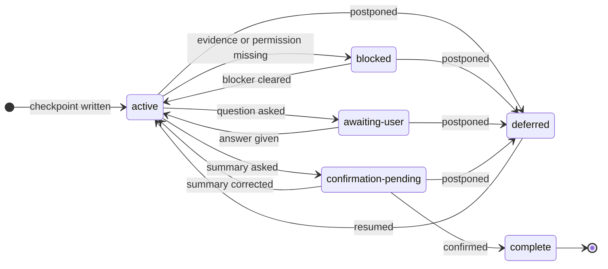

# Grilling session schema

This file covers where a session record lives, what it holds, and when it must
be rewritten. Read it before the first write of any session.

## Where the record lives

Fix the task's initial workspace root and keep it for the whole session. Do not
swap it for a repository root found later or for a folder the session moves
into. When the host shows several roots and ownership is unclear, ask which root
should hold the record.

Create new records at:

```text
<workspace-root>/.ptlam-agent-plugin/ptlam-grilling/<YYYY-MM-DD>_<title>.md
```

Use the session's creation date and a short, filesystem-safe title naming the
decision. Prefer the base filename; otherwise append the first free suffix
before `.md`, such as `_2`. Never overwrite or truncate a record.

Running the skill allows writes to this folder and the selected record, to the
domain context the domain-modeling dependency resolves, and to qualifying ADRs
at the ADR dependency's destination. Get separate permission before staging,
committing, publishing, or changing any other project file.

The record stores conclusions and evidence. It never stores a transcript, hidden
reasoning, secrets, credentials, or unrelated personal data.

## When to rewrite it

Rewrite the record after an answer or new evidence changes the map, before
yielding with the next question, before any summary or handoff, and whenever the
status changes. Replace stale state with current conclusions. Never append a
transcript. The record must make sense without the chat.

## Structure

Use this structure for every record. Leave out a section only when it truly does
not apply. Replace placeholders with the session's facts.

```markdown
# Grilling session: <descriptive title>

- Status: <active | awaiting-user | confirmation-pending | deferred | blocked |
  complete>
- Created: <timestamp>
- Updated: <timestamp>
- Workspace root: <absolute initial workspace path>

## Outcome and scope

<Intended outcome, eventual result or action, constraints, and non-goals.>

## Evidence

<Verified facts with source paths or links and verification dates.>

## Decision map

### Resolved

<User-owned decisions with answers, reasons, and consequences.>

For a structural decision, keep the judgment's constraints, frame, deferred
concerns with their signals, and redesign trigger with the answer. A deferred
concern is not a deferred decision.

### Assumptions, risks, and contradictions

<Accepted assumptions, current risks, contradictions, and invalidated branches.>

### Deferred

<Deferred decisions with owner and consequence.>

### Open decisions

<Unresolved decisions in dependency order.>

## Current checkpoint

Current question: <question or none> Recommendation: <answer and reason or none>
Strongest alternative: <alternative or none> Main trade-off:
<consequence or none> Resume from: <one exact instruction for the next agent>
```

## Status lifecycle

Carry exactly one status, and move it only along an edge of this lifecycle:



`complete` is the only status a later session may not resume.
