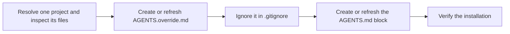

# PTLam Setup

Install or refresh PTLam's general agent instructions in one project. Run this
only when the user explicitly asks to initialize or update those instructions.

The bundled `PTLAM_AGENTS.md` asset is the source of truth for
`AGENTS.override.md`. The override outranks the project-specific guidance in
`AGENTS.md` and stays local to the project.

<!-- PLUGIN-COMPILER:REQUIRED-SKILLS -->

## How are the defaults installed without replacing project rules?



| File                 | Ownership                                                   |
| -------------------- | ----------------------------------------------------------- |
| `AGENTS.override.md` | Exact copy of `assets/PTLAM_AGENTS.md`, replaced as a whole |
| `.gitignore`         | Project-owned ignores plus the `AGENTS.override.md` entry   |
| `AGENTS.md`          | Project-owned instructions plus one managed block           |

## 1. Resolve the project and its current state

1. Resolve one project root from the user's path or the active workspace. Never
   target a home folder or a parent that holds several projects.
2. Inspect `AGENTS.md`, `AGENTS.override.md`, `.gitignore`, and the working tree
   when the project uses version control. Leave unrelated and in-progress
   changes alone.
3. Read [PTLam's agent instructions](assets/PTLAM_AGENTS.md) in full. That asset
   is the exact content of `AGENTS.override.md`.

Done when the project root is unambiguous, all three files were inspected, and
the asset is loaded.

## 2. Create or refresh `AGENTS.override.md`

1. When the file is absent, create it as an exact copy of the asset.
2. When it already matches byte for byte, leave it alone.
3. When it differs, replace the whole file with the asset. Do not merge or keep
   content from the old file; project-specific instructions belong in
   `AGENTS.md`.

Done when `AGENTS.override.md` matches the asset byte for byte.

## 3. Ignore `AGENTS.override.md`

1. When `.gitignore` is absent, create it with `AGENTS.override.md` as its only
   entry.
2. When it already contains that exact entry, leave it alone.
3. Otherwise add `AGENTS.override.md` on its own line and keep every existing
   rule and comment.
4. When the project uses Git, verify that Git ignores the file. If it is already
   tracked or a later negation rule exposes it, report that without changing the
   index or unrelated rules.

Done when `.gitignore` holds the entry and the handoff names any tracked-file or
negation conflict.

## 4. Link the override from `AGENTS.md`

Make sure `AGENTS.md` holds exactly one copy of this managed block:

<!-- prettier-ignore -->
```markdown
<!-- PTLAM-SETUP-SKILL:START -->

## AGENTS.override.md has precedence

Read [AGENTS.override.md](AGENTS.override.md). It has precedence over this file.

<!-- PTLAM-SETUP-SKILL:END -->
```

1. When `AGENTS.md` is absent, create it with the block as its whole content.
2. Count both the `PTLAM-SETUP-SKILL` marker pair and the older `PTLAM-INIT`
   pair. Stop on a missing mate, reversed order, a duplicate pair, or a file
   holding both pairs.
3. When the file holds exactly one balanced current or older pair, replace only
   that block with the block above.
4. When the file has no pair, insert the block after its first level-one
   heading, or at the top when there is none.
5. Keep everything outside the managed block unchanged.

Done when `AGENTS.md` holds the block exactly once and the project's own
guidance is intact.

## 5. Verify and hand off

1. Confirm all three files exist at the project root.
2. Confirm `AGENTS.override.md` matches the asset byte for byte.
3. Confirm `.gitignore` holds the entry and report whether Git ignores the file.
4. Confirm the relative link resolves and the managed block matches byte for
   byte.
5. Inspect the final diff. Report what changed, where, the checks performed, and
   any tracked-file, negation, or marker conflict.

Finish when the three files form an installation that can be run again with no
further change and the project's own guidance is intact.
