# PTLam Health Connector Architecture

Explain how one Health Connector behavior crosses the Flutter monorepo, or judge
which boundary should own a proposed change. Base every answer on the current
checkout; paths and committed configuration outrank neighboring `CLAUDE.md`
summaries.

This skill owns the repository's structure and contracts: package direction,
library audiences, the Pigeon channel, the Android and iOS layers, and the
platform limits. The loaded architecture skill owns the judgment a change
receives; this skill supplies the structure it judges. Not this skill:
environment setup, diagnosing one failing run, whole-diff review, feature
implementation, or language style.

<!-- PLUGIN-COMPILER:REQUIRED-SKILLS -->

## How does one SDK call reach a platform store?

```mermaid
flowchart LR
    App["Flutter application"] --> Facade["health_connector facade"]
    Facade --> PlatformClient["Dart platform client"]
    PlatformClient --> PigeonContract["Pigeon contract and generated channel"]
    PigeonContract --> NativePlugin["Kotlin or Swift plugin entry point"]
    NativePlugin --> NativeClient["Native client"]
    NativeClient --> Handler["Service or record handler"]
    Handler --> PlatformStore["Health Connect or HealthKit"]
```

The return path crosses the same boundaries in reverse: platform records, native
DTOs, Pigeon, Dart DTO mappers, domain records.

## 1. Explain a call path

1. Name the operation, its caller, the supported platforms, and its public
   result or failure. Done when the contract can be stated without naming an
   implementation.
2. Find the owning package and entry library with
   [workspace and API surfaces](references/workspace-and-api-surfaces.md). Done
   when dependency direction and audience are explicit.
3. Trace the call and return paths through
   [the platform channel](references/platform-channel.md). Done when every
   handoff and generated surface has an owner.
4. Read the native branch that applies: [Android](references/android.md),
   [iOS](references/ios.md), or both. Done when the client, service or handler,
   mapper, concurrency boundary, and host-app precondition are covered.
5. For a proposed change, check it against the public API, error-code,
   platform-support, privacy, and generated-code contracts those references
   name. Done when the change is placed by one layer's table or found to add,
   move, or publish a boundary.

Return the literal path and the state transformed at each boundary. Done when
each claim points to current source or committed configuration and every
material platform difference is visible.

## 2. Judge where a change belongs

Enter this step when the request asks where a change belongs, or whether a
boundary or public API change is suitable. Run step 1 for the behavior it
touches, then hand the loaded architecture skill that path as the current state
and these project facts as its inputs:

| Its input                        | This project supplies                                                                                                            |
| -------------------------------- | -------------------------------------------------------------------------------------------------------------------------------- |
| Question: system boundary        | The packages, libraries, channel surfaces, and native layers the change touches                                                  |
| Current state: published surface | Public Dart exports and `@since` history, data-type ids, Pigeon DTOs and methods, error-code strings, `supportedHealthPlatforms` |
| Demand                           | Consumers of the public library and the Flutter, Android, and iOS versions they run                                              |
| Platform limits                  | The Health Connect and HealthKit constraints in the native references and the promises in workspace and API surfaces             |
| Compatibility window             | Consumers of the public library, the Android API floor, and the iOS deployment floor, from committed configuration               |
| Data sensitivity                 | Health values, record ids, user-owned dates, and device names, which never cross the logging boundary                            |
| Cost of failure                  | A breaking SDK release, a hand-edited generated file, or an error code that differs between Dart, Kotlin, and Swift              |

Treat package dependency direction, generated-file ownership, and the
cross-language error-code contract as fixed constraints, never as options. Add
to the judgment's report the smallest owning layer, the interfaces it may use,
every layer that must stay unchanged, and each platform-specific consequence.

Finish when the judgment rests on the traced path and every input above points
to current source or committed configuration.
