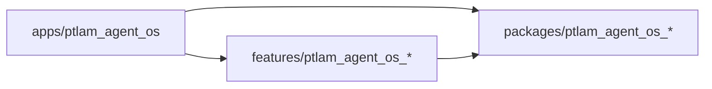

# File Organization

Where the `src/app` monorepo puts apps, features, and packages, what each kind
publishes, and where a monorepo-level file goes. The loaded Flutter skill owns
placement inside a feature's four layers.

## Three package kinds

```text
src/app/
├── .fvmrc
├── pubspec.yaml                          # pub workspace members and Melos scripts
├── apps/
│   └── ptlam_agent_os/                   # the runnable app for web and macOS
│       ├── pubspec.yaml                  # depends on features and packages
│       ├── analysis_options.yaml         # includes analysis_options.flutter.yml
│       ├── lib/
│       │   ├── main.dart                 # runs the app only
│       │   └── app/
│       │       ├── app.dart              # MaterialApp, theme, localization delegates
│       │       ├── app_router.dart       # one GoRouter composed from feature routes
│       │       ├── di.dart               # registers packages, then each feature
│       │       └── settings.dart         # typed application configuration, when needed
│       ├── test/                         # tests for app-owned code
│       ├── integration_test/             # end-to-end journeys
│       └── test_driver/
├── features/
│   └── ptlam_agent_os_<feature>/
│       ├── pubspec.yaml                  # depends on packages only
│       ├── analysis_options.yaml         # includes analysis_options.flutter.yml
│       ├── build.yaml                    # generators this feature uses, when any
│       ├── lib/
│       │   ├── ptlam_agent_os_<feature>.dart   # public surface
│       │   └── src/
│       │       ├── <feature>_di.dart     # register<Feature>Feature(GetIt)
│       │       ├── application/          # dtos, ports, use_cases
│       │       ├── domain/               # entities, value_objects, failures
│       │       ├── infrastructure/       # adapters, data_sources
│       │       ├── presentation/         # bloc, pages, widgets, routes
│       │       └── i18n/                 # one catalog per locale
│       └── test/
│           ├── test_doubles/             # doubles shared across levels
│           ├── integration/              # mirrors lib/src
│           ├── golden/
│           └── unit/                     # mirrors lib/src
└── packages/
    └── ptlam_agent_os_<package>/
        ├── pubspec.yaml                  # depends on packages only
        ├── analysis_options.yaml         # .dart.yml, or .flutter.yml when it imports Flutter
        ├── lib/
        │   ├── ptlam_agent_os_<package>.dart   # public surface
        │   └── src/                      # flat; no layers
        └── test/
```

| Kind    | Purpose                                                  | Structure                                     |
| ------- | -------------------------------------------------------- | --------------------------------------------- |
| App     | Composes features and packages into one runnable product | `lib/main.dart` and `lib/app/`; no layers     |
| Feature | One product capability the operator can name             | The four layers under `lib/src/`              |
| Package | One reusable boundary with no product logic              | `lib/src/` organized by what the package does |

The loaded skill's single-package tree (`lib/features/`, `lib/packages/`,
`lib/integrations/`, `lib/shared/`) does not apply here. Each of those folders
is a package of its own in this monorepo.

## Dependencies point one way



A feature never lists another feature in its `pubspec.yaml`. Pub does not reject
that edge, so check the dependency list when you add one. When two features need
the same code, move it to a package. When one feature needs another's behavior,
[composition.md](composition.md#joining-features-in-the-app) owns the port the
app fulfills.

## Adding a feature or package

1. Name it `ptlam_agent_os_<name>` and make the folder name match.
2. Set `resolution: workspace` and `publish_to: none` in its `pubspec.yaml`, and
   include the matching `ptlam_agent_os_lints` options file.
3. Confirm the root `pubspec.yaml` `workspace:` list covers its folder, then run
   `melos bootstrap` from `src/app`.
4. Add it to each dependent's `pubspec.yaml` with `fvm dart pub add`.

## One file spells the published surface

`lib/ptlam_agent_os_<name>.dart` exports what the app may use and nothing else.
For a feature that is its pages, its route declarations and route list, its
register function, and the domain types that cross to the app. Infrastructure
never leaves the feature. Everything under `lib/src/` is private.

## Where a monorepo-level file goes

| Adding                                                      | Put it in                                                              |
| ----------------------------------------------------------- | ---------------------------------------------------------------------- |
| A widget two features render                                | `packages/ptlam_agent_os_design_system/lib/src/components/`            |
| `AppLogger`                                                 | `packages/ptlam_agent_os_logger/`                                      |
| The client for the PTLam Agent OS API                       | `packages/ptlam_agent_os_api_client/`, generated from the API contract |
| A client or plugin wrapper for another external system      | `packages/ptlam_agent_os_<system>/`                                    |
| Code two features share                                     | A package named for what it does                                       |
| The router, dependency wiring, theme, or an app-only screen | `apps/ptlam_agent_os/lib/app/`                                         |

A package earns its place when its second consumer appears. Until then the code
belongs to the feature that has it. A feature's `infrastructure/clients/` exists
only for an API no package wraps; a data source in
`infrastructure/data_sources/` adapts a client package to the feature's ports.

Name a port implementation after its source: `OrdersRepository` is the port in
`application/ports/`, `ApiOrdersRepository` its adapter in
`infrastructure/adapters/`.
