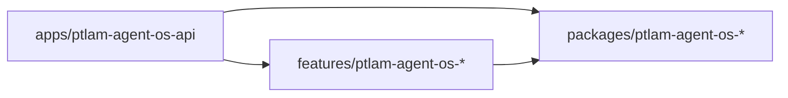

# Composition

How the app composes feature modules and how one feature reaches another without
depending on it. The loaded skill owns the module API, tokens, scopes, and
dynamic modules.

## The app imports, features export

`AppModule` composes configuration, operations, package modules, and one module
per feature package; it owns no feature behavior. A feature's `index.ts`
re-exports its module and its public surface. The app adds a feature by
importing that module and nothing else.

## Dependencies point one way



A feature never lists another feature in its `package.json`. When two features
need the same code, move it to a package. When one feature needs another's
behavior, declare the need as a port in its own `application/ports/` and let the
app fulfill it:

```typescript
// apps/ptlam-agent-os-api/src/tasks-workflows/tasks-workflows.module.ts
@Module({
  imports: [TasksModule, WorkflowsModule],
  providers: [
    {
      provide: WORKFLOW_GATE, // token exported by the tasks feature
      inject: [ValidateTransitionUseCase], // use case exported by the workflows feature
      useFactory: (validate: ValidateTransitionUseCase) =>
        new WorkflowGateAdapter(validate),
    },
  ],
  exports: [WORKFLOW_GATE],
})
export class TasksWorkflowsModule {}
```

The requesting feature module imports nothing for that port; the app's join
module provides the token and `AppModule` imports both. When the joined behavior
is itself a product rule, write it as an app-owned use case rather than hiding
it in an adapter.

## Check the graph mechanically

pnpm rejects a dependency cycle between packages (`disallowWorkspaceCycles`),
and Biome rejects an import cycle or an undeclared dependency inside one. No
configured check rejects a feature-to-feature dependency, because that edge is
acyclic. Inspect `features/*/package.json` for a `ptlam-agent-os-` feature in
`dependencies` and report the missing automated check rather than implying the
graph was proven.

Finish when the app is the only package that imports feature modules, no feature
depends on a feature, and every cross-feature need is a port a join module
fulfills.
