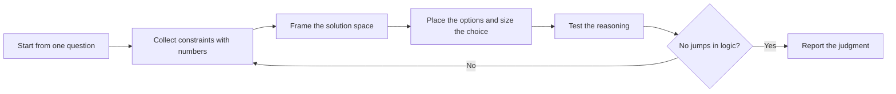

# PTLam Architecturing

Answer one architecture question with a clear judgment: which option fits, why,
what it gives up, what it assumes, and when to redesign. Size the answer for ten
times today's numbers, not for infinity.

An architecture question decides structure that is expensive to reverse: how a
system splits into components, runtimes, or data stores; a published surface
such as an API, SDK, CLI, schema, file format, or plugin interface; where the
true copy of state lives; or a commitment to a platform such as an OS, store,
device, or offline use.

Not this skill: code layout one team changes in one release, business
vocabulary, one failing run, or the written decision record on its own. This
skill does not interview; send an open decision back to the caller. It writes a
file only when the user names a destination.

<!-- PLUGIN-COMPILER:REQUIRED-SKILLS -->

## How does a question become a judgment?

## 1. Start from one question

Write the one decision this work informs and who makes it. Replace every
technology name in the request with the quality it stands for. Read the
applicable `AGENTS.md`, existing architecture documents, ADRs, and the domain
terms in `CONTEXT.md`. Treat each business context boundary as a candidate
component boundary.

Done when the question names the decision, the decision maker, and the system
boundary.

## 2. Collect constraints with numbers

Ask for a number before you estimate one. Label every estimate with its source.

| Constraint           | Unit by system kind                                                                   |
| -------------------- | ------------------------------------------------------------------------------------- |
| Demand               | Requests, events, records per window, installs, consumers, devices, or users          |
| Data volume          | Rows, records, files, or bytes per period, and how long they are kept                 |
| Platform limits      | OS versions, store rules, device memory and power, offline duration                   |
| Compatibility window | Hosts, versions, and consumers that must keep working                                 |
| Data sensitivity     | Regulated or personal data in scope, and the rules that govern it                     |
| Team                 | Size, skills on hand, budget, and deadline                                            |
| Horizon              | Expected lifespan and the measured growth curve                                       |
| Cost of failure      | An hour of downtime, a breaking release, a failed field update, a lost batch          |
| Investment driver    | Who funds the work, what drives it now, and the product risk beside the delivery risk |

Done when every constraint has a number or an explicit unknown, and the two or
three qualities that decide the question are named with their numbers.

## 3. Frame the solution space

Read [framing the solution space](references/framing-solution-space.md). It owns
the hidden dimensions behind common debates and the rules for a sketch.

When judging an existing design or proposal, first read
[judging suitability](references/judging-suitability.md). It owns the verdict
table and the old rules of thumb to re-check.

Done when everyone shares one frame with named dimensions before any option is
argued.

## 4. Place the options and size the choice

Put the current state and each option on the frame, including the simplest
option that meets today's numbers. Read
[sizing for scale](references/sizing-for-scale.md). It owns demand units,
starting shapes, what to defer, and redesign triggers.

Say which component owns each piece of authoritative state, and how the team
will watch the system run. This skill decides where boundaries fall; the
code-style rules decide what each crossing must obey.

Done when one option is recommended with its trade-offs, its deferred concerns,
and the trigger for the next redesign.

## 5. Test the reasoning

List every assumption the recommendation rests on, including the obvious ones.
Then ask the questions a decision maker asks. A jump in logic marks a hidden
assumption, a buried risk, or an answer chosen before the reasoning.

| Question                                                   | Gap it exposes                   |
| ---------------------------------------------------------- | -------------------------------- |
| Which alternatives were considered, and why did they lose? | A frame with one option on it    |
| Which measure defines success, and what is its number now? | A quality with no number         |
| What is the upfront cost, and what is the recurring cost?  | Cost hidden in a future budget   |
| Could the decision wait for a measured signal?             | Premature commitment             |
| Could a simpler shape start now and be upgraded later?     | A missing step on the frame      |
| Which assumption, if false, reverses the decision?         | The assumption nobody wrote down |

Done when a skeptical reader can follow every step from constraints to
recommendation without a jump.

## 6. Report the judgment

Use the loaded diagram skill for the frame or topology picture.

| Field            | Content                                                                |
| ---------------- | ---------------------------------------------------------------------- |
| Question         | The decision, the decision maker, and the system boundary              |
| Constraints      | Numbers, business terms, sources, unknowns, and the deciding qualities |
| Frame            | The named dimensions and where the current state and each option sit   |
| Recommendation   | The chosen option, or the verdict on an existing design                |
| Trade-offs       | What the choice gives up, and why that is acceptable now               |
| Assumptions      | Conditions that would change the recommendation if false               |
| Deferred         | Concerns left out until a signal, and the signal                       |
| Redesign trigger | The measured number, curve, or event that starts the next investment   |
| Open decision    | At most one user-owned question with a recommended answer, or none     |

After the user confirms the recommendation, run the loaded ADR skill's
qualification gate and return its verdict. Create the ADR file only when the
user asks for it.

Finish when every field is filled and the recommendation fits the stated needs
at the next order of magnitude.
