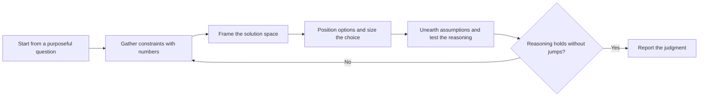

# PTLam Architecturing

Answer one system-level architecture question with a suitability judgment: a
recommendation or verdict sized for the next order of magnitude, with the
constraints, frame, trade-offs, assumptions, and redesign trigger behind it. An
architecture is suitable, not good: its conscious trade-offs match the job the
system must do.

An architecture question decides structure that is expensive to reverse in any
kind of system: a component, runtime, or data-store split; a published surface
such as an API, SDK, CLI, schema, file format, or plugin interface; where
authoritative state lives; or a platform commitment such as an OS, store,
device, or offline operation. Code structure one team changes in one release
belongs to code-style guidance, business vocabulary to domain modeling, one
failing run to diagnosis, and the record of a confirmed decision to the ADR
workflow.

This skill reads and reasons; it writes a file only when the user names a
destination. Only `ptlam-grilling` interviews.

<!-- PLUGIN-COMPILER:REQUIRED-SKILLS -->

## How does a question become a suitability judgment?

## 1. Start from a purposeful question

Write the one decision this work must inform and who acts on it. Replace every
technology name in the request with the quality it stands for. Read the
applicable `AGENTS.md`, existing architecture documents, ADRs, and `CONTEXT.md`
domain terms and context boundaries. Treat a context boundary as a candidate
component boundary.

Complete this step when the question names the decision, the decision maker, and
the system boundary it concerns.

## 2. Gather constraints with numbers

Ask for a number before estimating one. Label every estimate with its source.

| Constraint           | Unit by system kind                                                                     |
| -------------------- | --------------------------------------------------------------------------------------- |
| Demand               | Requests, events, records per window, installs, consumers, devices, or concurrent users |
| Data volume          | Rows, records, files, or bytes per period, and retention                                |
| Platform limits      | OS versions, store rules, device memory and power budget, offline duration              |
| Compatibility window | Hosts, versions, and consumers that must keep working                                   |
| Data sensitivity     | Regulated or personal data in scope, and the regime that governs it                     |
| Team                 | Size, skills on hand, budget, and deadline                                              |
| Horizon              | Expected lifespan and the measured growth curve                                         |
| Cost of failure      | An hour of downtime, a breaking release, a failed field update, a lost batch            |
| Investment driver    | Who funds the work, what drives it now, and the product risk beside execution risk      |

Complete this step when every constraint carries a number or an explicit
unknown, and the two or three qualities that decide the question are named with
their numbers.

## 3. Frame the solution space

Read [framing the solution space](references/framing-solution-space.md); it owns
the dimensions behind common debates, frame-then-position, and sketch semantics.

When judging an existing design or proposal, read
[judging suitability](references/judging-suitability.md) before framing. It owns
reconstructing the authors' needs and decisions, the verdict, and stale
heuristics.

Complete this step when the parties, or the reader, share one frame with named
dimensions before any option is argued.

## 4. Position options and size the choice

Place the current state and each option on the frame, including the simplest
option that meets today's numbers.

Read [sizing for the next order of magnitude](references/sizing-for-scale.md);
it owns demand units and starting shapes per system kind, deferral signals,
exceptions, day-zero concerns, inherent complexity, and redesign triggers.

Say which component owns each piece of authoritative state. Say how the team
will observe the system in the field. This skill decides where boundaries fall
and how many crossings they carry; the code-style boundaries, contracts, and
evolution rules own what each crossing must obey and how it migrates.

Complete this step when one option is recommended with its accepted trade-offs,
its deferred concerns, and the trigger for the next redesign.

## 5. Unearth assumptions and test the reasoning

List every assumption the recommendation rests on: what is always available,
what never changes, which heuristic decided a step. State each one even when it
reads as obvious.

Then ask the probes a decision maker asks. A jump in logic marks a hidden
assumption, a buried risk, or a decision reverse-engineered from a preferred
answer.

| Probe                                                          | Gap it exposes                   |
| -------------------------------------------------------------- | -------------------------------- |
| Which alternatives were considered, and why did they lose?     | A frame with one option on it    |
| Which measure defines success, and what is its number today?   | A quality with no number         |
| What is the upfront investment, and what is the recurring one? | Cost hidden in a future budget   |
| Could the decision be deferred until a measured signal?        | Premature commitment             |
| Could a simpler shape start now and be upgraded later?         | A missing step on the frame      |
| Which assumption, if false, reverses the decision?             | The assumption nobody wrote down |

Complete this step when a skeptical reader can follow every step from
constraints to recommendation without a jump.

## 6. Report the judgment

Apply the loaded diagram skill for the frame or topology visual.

| Field            | Required content                                                            |
| ---------------- | --------------------------------------------------------------------------- |
| Question         | The decision, decision maker, and system boundary.                          |
| Constraints      | Numbers, business terms, sources, explicit unknowns, deciding qualities.    |
| Frame            | The named dimensions and the positions of current state and options.        |
| Recommendation   | The chosen option, or the suitability verdict for an existing design.       |
| Trade-offs       | What the choice gives up, and why that is acceptable now.                   |
| Assumptions      | Conditions that would change the recommendation if false.                   |
| Deferred         | Concerns left out until a signal, and the signal.                           |
| Redesign trigger | The measured number, curve, or named event that starts the next investment. |
| Open decision    | At most one user-owned question with a recommended answer, or none.         |

After the user confirms the recommendation, apply the loaded ADR skill's
qualification gate and return its verdict. Creating the ADR file needs the
user's explicit request. Finish when every field is satisfied and the
recommendation is suitable for the stated needs at the next order of magnitude.
