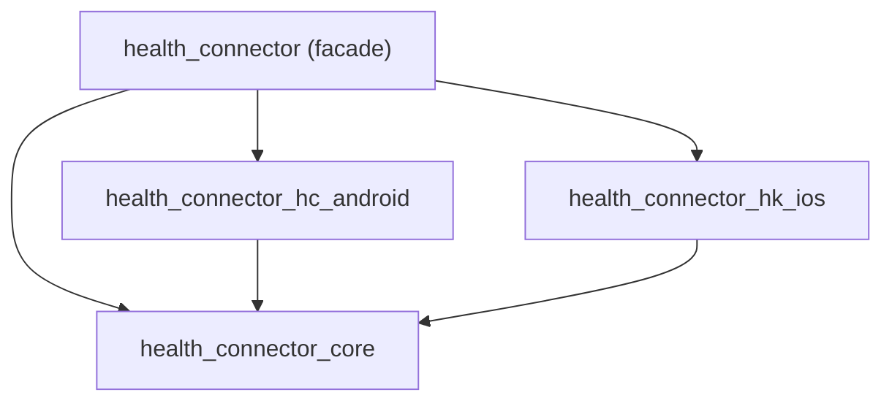

# PTLam Health Connector Dart Code Style

Conventions for the Dart code in the Health Connector plugin monorepo: the melos
workspace, the package boundaries, the sealed health-data-type and record
hierarchies, the Pigeon boundary, doc comments, logging, and tests. This skill
owns what is true of this repository only. Kotlin under
`packages/health_connector_hc_android/android/` belongs to
`ptlam-code-style-kotlin-health-connector`; Swift under
`packages/health_connector_hk_ios/ios/` belongs to
`ptlam-code-style-swift-health-connector`.

<!-- PLUGIN-COMPILER:REQUIRED-SKILLS -->

## Before the first edit

1. Run `fvm install` and `fvm use`, then confirm `fvm flutter --version` matches
   the version pinned in `.fvmrc`. Prefix every Dart and Flutter command in this
   repository with `fvm`.
2. Run `melos bootstrap` from the repository root and confirm it links every
   workspace package without a `dependency_overrides` block.
3. Read the root `pubspec.yaml`. It is the workspace manifest and the only place
   melos scripts and shared dependency versions are declared.
4. Name the package you are changing and the direction its dependencies may run,
   using [the package map](#the-package-map).

## The workspace

The root `pubspec.yaml` declares the package `health_connector_workspace` with a
`workspace:` list; every member package sets `resolution: workspace`. Its
`melos.command.bootstrap` block declares `meta` as a shared dependency and
`mocktail`, `parameterized_test`, `pigeon`, and `test` as shared dev
dependencies. Change a shared version there, not in a member package.

Run scripts as `melos run <name>` from the repository root.

| Script                | Runs                                             | Applied to                 |
| --------------------- | ------------------------------------------------ | -------------------------- |
| `analyze:dart`        | `dart analyze .`                                 | every package with `lib/`  |
| `analyze:dart:strict` | `dart analyze --fatal-infos --fatal-warnings .`  | every package with `lib/`  |
| `format:dart`         | `dart format .`                                  | every package with `lib/`  |
| `format:dart:check`   | `dart format --set-exit-if-changed .`            | every package with `lib/`  |
| `test:dart`           | `flutter test`                                   | every package with `test/` |
| `test:dart:coverage`  | `flutter test --coverage`, then `genhtml`        | the selected package       |
| `pigeon`              | both Pigeon inputs, the Swift patch, then format | both platform packages     |
| `get`                 | `flutter pub get`, sequentially                  | every package with `lib/`  |
| `doc:generate`        | `dart doc .`                                     | `health_connector` only    |

`melos run analyze`, `melos run analyze:strict`, and `melos run format` also run
the Swift and Kotlin tools. Use the `:dart` variants while iterating on Dart.

## The package map

| Package                       | Owns                                                                            |
| ----------------------------- | ------------------------------------------------------------------------------- |
| `health_connector`            | The public facade: `HealthConnector` and `HealthConnectorImpl`                  |
| `health_connector_core`       | Domain models, `HealthConnectorPlatformClient`, annotations, validation helpers |
| `health_connector_hc_android` | `HealthConnectorHCClient`, the Android Pigeon DTOs, and their mappers           |
| `health_connector_hk_ios`     | `HealthConnectorHKClient`, the iOS Pigeon DTOs, and their mappers               |
| `health_connector_logger`     | `HealthConnectorLogger` and its log processors                                  |
| `health_connector_lint`       | `lib/analysis_options.yaml`; the package contains no Dart code                  |



Each of those four packages also depends on `health_connector_logger`, which
depends on nothing else in the repository. All five take `health_connector_lint`
as a dev dependency. A platform package never imports the facade or the other
platform package; core never imports a platform package.

## Logging

`avoid_print` is enabled, so every package logs through
`HealthConnectorLogger.debug`, `.info`, `.warning`, or `.error`.

```dart
HealthConnectorLogger.info(
  tag,
  operation: 'readRecords',
  message: 'Records read successfully',
  context: {'record_count': records.length, 'has_more': response.hasMore},
);
```

Pass the tag positionally. Instance code uses the `tag` getter that
`ObjectNameExtension` adds to every `Object`; a static or interface member
declares its own `static const _tag`. Keep `context` keys `snake_case` and their
values scalars or counts. On a failure path, log `.error` with `exception:` and
`stackTrace:` before you rethrow.

## Pick a reference

| Concern                                                                          | Reference                                                               |
| -------------------------------------------------------------------------------- | ----------------------------------------------------------------------- |
| Adding a health data type end to end on the Dart side                            | [adding-a-health-data-type.md](references/adding-a-health-data-type.md) |
| Deciding what a package exports, or marking an API internal or experimental      | [api-surface.md](references/api-surface.md)                             |
| Changing a lint rule, or resolving an analyzer message specific to this repo     | [analyzer-contract.md](references/analyzer-contract.md)                 |
| Extending a sealed hierarchy, a `part` file set, or a capability interface       | [domain-hierarchies.md](references/domain-hierarchies.md)               |
| Writing a record's constructor, bounds, `copyWith`, equality, or a unit type     | [record-authoring.md](references/record-authoring.md)                   |
| Editing a Pigeon input, regenerating, or writing a mapper                        | [pigeon-boundary.md](references/pigeon-boundary.md)                     |
| Marking platform or version support, or promising behavior across both platforms | [platform-support.md](references/platform-support.md)                   |
| Writing a public API doc comment or a dartdoc category                           | [doc-comments.md](references/doc-comments.md)                           |
| Placing a test, choosing its test package, or injecting a platform client        | [testing.md](references/testing.md)                                     |

## Finish

Finish when `melos run format:dart:check` and `melos run analyze:dart:strict`
report nothing, `melos run test:dart` passes, `melos run pigeon` leaves no diff
if you touched a Pigeon input, and the handoff names every check you did not
run.
