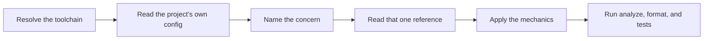

# PTLam Flutter Code Style

Conventions for Flutter application code: the toolchain, the layering, the
source tree, the widgets, the logging, and the tests. This skill owns the
Flutter mechanics only; the foundation owns the standard they satisfy.

<!-- PLUGIN-COMPILER:REQUIRED-SKILLS -->

## At a glance

## Before the first edit

1. Resolve the Flutter version through FVM. Never invoke a globally installed
   `flutter`; every command in this skill runs as `fvm flutter …`.
2. Establish which project you are in:

   | Project | Version policy |
   | --- | --- |
   | New | Latest stable Flutter and latest stable packages |
   | Existing | Read `.fvmrc`, `pubspec.yaml`, and `pubspec.lock`, then match them |

3. Read `analysis_options.yaml`. It, `pubspec.lock`, and `.fvmrc` are the source
   of truth for this project; the references below describe the intended
   baseline, not the resolved one.

## Pick a reference

| Concern | Reference |
| --- | --- |
| Choosing the SDK, adding a package, running code generation | [toolchain.md](references/toolchain.md) |
| Placing a layer; choosing `setState`, `Cubit`, or `Bloc`; wiring dependencies | [architecture.md](references/architecture.md) |
| Adding a file or a feature; deciding what a feature exports | [file-organization.md](references/file-organization.md) |
| Naming, formatting, imports, `const`, and analyzer exceptions | [dart-style.md](references/dart-style.md) |
| Building a widget, splitting one, or using `BuildContext` | [widgets.md](references/widgets.md) |
| Defining a DTO, a domain model, a failure, or a Freezed union | [models.md](references/models.md) |
| Calling an API, or reading and writing anything that persists | [networking-and-storage.md](references/networking-and-storage.md) |
| Adding or changing user-visible text | [localization.md](references/localization.md) |
| Emitting a log record | [logging.md](references/logging.md) |
| Writing a doc comment or an explanatory comment | [documentation.md](references/documentation.md) |
| Writing, placing, or restructuring a test | [testing.md](references/testing.md) |

## A check failed — where to look

| Failing check | Reference |
| --- | --- |
| `fvm flutter analyze`, a `very_good_analysis` lint | [dart-style.md](references/dart-style.md) |
| `dart format` reports a diff | [dart-style.md](references/dart-style.md) |
| `build_runner` fails, or a `*.g.dart` / `*.freezed.dart` is missing | [toolchain.md](references/toolchain.md) |
| A generated route or `strings.g.dart` symbol is undefined | [localization.md](references/localization.md) (Slang), [architecture.md](references/architecture.md) (routes) |
| Flutter SDK or Dart SDK constraint mismatch | [toolchain.md](references/toolchain.md) |
| `pumpAndSettle` times out, or a `blocTest` expectation never arrives | [testing.md](references/testing.md) |

## Finish

Finish when the touched code satisfies the reference for its concern,
`fvm flutter analyze` and `dart format --output=none --set-exit-if-changed .`
report nothing, the affected tests pass, and every check you could not run is
named in the handoff.
