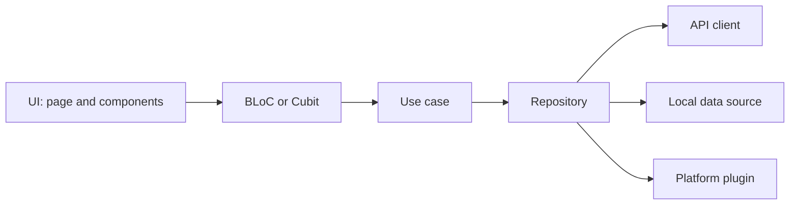

# Architecture and State

The layer chain, the state holders, and dependency wiring. The
`ptlam-code-style` foundation owns the one-direction dependency rule these
layers satisfy.

Every dependency points one way. A layer may skip nothing and may never call
back toward its caller.



## What each layer may know

| Layer | May depend on | Never touches |
| --- | --- | --- |
| UI | Its own BLoC or Cubit, design system, localization | Repositories, data sources, Dio, plugins |
| BLoC or Cubit | Use cases, models | `BuildContext`, widgets, another BLoC |
| Use case | Repositories, models | Widgets, `BuildContext`, HTTP or storage APIs |
| Repository | API clients, data sources, plugins, models | Widgets, BLoCs, use cases |
| API client, data source, plugin adapter | Its one external system, models | Anything above it |

Every layer speaks in models. A layer converts foreign shapes into models at its
own boundary, so nothing above it sees a `Response`, a `SharedPreferences` key,
or a plugin exception.

A layer with nothing to add is still worth keeping when it names the boundary. A
use case that only forwards to a repository is fine; a use case that exists to
satisfy a diagram is not — inline it.

## Choose the smallest state holder

Use [`flutter_bloc`](https://pub.dev/packages/flutter_bloc) for BLoCs and
Cubits. Use
[`bloc_concurrency`](https://pub.dev/packages/bloc_concurrency) when an event
handler needs an explicit ordering policy.

| Situation | Use |
| --- | --- |
| Ephemeral state no other widget or rule observes | `setState`, `ValueNotifier`, or a controller |
| A small synchronous view model, such as one local form step | `Cubit` |
| Multiple external event sources, cancellation, or recovery | `Bloc` |

A simple one-shot action may stay a `Cubit`. Promote to `Bloc` when a second
event source appears, not in anticipation of one.

One page observes one primary state holder. When a page needs a second, ask
whether the second belongs to a child component or to a separate feature.

## BLoC rules

- A BLoC exposes domain or view state. Never a Dio response, a persistence
  record, a plugin exception, or a provider claim.
- A BLoC never takes `BuildContext`, a widget, or another BLoC as a dependency.
- Declare an explicit concurrency transformer from `bloc_concurrency` on any
  handler where ordering matters. Silence here means "concurrent", which is
  rarely what the workflow wants.
- Close every subscription the BLoC opens in `close()`.

### Keep one BLoC library in three authored files

Keep the BLoC, event, and state in separate files. Make the event and state
files parts of the BLoC library so Freezed produces only
`orders_bloc.freezed.dart`:

[models.md](models.md#freezed-for-immutable-data) owns the Freezed package and
union rules. This section owns the BLoC library layout.

```dart
// orders_bloc.dart
import 'package:flutter_bloc/flutter_bloc.dart';
import 'package:freezed_annotation/freezed_annotation.dart';

part 'orders_event.dart';
part 'orders_state.dart';
part 'orders_bloc.freezed.dart';

final class OrdersBloc extends Bloc<OrdersEvent, OrdersState> {
  OrdersBloc() : super(const OrdersState.initial());
}
```

```dart
// orders_event.dart
part of 'orders_bloc.dart';

@freezed
sealed class OrdersEvent with _$OrdersEvent {
  const factory OrdersEvent.started() = OrdersStarted;
}
```

```dart
// orders_state.dart
part of 'orders_bloc.dart';

@freezed
sealed class OrdersState with _$OrdersState {
  const factory OrdersState.initial() = OrdersInitial;
}
```

The BLoC file owns the only `*.freezed.dart` directive. Never add a generated
part directive to the event or state file.

### Connecting two BLoCs

Do not inject one BLoC into another. Connect them in the widget layer: a
`BlocListener` observes the first and dispatches an event to the second.

The widget layer is where the composition is visible and where the lifecycle is
already managed. An injected BLoC hides the edge and outlives the page that
created it.

## Composition and routing

`app_dependencies.dart` holds every
[`get_it`](https://pub.dev/packages/get_it) registration and nothing else.
Register concrete adapters, repositories, and use-case factories there.

Feature code receives its dependencies through constructors. Resolving from the
service locator inside a BLoC, use case, or repository puts the container in the
call graph and makes the class untestable without it.

Routes live in `app_router.dart` and are declared with
[`go_router`](https://pub.dev/packages/go_router) and
[`go_router_builder`](https://pub.dev/packages/go_router_builder), so route
names and parameters are checked at compile time. Navigate through the
generated route objects, never through a hand-written path string.

Wrap platform permissions behind a feature-owned adapter built with
[`permission_handler`](https://pub.dev/packages/permission_handler). Business
layers depend on the adapter contract, never the package API.
