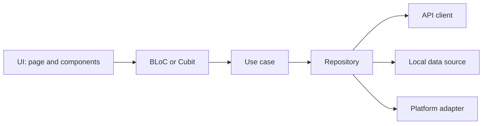

# Architecture

The Flutter layer map, repository boundary, and dependency composition. The
`ptlam-code-style` foundation owns the one-direction dependency rule this map
satisfies.

## What each layer may know

| Layer | May depend on | Never touches |
| --- | --- | --- |
| UI | Its own BLoC or Cubit, design system, localization | Repositories, data sources, Dio, plugins |
| BLoC or Cubit | Use cases, models | `BuildContext`, widgets, another BLoC |
| Use case | Repositories, models | Widgets, `BuildContext`, HTTP or storage APIs |
| Repository | API clients, data sources, adapters, models | Widgets, BLoCs, use cases |
| Client, data source, adapter | Its one external system, boundary types | Anything above it |

Every layer speaks in models. Convert a foreign response, stored record, or
plugin result at the boundary that owns it, so nothing above the repository
sees a `Response`, storage key, or plugin exception.

Keep a layer when it names a real boundary. A use case that only forwards to a
repository is fine when that boundary carries product meaning; a use case that
exists only to satisfy the diagram should be inlined.

## One repository per concern

A repository composes the clients, data sources, and platform adapters for one
concern and presents one domain-shaped API. It owns policy the layers above
should not know:

- which source answers first and what happens when it fails;
- what a missing stored value falls back to; and
- when a local change is mirrored remotely.

A use case asks the repository for a concern. It never chooses between a cache
and a network call itself. The repository converts boundary exceptions into
the domain failures owned by [models.md](models.md).

## Dependency composition

`app_dependencies.dart` holds every
[`get_it`](https://pub.dev/packages/get_it) registration and nothing else.
Register concrete adapters, repositories, and use-case factories there.

Feature code receives dependencies through constructors. Resolving from the
service locator inside a BLoC, use case, or repository puts the container in
the call graph and makes the class untestable without it.

Wrap platform permissions behind a feature-owned adapter built with
[`permission_handler`](https://pub.dev/packages/permission_handler). Business
layers depend on the adapter contract, never the package API.
