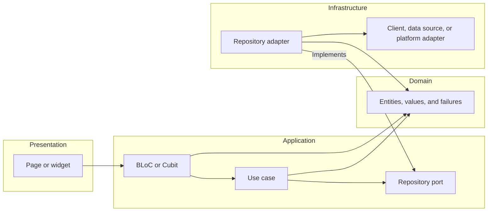

# Architecture

The Flutter feature-layer map, application ports, infrastructure adapters, and
dependency composition.

## See the feature dependency direction

BLoCs and Cubits are application state holders. They translate user intent into
use-case calls and expose renderable state without owning widget or I/O
mechanics.

## Make dependencies point inward

| Layer             | Owns                                                               | May depend on                                  | Never touches                                   |
| ----------------- | ------------------------------------------------------------------ | ---------------------------------------------- | ----------------------------------------------- |
| `presentation/`   | Pages, widgets, feature routes, and UI effects                     | Application state holders and domain values    | Ports, repositories, data sources, Dio, plugins |
| `application/`    | BLoCs, Cubits, use cases, and ports                                | Domain types                                   | Widgets, `BuildContext`, HTTP or storage APIs   |
| `domain/`         | Entities, value objects, business rules, and stable failures       | Nothing outside the domain                     | Flutter, application, persistence, or plugins   |
| `infrastructure/` | Port implementations, DTOs, clients, data sources, and SDK bridges | Application ports, domain types, external APIs | Presentation or application orchestration       |

Presentation dispatches intent to one application state holder. A state holder
calls use cases, and use cases depend on application ports. Infrastructure
adapters implement those ports and map external values to domain values.

Keep a layer when it names a real boundary. A use case that only forwards to a
repository port is valid when that operation carries product meaning; one that
exists only to satisfy the tree should be inlined.

## One repository port per concern

Put the repository contract under `application/ports/` and its implementation
under `infrastructure/adapters/`. The adapter composes clients, data sources,
and platform adapters for one concern and presents one domain-shaped API.

The implementation owns infrastructure policy the layers above should not know:

- which source answers first and what happens when it fails;
- what a missing stored value falls back to; and
- when a local change is mirrored remotely.

A use case calls the port. It never chooses between a cache and a network call.
The infrastructure adapter converts boundary exceptions into the domain failures
owned by [models.md](models.md).

## Compose dependencies at the application root

`app/di.dart` holds every [`get_it`](https://pub.dev/packages/get_it)
registration and nothing else. Register infrastructure adapters under their
application-port types, then construct use cases and application state holders.

Feature code receives dependencies through constructors. Resolving from the
service locator inside a BLoC, use case, port implementation, or widget hides
the dependency edge and makes the class untestable without the container.

Treat each constructor edge as an explicit contract:

| Edge                     | Input                          | Output                       | Authority                                                    |
| ------------------------ | ------------------------------ | ---------------------------- | ------------------------------------------------------------ |
| Widget to state holder   | User intent and view lifecycle | Renderable state             | Dispatches intent; cannot select data sources                |
| State holder to use case | Domain command or query        | Domain result or failure     | Coordinates application state; cannot perform I/O            |
| Use case to port         | Domain-shaped request          | Domain entity or failure     | Applies product policy; cannot select transport mechanics    |
| Adapter to boundary      | DTO or boundary parameters     | Boundary result or exception | Selects sources and converts failures; cannot update widgets |

Wrap platform permissions behind a feature-owned infrastructure adapter built
with [`permission_handler`](https://pub.dev/packages/permission_handler).
Application and domain code depend on the port, never the package API.

Finish when every feature dependency points inward, BLoCs and Cubits live in
`application/`, presentation reaches infrastructure only through application
state holders and use cases, infrastructure implements application ports, and
domain code imports no Flutter or external-system mechanic.
