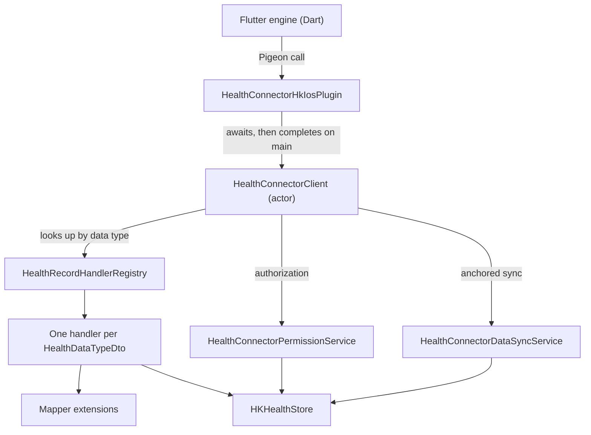

# Layers of the iOS Native Package

The path a Pigeon call takes, what each layer may do, and where a new file
belongs. Put a change in one layer; a change that touches three is a sign the
responsibility was assigned wrongly.

## How does a Pigeon call reach HealthKit?

## Give each layer one job

| Layer         | Type                            | Owns                                                                  | Must not                                         |
| ------------- | ------------------------------- | --------------------------------------------------------------------- | ------------------------------------------------ |
| Entry point   | `HealthConnectorHkIosPlugin`    | Pigeon conformance, client lifetime, logging setup, main-thread reply | Query HealthKit, convert DTOs, hold domain logic |
| Orchestration | `HealthConnectorClient` (actor) | Input validation, handler lookup, response DTO assembly               | Contain per-record-type query or unit logic      |
| Lookup        | `HealthRecordHandlerRegistry`   | Data type to handler, capability check                                | Call HealthKit                                   |
| Handler       | One per `HealthDataTypeDto`     | HealthKit reads, writes, deletes, aggregation for its type            | Touch Pigeon completion handlers                 |
| Service       | Permission and data sync        | Cross-type authorization and anchored sync                            | Know about individual record types               |
| Mapper        | Extensions in `mappers/`        | DTO to HealthKit conversion and back                                  | Perform I/O, decide policy, or log at info level |
| Utility       | Extensions in `utils/`          | Reusable conversions and Info.plist validation                        | Depend on a handler, service, or the client      |

The entry point holds the only `HealthConnectorClient`, created lazily inside
`initialize(config:completion:)` behind an `NSLock` and built by the throwing
factory `HealthConnectorClient.getOrCreate()`. That factory refuses to build a
client when `HKHealthStore.isHealthDataAvailable()` is false or when the host
app's Info.plist is missing a usage description.

The client keeps its own `HKHealthStore` reference for the few operations that
cross handler boundaries: the atomic batch `save` in `writeRecords`, workout
route attachment, route permission checks, and the exercise-route query. Do not
widen that list. Anything scoped to a single record type belongs in a handler.

## Services take the work no handler can own

| Service                            | Kind                            | Responsibility                                                                                                             |
| ---------------------------------- | ------------------------------- | -------------------------------------------------------------------------------------------------------------------------- |
| `HealthConnectorPermissionService` | `struct`                        | Builds `HKObjectType` read sets and `HKSampleType` write sets from permission DTOs, requests authorization, reports status |
| `HealthConnectorDataSyncService`   | `struct`, `@unchecked Sendable` | Runs one `HKAnchoredObjectQuery` across many types, encodes and decodes the anchor, and pages the result                   |

Both take the `HKHealthStore` by initializer injection from the client. Both
conform to `Taggable` so their logging tag is their own type name. Add a service
only when work spans data types; per-type work is a handler.

## Mappers are extensions, and the direction is in the name

Every mapper is an extension on the type being converted, never a free function
or a converter class. The `toX` prefix names the destination.

| File or directory                                        | Owns                                                                                                                        |
| -------------------------------------------------------- | --------------------------------------------------------------------------------------------------------------------------- |
| `mappers/health_record_mappers/HealthRecordMapper.swift` | The two dispatch switches: `HealthRecordDto.toHKSample()` and `HKSample.toDto()`                                            |
| `mappers/health_record_mappers/<Type>RecordMapper.swift` | One record type in both directions, such as `StepsRecordDto.toHKQuantitySample()` and `HKQuantitySample.toStepsRecordDto()` |
| `mappers/HealthDataTypeMapper.swift`                     | `HealthDataTypeDto.toHKSampleType()`, the single source of type identity                                                    |
| `mappers/PermissionMapper.swift`                         | Permission DTO to HealthKit sample types                                                                                    |
| `mappers/SortOrderMapper.swift`                          | `SortOrderDto` to a HealthKit sort identifier and direction                                                                 |
| `mappers/HealthConnectorErrorMapper.swift`               | Error translation, described in [errors.md](errors.md)                                                                      |
| `mappers/HealthConnectorLogMapper.swift`                 | `OSLogType` to `HealthConnectorLogLevelDto`                                                                                 |
| `mappers/metadata_mapper/`                               | `MetadataBuilder`, `MetadataMapper`, and one typed key per concern under `metadata_keys/`                                   |
| `mappers/health_data_type_mappers/`                      | Small enum-to-enum conversions such as `InsulinDeliveryReasonDto`                                                           |

A new record type adds one file under `health_record_mappers/` and one `case` to
each dispatch switch in `HealthRecordMapper.swift`. Both switches end in a
`HealthConnectorError.invalidArgument`, so a missing case fails at runtime, not
at compile time. Add the case in the same commit as the handler.
