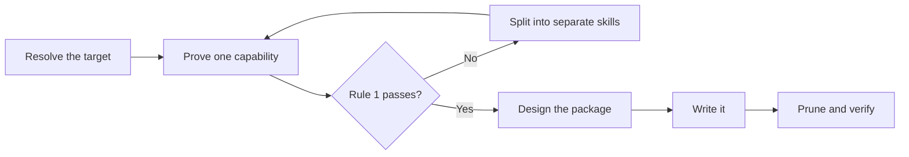

# PTLam Creating Skills

Create, review, or refactor one agent-skill package that a maintainer can read
once and a future agent can execute.

<!-- PLUGIN-COMPILER:REQUIRED-SKILLS -->

## Two rules

**Rule 1 — one skill, one capability.** A skill owns one responsibility, one
kind of result, and one standard for being done. Keep create, review, and
repair branches together only when all three match.

**Rule 2 — the maintainer reads it first.** Someone has to understand this
package well enough to change it later. A package only an agent can follow is
not finished.

When a file runs long, split it or cut from it. Never buy the space by packing
two ideas into one denser sentence.

## At a glance

## 1. Resolve the target

1. Name the operation: create, refactor, or review. A review changes no files.
2. Find the target repository, skill directory, and host. The current directory
   is not automatically the target.
3. Read the target's repository instructions, its neighboring skills, and its
   host schema, generator, and validators.
4. Write down which files you author, which a generator owns, who owns the
   metadata, and which side effects you are allowed.

Done when the operation, the files you may change, and the available checks are
named.

## 2. Prove it is one capability

When defining or challenging a skill boundary, read
[skill atomicity and composition](references/skill-atomicity.md). It owns the
capability tests, the keep-or-split decision, and the composition rules.

Write one line for each: the responsibility, the artifact the skill produces or
judges, its branches, its inputs, its acceptance standard, and the skills it
depends on. Then apply Rule 1 to what you wrote.

If Rule 1 fails, list each skill the split produces with its capability,
trigger, output, and the edge that joins it to the others. Continue with the
skills the user approves.

Done when Rule 1 passes for one capability, or the split map accounts for every
capability you found.

## 3. Design the package

When designing or reshaping a package, read
[package layout](references/skill-package-layout.md). It owns what each
directory holds, the file-length limit, and when detail leaves `SKILL.md`.

Assign guidance for each supporting resource—the tools, services, packages,
sources, or materials a workflow relies on—to the workflow that uses it. Keep
guidance shared by the normal path in `SKILL.md`; route conditional guidance to
that workflow's owning reference and point there instead of repeating it.

Choose how the skill starts:

| Choose | When |
| --- | --- |
| Model invocation | An agent should find the skill on its own |
| User invocation | Only the person should start it |
| A router skill | Routing several skills is useful work by itself |

For each skill this one depends on, state the load order, its inputs, its
outputs, what it may change, and who wins on conflict.

When a foundation and specialization compose, build the ownership map required
by [skill atomicity and composition](references/skill-atomicity.md#compose-without-duplicating-ownership).
Classify every specialization rule before writing it; link to the foundation
instead of paraphrasing shared behavior.

Done when the file tree and reading order exist, invocation is chosen, every
dependency edge is written down, and any foundation-specialization ownership
map has no unclassified rule.

## 4. Write it

Read [writing for maintainers](references/writing-for-maintainers.md) before
any prose. It owns reading order, sentence shape, the order to try visual
forms in, and what to cut. When that order settles on a diagram, apply the
required `ptlam-mermaiding` skill to author or judge it.

Read [prompting best practices](references/prompting-best-practices.md) when
the skill steers non-trivial reasoning, tool use, output shape, or autonomy.

Say what to do before what to avoid. Use a prohibition only for a guardrail
with no positive form, and name the permitted behavior beside it.

Write the metadata against the target's schema and its metadata owner: one
trigger per branch, no synonyms, and a reach clause when another skill should
compose this one. Read [frontmatter specification](references/skill-frontmatter-spec.md)
when the target uses Claude-style inline YAML.

Tests, evals, benchmarks, graders, and trigger tuning stay outside this skill.

Done when every branch runs without hidden context, every step ends in
something someone can check, and the target accepts the metadata.

## 5. Prune and verify

Delete everything
[writing for maintainers](references/writing-for-maintainers.md#delete-these-on-sight)
lists. Then reapply Rule 1, run the validators the target provides, inspect the
tree and the diff, and check every changed file:

| Check | Passes when |
| --- | --- |
| Capability | Rule 1 holds and every dependency names its owner. |
| Composition | The foundation stays complete; each specialization rule adds a mechanic, tightens the domain, or links to its owner. |
| Layout | Every file has a consumer and fits its limit; each split earns its navigation cost through ownership, conditional loading, or readability. |
| Disclosure | `SKILL.md` holds the whole normal path; each reference sits one hop away behind a condition named there and nowhere else. |
| Readability | Titles, headings, and visual labels alone reveal the path and how it ends. |
| Visual form | Each point sits in the highest form that fits it, replaces the prose it stands in for, and passes `ptlam-mermaiding` when it is a diagram. |
| Metadata | Name, directory, description, and invocation agree with the host. |
| Freshness | Nothing duplicated, stale, unused, or placeholder remains; links resolve. |

Report what changed, where, which checks ran and what they returned, which
checks were unavailable, and what is still uncertain. Do not claim an
effectiveness you did not measure.

Complete the task when both rules hold, the checklist passes, and every
authored and generated file is current.
