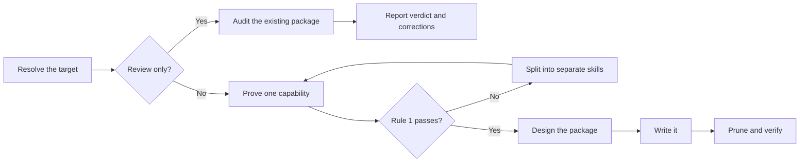

# PTLam Creating Skills

Create, review, or refactor one agent-skill package that a maintainer can read
once and a future agent can execute.

<!-- PLUGIN-COMPILER:REQUIRED-SKILLS -->

## Two rules

**Rule 1 — one skill, one capability.** A skill owns one responsibility, one
kind of result, and one standard for being done. Keep create, review, and repair
branches together only when all three match.

**Rule 2 — the maintainer reads it first.** Someone has to understand this
package well enough to change it later. A package only an agent can follow is
not finished.

## How does a skill reach a verdict or finished package?

## 1. Resolve the target

1. Name the operation: create, refactor, or review.
2. Find the target repository, skill directory, and host. The current directory
   is not automatically the target.
3. Read the target's repository instructions, its neighboring skills, and its
   host schema, generator, and validators.
4. Write down which files you author, which a generator owns, who owns the
   metadata, and which side effects you are allowed.

Done when the operation, the files you may change, and the available checks are
named.

For a review, read [reviewing skills](references/reviewing-skills.md), apply
step 2, skip steps 3 and 4, then finish with the review branch of step 5.

## 2. Prove it is one capability

When defining or challenging a skill boundary, read
[skill atomicity and composition](references/skill-atomicity.md). It owns the
capability tests, the keep-or-split decision, and the composition rules.

Write one line for each: the responsibility, the artifact the skill produces or
judges, its branches, its inputs, its acceptance standard, and the skills it
depends on. Then apply Rule 1 to what you wrote.

If Rule 1 fails, list each resulting skill with its capability, trigger, output,
and composition edge. A review reports that split. A change continues only with
the skills the user approves.

Done when Rule 1 passes for one capability, or the split map accounts for every
capability you found.

## 3. Design the package

For create or refactor, read
[package layout](references/skill-package-layout.md). It owns what each
directory holds, the file-length limit, and when detail leaves `SKILL.md`.

Assign guidance for each supporting resource—the tools, services, packages,
sources, or materials a workflow relies on—to the workflow that uses it. Keep
guidance shared by the normal path in `SKILL.md`; route conditional guidance to
that workflow's owning reference and point there instead of repeating it.

Read [composing skills](references/composing-skills.md). It owns invocation,
dependency interfaces, and foundation-specialization ownership.

Done when the file tree and reading order exist and the composition contract
passes.

## 4. Write the package

For create or refactor, read
[writing for maintainers](references/writing-for-maintainers.md) before any
prose. It owns reading order, sentence shape, the order to try visual forms in,
and what to cut. When that order settles on a diagram, apply the required
`ptlam-mermaiding` skill to author or judge it.

Read [prompting best practices](references/prompting-best-practices.md) when the
skill steers non-trivial reasoning, tool use, output shape, or autonomy.

Say what to do before what to avoid. Use a prohibition only for a guardrail with
no positive form, and name the permitted behavior beside it.

Write the metadata against the target's schema and its metadata owner: one
trigger per branch, no synonyms, and a reach clause when another skill should
compose this one. Read
[frontmatter specification](references/skill-frontmatter-spec.md) when the
target uses Claude-style inline YAML.

Tests, evals, benchmarks, graders, and trigger tuning stay outside this skill.

Done when every branch runs without hidden context, every step ends in something
someone can check, and the target accepts the metadata.

## 5. Prune and verify

Read [verifying skills](references/verifying-skills.md). It owns pruning,
package checks, the final report, and completion for every operation.
