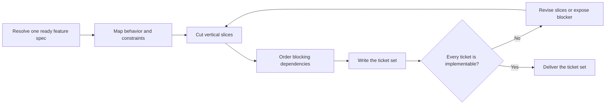

# PTLam Planning Tickets

Turn one ready feature specification into one ordered ticket set whose files are
vertical implementation slices. The ticket set owns work decomposition and
blocking edges; it does not change feature behavior, invent architecture, or
publish work to an external tracker.

<!-- PLUGIN-COMPILER:REQUIRED-SKILLS -->

## How does a ready feature spec become implementable tickets?

Only `ptlam-grilling` interviews. This skill decomposes confirmed specification
content and never asks a second discovery sequence.

## 1. Resolve the spec and destination

Require one feature spec with status `ready`. Stop when it is draft, blocked,
missing traceability, or internally contradictory. A new product or large epic
must reach the PRD first; a feature inside an existing product starts at the
spec; a small fix skips this pipeline.

Read applicable `AGENTS.md` files before resolving paths. Use their ticket
location when defined; otherwise use
`<project-root>/docs/specs/<feature>/tickets/`.

Invocation authorizes creating that directory, its `README.md`, and numbered
ticket files. It does not authorize overwriting existing tickets, changing the
spec, changing code, publishing tracker items, or performing Git operations.

Complete this step when the source spec, project root, empty or authorized
destination, and file authority are explicit.

## 2. Map the implementation obligations

Read the complete spec and the repository evidence it cites. Build a map from
behavior IDs to contracts, data lifecycles, failure paths, rollout constraints,
and required evidence. Preserve deliberate implementation freedom.

Record missing outcome-changing detail as a spec blocker. Do not repair the spec
inside a ticket or convert an assumption into a requirement.

Complete this step when every spec behavior and constraint has one disposition
in the work map and no ticket needs to invent product behavior.

## 3. Slice vertically

Make each ticket deliver one observable path through the relevant layers. A
slice should be independently reviewable and verifiable, even when another
ticket must land first.

Prefer the smallest end-to-end walking path, then extend behavior, failure
handling, data lifecycle, compatibility, and rollout in coherent increments.
Avoid separate database, API, UI, or test tickets that have no user- or
operator-visible outcome. When enabling work cannot be vertical, name its first
consumer and keep it smaller than that consumer.

Complete this step when every ticket owns one outcome, every spec behavior is
covered once or deliberately shared, and no slice is merely a technical layer.

## 4. Order dependencies

Assign stable IDs in execution order. For each ticket, name `Blocked by` and
`Blocks` edges using those IDs. An earlier file may depend on no later file.
Split or reorder any cycle instead of hiding it in prose.

Complete this step when the dependency graph is acyclic, every edge is present
at both endpoints, and the numbered filenames form a valid implementation order.

## 5. Write and verify the ticket set

Read [the ticket set schema](references/ticket-set-schema.md). It owns the
overview file, ticket shape, filename rule, and readiness checks.

Verify that each acceptance statement is observable, each proof obligation comes
from the spec, and the dependency visual matches the ticket edges. Report the
directory, ticket count, ordered IDs, checks, and blockers.

Complete the task when every schema check passes and an implementer can take the
first unblocked ticket without recovering context from chat.
