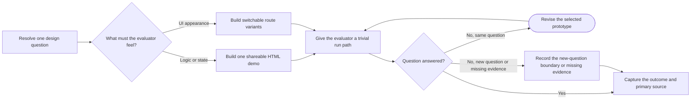

# PTLam Prototyping

Build one runnable, throwaway prototype that answers one design question for a
developer or non-developer evaluator. The question selects a logic demo or a UI
variant route.

After evaluation, the complete prototype is the primary source: evidence of what
the evaluator saw, even though none of its code ships.

This skill does not build an MVP, production feature, technical benchmark, or
durable demo.

<!-- PLUGIN-COMPILER:REQUIRED-SKILLS -->

## How does one question choose and finish a prototype?

| Boundary   | Contract                                                                                    |
| ---------- | ------------------------------------------------------------------------------------------- |
| Question   | One design decision and the observation that would answer it.                               |
| Logic      | One self-contained HTML file with free play, guided scenarios, and visible state.           |
| UI         | Three to five structurally different variants on one route with a visible switcher.         |
| Production | The validated decision may transfer; prototype code does not.                               |
| Authority  | Local prototype writes are in scope; commits, pushes, and issue changes need authority.     |
| Completion | The evaluator can run it, the answer or missing evidence is recorded, and capture is clear. |

## 1. Resolve the target and branch

1. Read the request, every applicable `AGENTS.md`, and the relevant existing
   module or page. Inspect current behavior before changing it.
2. State one question and the decision its answer will change. Ask when an
   ambiguity would select different artifacts. If no answer is available, infer
   from the target: a backend module selects logic; a page or component selects
   UI. Put that assumption inside the prototype.
3. Select and read exactly one branch:

| Question                                                                   | Branch                       |
| -------------------------------------------------------------------------- | ---------------------------- |
| Does this business logic, state model, data shape, or method surface work? | [Logic](references/logic.md) |
| What should this page, component, layout, or interaction look like?        | [UI](references/ui.md)       |

After selecting the branch:

1. Resolve a conspicuously named prototype location close to the target module
   or page. Follow the existing project and routing conventions. For tracked
   application changes, first isolate the work through the injected Git
   workflow.
2. Define the evidence, the smallest useful scope, the handover path, and every
   permitted side effect. Building authorizes local prototype files. It does not
   by itself authorize a commit, push, issue update, or production change.

Complete this step when the question, branch, destination, evidence, run path,
and authority are explicit.

## 2. Build the selected artifact

Apply the selected branch, then these shared rules:

1. Make the question and throwaway status visible in the artifact.
2. Give the evaluator one obvious way to start it. A logic demo opens directly;
   a UI prototype uses one task-runner or local-serve command and one surfaced
   URL.
3. Keep prototype-owned state in memory and use representative synthetic data by
   default. Retain existing read-only UI data only after resolving its access,
   privacy, evaluator, and capture effects. When persistence is the question,
   use a scratch database or file whose name says it is safe to wipe.
4. Implement only what makes the question evaluable. Skip test suites,
   generalized abstractions, broad error handling, and unrelated polish.
5. Surface the full relevant state after every logic action or UI variant switch
   without making prototype controls look like product UI.

Complete this step when the artifact runs through its promised entry point, the
question is visible, and the evaluator can see what each action changes.

## 3. Hand over, observe, and revise

Give the evaluator the exact file or URL, command when needed, available logic
scenarios or UI variant keys, and the one question to judge. Wait for human
feedback when the answer depends on feel or preference; never invent it.

Repair a broken artifact and rerun it. Revise freely while new feedback still
tests the same question. Stop when the question is answered, the necessary
evidence is unavailable, or the next change would test a different question.

Complete this step when the answer traces to an observation or the missing
evidence is named.

## 4. Capture the answer and primary source

Record the question, answer, decisive observation, accepted logic or UI choice,
and remaining limitation in the implementation issue, commit, or handoff.

Treat the complete prototype as a primary source, not production code. When Git
capture and external writes are authorized, preserve it on a throwaway branch
outside the production branch. Place a pointer on the implementation issue when
one exists; otherwise include it in the handoff. Delegate branch, worktree,
staging, and commit mechanics to the injected Git workflow. Otherwise report the
exact capture effect still awaiting authority.

The production branch keeps only a fresh implementation of the validated
decision. It keeps no demo shell, switcher, losing variant, or shortcut merely
because the prototype worked.

Complete the task when the result is recorded, the prototype's preservation or
pending capture is explicit, and production code cannot be mistaken for the
throwaway artifact.
