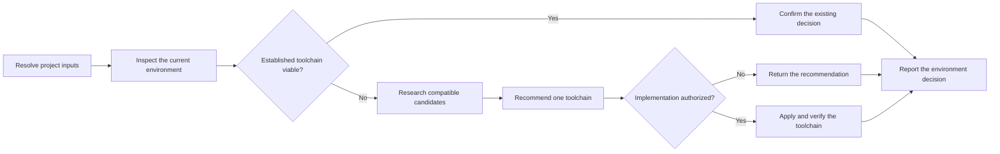

# PTLam Resolving a Testing Environment

Resolve, evaluate, recommend, or apply one viable testing environment and
toolchain for a project. Every branch produces the same environment decision
and verifies it against project constraints and required test risks.

<!-- PLUGIN-COMPILER:REQUIRED-SKILLS -->

## At a glance

## Environment contract

| Concern | Boundary |
| --- | --- |
| Primary decision | One execution environment and compatible testing toolchain for the required risks |
| Trigger | The environment is ambiguous, unverified, incompatible, missing, being replaced, or explicitly under review |
| Authority | Detection and recommendation are read-only; dependency or configuration changes require separate user or task authority |
| Context effect | Project testing context remains read-only; return suggested maintenance to `ptlam-managing-testing-context` |
| Acceptance | The decision is compatible, viable, evidence-backed, and either verified in the project or clearly marked as an unapplied recommendation |

## 1. Resolve inputs and inspect the project

Use a caller-provided `ptlam-managing-testing-context` read-only result when
available. Otherwise resolve the project root from explicit task paths and live
repository evidence. Treat context as an optional verified cache and never
write it from this skill.

Read repository instructions, manifests, lockfiles, build configuration, CI,
package boundaries, supported platforms, relevant decision records, existing
tests, fixtures, commands, and neighboring modules. Distinguish the execution
environment from the tools used to test it.

Identify the required unit, integration, and end-to-end risks; current runners,
assertion APIs, mocking dependencies, harnesses, and infrastructure; and version,
platform, CI, licensing, and dependency-policy constraints.

Complete this step when the project environment, required risks, current tools,
constraints, and implementation authority are explicit.

## 2. Confirm or reject the established toolchain

Reuse repository-approved tools when they support the required behavior and
environment without distorting test design. Treat existing dependencies and
tests as evidence rather than automatic approval.

Confirm installed-version compatibility with the runtime, supported platforms,
CI, and repository policy. Use the installed version's current official
documentation for APIs, lifecycle, configuration, and commands. Do not add a
second tool for the same role merely because it is familiar.

Complete this step when the established toolchain is confirmed viable or each
material reason it cannot satisfy the project is recorded.

## 3. Research a missing or unsuitable tool

Enter this step only when no established viable toolchain exists or the user
explicitly requests comparison.

1. Form a short candidate list, then verify current claims against official SDK
   or package documentation, source repositories, changelogs, and authoritative
   registries.
2. Keep only candidates compatible with current versions, platforms, CI, and
   dependency policy.
3. Compare support for the required test risks, Given-When-Then readability,
   public-seam testing, async behavior, isolation, determinism, cleanup,
   test-double needs, IDE and CI integration, maintenance, documentation,
   license, and repository fit.
4. Prefer official SDK-provided tooling when it satisfies the requirements;
   otherwise prefer the smallest maintained dependency that fits.
5. Label the recommendation provisional when current authoritative sources
   cannot be accessed.

Complete this step when one candidate is best supported by current evidence and
every rejected material alternative has a named trade-off.

## 4. Recommend or apply the decision

State the environment, current evidence, selected tools, material constraints,
and why the choice fits the required test risks.

Use an established viable tool directly when repository policy and task scope
make that use unambiguous. Add, replace, or reconfigure a tool only when the
user or encompassing task authorizes that project change. Preserve the package
manager, lockfile, repository layout, and current dependency policy.

Map each tool's taxonomy to the project's risk-based unit, integration, or
end-to-end levels. Return durable environment, command, test-root, and
preference facts as suggested context maintenance rather than writing them.

Complete this step when the decision is either an evidence-backed unapplied
recommendation or an authorized implementation with its exact file effects.

## 5. Verify and report

For an implementation, run the smallest command that proves the selected tool
loads and can execute its intended test level, then run broader configuration,
type, package, or CI-equivalent checks in proportion to the change. For a
recommendation, verify every current compatibility claim and state which
project checks remain unavailable until implementation.

Report the environment and tools, evidence and sources, versions or constraints,
exact commands and results, rejected alternatives with material trade-offs,
authorized file or dependency effects, read-only context state, suggested
context maintenance, and every uncertainty.

Complete the task when one viable established toolchain is confirmed or one
compatible recommendation is supported, all applied effects are authorized and
verified, and the handoff does not imply that an unapplied or unrun check passed.
