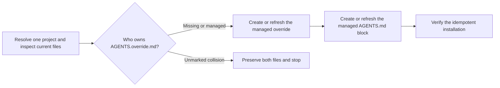

# PTLam Project Setup

Install or refresh PTLam's general agent instructions in one project. Run this
workflow only when the user explicitly asks to initialize or update those
instructions.

The bundled `PTLAM_AGENTS.md` reference is the source of truth for the managed
override. Project-specific guidance remains owned by `AGENTS.md`.

<!-- PLUGIN-COMPILER:REQUIRED-SKILLS -->

## How are PTLam defaults installed without replacing project rules?



## Managed files

| File                 | Ownership                                                                       |
| -------------------- | ------------------------------------------------------------------------------- |
| `AGENTS.override.md` | Exact generated copy of `references/PTLAM_AGENTS.md` when managed by this skill |
| `AGENTS.md`          | Project-owned instructions plus one managed link and precedence block           |

## 1. Resolve the project and current state

1. Resolve one project root from the user's explicit path or the active
   workspace. Never target a home directory or a parent containing several
   projects.
2. Inspect `AGENTS.md`, `AGENTS.override.md`, and the working-tree state when
   the project uses version control. Preserve unrelated and in-progress changes.
3. Read [PTLam's general agent instructions](references/PTLAM_AGENTS.md) in
   full. That reference owns the exact managed contents of `AGENTS.override.md`.

Complete this step when the project root is unambiguous, both destination files
have been inspected, and the bundled source is loaded.

## 2. Create or refresh `AGENTS.override.md`

1. When the file is absent, create it as an exact copy of the bundled source.
2. When it already matches byte for byte, leave it unchanged.
3. When it differs and contains the `PTLAM-INIT:MANAGED` marker, replace it with
   the bundled source. The marker identifies generated content; project-specific
   instructions belong in `AGENTS.md`.
4. When it differs and lacks the marker, preserve it and report the collision.
   Stop before editing `AGENTS.md`. Continue only with explicit authority to
   replace the unmarked file.

Complete this step when `AGENTS.override.md` matches the bundled source. A
preserved collision blocks installation and is the terminal result for this run.

## 3. Link the override from `AGENTS.md`

Enter this step only after `AGENTS.override.md` matches the bundled source.
Ensure `AGENTS.md` contains exactly one copy of this managed block:

```markdown
<!-- PTLAM-INIT:START -->

## PTLam preferences

Read [PTLam's general agent instructions](AGENTS.override.md) before this file.
Treat them as defaults. This `AGENTS.md` owns project facts, mechanics, domain
constraints, and any explicit replacement it names.
<!-- PTLAM-INIT:END -->
```

1. When `AGENTS.md` is absent, create it with `# Project agent instructions`
   followed by the managed block.
2. Count the start and end markers. Stop on a missing mate, reversed order, or
   more than one pair.
3. When the file contains exactly one balanced pair, replace only that block
   with the canonical block above.
4. When the file has no marker pair, insert the block after its opening
   level-one heading when present, or at the beginning otherwise.
5. Preserve all content outside the block. If an unmarked instruction already
   links to `AGENTS.override.md` and states both the always-load and precedence
   rules, treat it as equivalent and do not add a duplicate.

Complete this step when `AGENTS.md` links to the sibling override, always-load
and precedence are explicit once, and unrelated project guidance remains
unchanged.

## 4. Verify and hand off

1. Confirm both files exist at the project root.
2. Confirm `AGENTS.override.md` matches the bundled source byte for byte and has
   exactly one `PTLAM-INIT:MANAGED` marker.
3. Confirm the relative link resolves and the managed block matches the
   canonical block byte for byte.
4. Inspect the final diff. Report what changed, where, the checks performed, and
   any preserved collision.

Complete the workflow when the two files form an idempotent installation and
project-owned guidance is intact. A collision completes only the blocked
handoff; it does not count as an installation.
