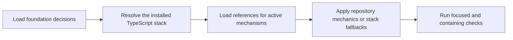

# PTLam Testing TypeScript

Apply `ptlam-testing` first, then use this specialization for framework-free,
browser-free TypeScript libraries, Node.js code, CLIs, and tooling built with
Vite, Vitest, and Vitest V8 coverage. The foundation owns behavioral testing;
this skill owns only stack mechanics left open by current repository evidence.

<!-- PLUGIN-COMPILER:REQUIRED-SKILLS -->

## At a glance

## 1. Start from the foundation decisions

1. Read the required `ptlam-testing` skill before choosing tools,
   configuration, placement, or test code.
2. Follow it to resolve the project root, mode, behavior, public seam, primary
   level, test-double boundary, TDD activation, audit authority, and
   verification depth.
3. Preserve every foundation invariant. Let an established repository layout
   own placement; use this specialization's source-adjacent rule only when the
   repository and user leave placement open.

Complete this step when all behavioral decisions and higher-precedence project
mechanics are explicit, leaving only TypeScript-stack choices unresolved.

## 2. Resolve the installed stack

1. Confirm the target is framework-free and browser-free TypeScript. For a web
   framework, DOM API, or browser runtime, return to the foundation and use a
   scope-specific specialization.
2. Inspect the package manifest, lockfile, package-manager declaration, Vite and
   Vitest configuration, TypeScript configuration, scripts, CI, and neighboring
   tests.
3. Reuse an established Vite/Vitest toolchain when it is compatible and viable.
   When setup or migration is in scope, select mutually compatible versions of
   Vite, Vitest, TypeScript, the runtime, and coverage provider through the
   repository's package manager and preserve its lockfile.
4. Treat the installed Vitest version and matching official documentation as
   the syntax authority. Verify version-sensitive options against that version.
5. Read
   [TypeScript and Vitest stack](references/typescript-vitest-stack.md) whenever
   configuring, writing, running, auditing, or diagnosing Vitest tests. It owns
   stack defaults, placement fallback, API preferences, coverage rules, and
   proof commands.

Complete this step when the scope, package manager, runtime, installed versions,
configuration owner, Node environment, and applicable stack preferences are
known.

## 3. Load references for active mechanisms

| Concern | Required Vitest references |
| --- | --- |
| Configuration, options, or scripts | [Configuration](references/vitest/core-config.md) and [CLI](references/vitest/core-cli.md) |
| Monorepos or several Node test groups | [Projects](references/vitest/advanced-projects.md) |
| Test and suite definitions | [Test API](references/vitest/core-test-api.md) and [describe API](references/vitest/core-describe.md) |
| Setup, teardown, or resource lifetime | [Lifecycle hooks](references/vitest/core-hooks.md) |
| Assertions, async expectations, custom matchers, or narrowing | [Expect API](references/vitest/core-expect.md) |
| Compile-time contracts | [Type testing](references/vitest/advanced-type-testing.md) |
| Mocks, spies, fake timers, module replacement, globals, or environment stubs | The foundation's test-double reference, then [mocking](references/vitest/features-mocking.md) and [`vi` utilities](references/vitest/advanced-vi.md) |
| Reusable fixtures or test context | [Test context and fixtures](references/vitest/features-context.md) |
| Worker pools, isolation, sharding, or concurrent tests | [Concurrency and parallelism](references/vitest/features-concurrency.md) |
| Selecting or listing tests | [Filtering](references/vitest/features-filtering.md) |
| Semantic test tags | [Test tags](references/vitest/features-test-tags.md) |
| Coverage | [Coverage](references/vitest/features-coverage.md) |
| CI or machine-readable output | [Reporters](references/vitest/features-reporters.md) |
| Snapshots | [Snapshot testing](references/vitest/features-snapshots.md) |

Load every reference required by an active mechanism and no unrelated API
reference. The bundled snapshot supplies versioned context; the installed
version's official documentation remains authoritative when they differ.

Complete this step when each active Vitest mechanism has one loaded source for
its implementation rules.

## 4. Apply the TypeScript stack contract

- Use the repository's established placement. When no placement owner exists,
  preserve the source basename and place runtime and type-contract tests beside
  the source: `foo.ts` maps to `foo.test.ts` and `foo.test-d.ts`.
- Group tests with `describe` and declare cases with `it`. Import used APIs
  explicitly from `vitest`; translate the upstream `test` alias and modifiers
  to `it`, such as `it.each` and `it.concurrent`.
- Use Vite for transformation and module resolution. Reuse project aliases and
  plugins without duplicating their definitions.
- Use Vitest's `node` environment. Browser Mode, `jsdom`, `happy-dom`, and other
  browser or DOM environments are outside this specialization.
- Prefer `@vitest/coverage-v8` unless repository or runtime evidence requires
  Istanbul compatibility.
- Keep globals disabled unless an established globals-based convention makes a
  migration disruptive or out of scope.
- Use `toMatchSnapshot` only when a complex output's complete stable structure
  is the behavior. Review the initial snapshot and every update.
- For language-specific expected output, await `toMatchFileSnapshot` with an
  explicit relative path and keep each language's golden file separate.
- Run TypeScript analysis separately because Vite transformation and ordinary
  Vitest execution do not prove whole-project type correctness.

Complete this step when every stack choice follows current repository evidence
or this skill's fallback, and each deviation has a concrete compatibility or
project-convention reason.

## 5. Verify and hand off

1. Run the smallest focused Vitest command in non-watch mode after each
   meaningful change.
2. Run the containing package or project suite, the repository's TypeScript
   check, and coverage when it is in scope or required.
3. Apply the foundation's broader verification and reporting contract.
4. State the resolved Vite, Vitest, coverage provider, TypeScript, runtime, and
   package-manager versions; exact commands and results; placement owner; and
   every skipped or unavailable check.

Complete the task when focused tests pass, proportional containing checks are
complete, TypeScript analysis is accounted for, and the handoff does not imply
that unrun coverage or type checks passed.
