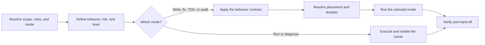

# PTLam Testing

Test observable behavior through the smallest public seam that can establish
the risk. A stack specialization adds the mechanics; this foundation decides
what a test must prove.

<!-- PLUGIN-COMPILER:REQUIRED-SKILLS -->

## At a glance

## Who decides what

For any mechanic these rules leave open, take the first source that answers it:

| Order | Source | Owns |
| --- | --- | --- |
| 1 | Current user instructions | Anything the user states for this task |
| 2 | Applicable `AGENTS.md` | Project requirements and permitted exceptions |
| 3 | Current repository files | Established commands, configuration, and layout |
| 4 | The active specialization | Stack mechanics the repository leaves open |
| 5 | This skill | The behavior contract, and the fallbacks it points to |

Report an unresolved conflict instead of choosing silently. Repository files
are evidence, not a second store of preferences.

No source may remove these: Given-When-Then, public-seam behavior,
independently derived expectations, deterministic cleanup, nearest-scope
reusable doubles, read-only audits, and TDD only when the user asks for it by
name.

## 1. Resolve scope, rules, and mode

1. Resolve the target project from the user's paths and current worktree. Read
   the current user instructions and every applicable `AGENTS.md` from the
   project root down to the files in scope.
2. Choose one mode:

   | Mode | Authority | Uses steps |
   | --- | --- | --- |
   | Write or fix | Create or change tests; make only authorized production changes | All |
   | Run or diagnose | Execute tests or isolate a failure; project files stay read-only | 1, 2, 5, 6 |
   | Audit | Inspect and report; fixing needs a separately selected write-or-fix mode | All |
   | TDD | Red-Green-Refactor, only when the user asks for test-first work by name | All |

3. Read only the manifests, test configuration, neighboring production code,
   existing tests, scripts, and CI that the selected mode needs.

Done when the project, the mode, the change authority, the applicable rules,
and the relevant repository evidence are known.

## 2. Define behavior, risk, and level

1. State the observable behavior or failure risk in the repository's domain
   language.
2. Choose the smallest clear public seam. Ask only when materially different
   seams would change behavior, cost, or confidence.
3. Select exactly one primary level:
   [unit](references/test-levels/unit.md),
   [integration](references/test-levels/integration.md), or
   [end-to-end](references/test-levels/e2e.md). Add a second only when it covers
   a distinct risk without duplicating assertions.
4. Select the active stack specialization. When none of the available ones
   matches, report the unsupported scope instead of inventing a toolchain.

Done when the task has a behavior, a public seam where one applies, one primary
level, and an active specialization.

## 3. Apply the universal behavior contract

Read [the behavior contract](references/behavior-contract.md) and apply it to
every test you plan. It owns the rules that no repository convention,
specialization, or tool document may remove.

Done when every planned test states one observable risk and satisfies that
contract, before any stack mechanic is chosen.

## 4. Resolve placement and doubles

Read [test placement](references/patterns/test-placement.md) when the repository
and the specialization both leave placement open. It owns the fallback layout
and the rules for relocating a misplaced test.

Read [test doubles](references/patterns/test-doubles.md) whenever a double is
present or proposed. It owns the semantic roles, the boundary choice, the
placement, the lifecycle, and the false-confidence safeguards.

Done when one source owns placement, every new test has an unambiguous
location, and every double has a justified boundary and a nearest common owner.

## 5. Run the selected mode

| Mode | Follow |
| --- | --- |
| Run or diagnose | [run or diagnose](references/modes/run-and-diagnose.md) |
| Write or fix | [write or fix](references/modes/write-and-fix.md) |
| TDD | [test-driven development](references/modes/test-driven-development.md) |
| Audit | [audit](references/modes/audit.md) |

Follow only the selected mode's file. Each one owns its actions, its limits,
and its finish condition.

## 6. Verify and hand off

1. Run the smallest focused test after each meaningful change.
2. Once the focused tests pass, run the containing package or module suite.
3. Run stack-specific and repository-wide checks in proportion to the risk, the
   mode, and any applicable user or `AGENTS.md` requirement.
4. Report the level, the active specialization, the changed behavior and files,
   the exact commands and their results, and every skipped or unavailable check.
5. Disclose remaining risks, migrations, conflicts, unsupported scope, and
   unresolved decisions.

Complete the task when the selected mode has one verified outcome, every file
effect stayed inside its authority, and the handoff never implies that an unrun
check passed.
