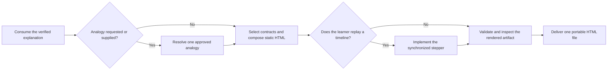

# PTLam Visualization with HTML

Create or revise one portable HTML explainer that lets a learner see and, when
useful, manipulate a system. The artifact uses native HTML, CSS, JavaScript, and
inline SVG. It opens directly, with no framework, build step, CDN, web server,
sibling file, or external runtime asset.

This skill builds focused learning artifacts. App-shell navigation, pickers,
floating actions, menus, dialogs, and sheets belong to a general application or
site workflow instead.

<!-- PLUGIN-COMPILER:REQUIRED-SKILLS -->

## How does an explanation become a portable HTML artifact?



## Read for every artifact

| Reference                                                                     | Owns                                                                    |
| ----------------------------------------------------------------------------- | ----------------------------------------------------------------------- |
| [design-system baseline](references/design-system/design-system.md)           | The token and component system the scaffold emits, and how to extend it |
| [accessibility](references/design-system/foundations/accessibility.md)        | Contrast, focus, semantics, and assistive-technology behavior           |
| [content design](references/design-system/foundations/content-design.md)      | Visible wording, localization, alternative text, and truncation         |
| [interaction](references/design-system/foundations/interaction.md)            | States, targets, and input handling                                     |
| [layout](references/design-system/foundations/layout.md)                      | Grid, spacing, and responsive structure                                 |
| [document shell](references/design-system/patterns/layouts/document-shell.md) | Page frame, header, and section rhythm                                  |

## 1. Consume the explanation and resolve the artifact

Start from the required `ptlam-explaining` skill's explanation package. Consume
its Goal, Presentation, Model, Explanation, and Limits fields. Do not rebuild or
quietly change any of them here.

Resolve the output path, and whether the task creates or revises an artifact.
Inspect an existing artifact before changing it. Decide whether the result is
literal-only, needs a new analogy, or already contains a user-supplied one.

Done when the destination and change authority are clear, one verified
foundation explanation supplies every literal fact, and the analogy branch is
known.

## 2. Resolve the optional analogy

Use an analogy only when the user explicitly asks for one, or supplies an
already selected analogy model. Otherwise carry the `ptlam-explaining` literal
model into step 3 unchanged.

For either analogy case, follow
[the analogy branch](references/analogy-branch.md). It owns how to reach that
skill's analogy branch and how to accept or reject an analogy. Then load the
selected rendering contracts directly:

| When                                      | Read                                                                                |
| ----------------------------------------- | ----------------------------------------------------------------------------------- |
| Any selected analogy                      | [analogy mapping](references/design-system/patterns/content/analogy-mapping.md)     |
| Two synchronized maps teach the mechanism | [analogy twin](references/design-system/patterns/analogy-twin/analogy-twin.md)      |
| Lifetime or change cadence is the lesson  | [layered lifetimes](references/design-system/patterns/content/layered-lifetimes.md) |

Done when the artifact is literal-only or carries one approved analogy.

## 3. Select contracts and compose the document

Once the literal learning model is stable, read
[visual contract selection](references/visual-contract-selection.md). It maps
each relationship, composition, control, component, and customization concern to
the contract that owns it, and it owns how many to load.

For a new artifact, read [scaffolding](references/scaffolding.md) and run its
command. It owns inputs, filesystem effects, output, refusal behavior, and
recovery.

The scaffold, not the references above, is the source for exact baseline tokens,
global CSS, and shell markup. Replace every instructional placeholder. For an
existing artifact, preserve correct content and interaction state while bringing
the file into this contract.

Read [learning sequence](references/learning-sequence.md) for the order the
document must teach in.

Done when static HTML teaches the whole sequence, every material relationship
has one visual grammar, every interactive element has one component contract,
and no instructional placeholder remains.

## 4. Implement the state model

Skip this step for a static artifact.

When the learner must replay or inspect an ordered timeline, follow
[the synchronized state model](references/state-model.md). It owns the step
model, the required controls, and the scripts-disabled fallback.

Observable state without playback stays in the static composition selected in
step 3 and does not require timeline controls.

Done when the artifact is static or its state model passes that file's checks.

## 5. Validate and inspect the rendered artifact

Run the bundled static validator from any working directory:

```bash
node --experimental-strip-types \
  "<skill-directory>/scripts/validation/validate-html.ts" <artifact.html>
```

Fix every error. Then open the document and follow
[rendered inspection](references/rendered-inspection.md). It owns the browser
conditions the artifact must survive, and how to repair a failure.

Done when validation passes and every rendered condition holds.

## 6. Deliver and hand off

Read [delivery](references/delivery.md). It owns the final artifact handoff and
completion check.
