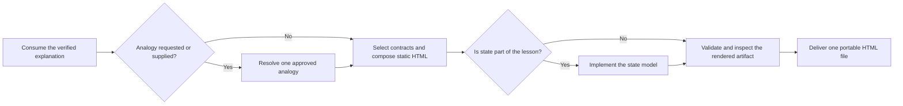

# PTLam Visualization with HTML

Create or revise one portable HTML explainer that lets a learner see and, when
useful, manipulate a system. The artifact uses native HTML, CSS, JavaScript, and
inline SVG. It opens directly, with no framework, build step, CDN, web server,
sibling file, or external runtime asset.

This skill builds focused learning artifacts. App-shell navigation, pickers,
floating actions, menus, dialogs, and sheets belong to a general application or
site workflow instead.

<!-- PLUGIN-COMPILER:REQUIRED-SKILLS -->

## At a glance



## Read for every artifact

| Reference | Owns |
| --- | --- |
| [portable artifact contract](references/portable-artifact-contract.md) | File boundary, document semantics, accessibility baseline, progressive enhancement, and verification conditions |
| [design-system baseline](references/design-system/design-system.md) | The token and component system the scaffold emits, and how to extend it |
| [accessibility](references/design-system/foundations/accessibility.md) | Contrast, focus, semantics, and assistive-technology behavior |
| [interaction](references/design-system/foundations/interaction.md) | States, targets, and input handling |
| [layout](references/design-system/foundations/layout.md) | Grid, spacing, and responsive structure |
| [usability](references/design-system/foundations/usability.md) | Readability and comprehension defaults |
| [document shell](references/design-system/patterns/layouts/document-shell.md) | Page frame, header, and section rhythm |

## 1. Consume the explanation and resolve the artifact

Start from the required `ptlam-explaining` skill's result. Consume its learning
goal, learner background, confusing mechanism, depth, language, literal answer,
literal model, explanatory structure, and stated uncertainty. Do not rebuild or
quietly change any of them here.

Resolve the output path, and whether the task creates or revises an artifact.
Inspect an existing artifact before changing it. Decide whether the result is
literal-only, needs a new analogy, or already contains a user-supplied one.

Done when the destination and change authority are clear, one verified
foundation explanation supplies every literal fact, and the analogy branch is
known.

## 2. Resolve the optional analogy

Use an analogy only when the user explicitly asks for one, or supplies an
already selected analogy model. Otherwise carry the `ptlam-explaining` literal
model into step 3 unchanged.

For either analogy case, follow
[the analogy branch](references/analogy-branch.md). It owns how to reach that
skill's analogy branch, how to accept or reject an analogy, and which patterns
to read.

Done when the artifact is literal-only or carries one approved analogy.

## 3. Select contracts and compose the document

Read [visual contract selection](references/visual-contract-selection.md). It
maps each relationship, composition, control, component, and customization
concern to the contract that owns it, and it owns how many to load.

For a new artifact, resolve `<skill-directory>` to the directory holding this
`SKILL.md`, use Node.js 22.6 or newer, and run from any working directory:

```bash
node --experimental-strip-types \
  "<skill-directory>/scripts/scaffolding/scaffold-html.ts" \
  output.html --title "How the system works"
```

The scaffold, not the references above, is the source for exact baseline
tokens, global CSS, and shell markup. Replace every instructional placeholder.
For an existing artifact, preserve correct content and interaction state while
bringing the file into this contract.

Read [learning sequence](references/learning-sequence.md) for the order the
document must teach in.

Done when static HTML teaches the whole sequence, every material relationship
has one visual grammar, every interactive element has one component contract,
and no instructional placeholder remains.

## 4. Implement the state model

Skip this step for a static artifact.

When time or state is part of the lesson, follow
[the synchronized state model](references/state-model.md). It owns the step
model, the required controls, and the scripts-disabled fallback.

Done when the artifact is static or its state model passes that file's checks.

## 5. Validate and inspect the rendered artifact

Run the bundled static validator from any working directory:

```bash
node --experimental-strip-types \
  "<skill-directory>/scripts/validation/validate-html.ts" <artifact.html>
```

Fix every error. Then open the document and follow
[rendered inspection](references/rendered-inspection.md). It owns the browser
conditions the artifact must survive, and how to repair a failure.

Done when validation passes and every rendered condition holds.

## 6. Deliver and hand off

Return the single `.html` file at the resolved destination. Report what changed
and where, the selected visual grammar, whether the analogy branch ran, the
validator command and its result, the browser conditions you inspected, and any
behavior that remains unverified.

Complete the task when the file opens directly, teaches the lesson with no
external runtime resource, and the handoff separates static checks from
rendered browser evidence.
