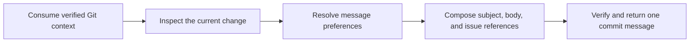

# PTLam Writing a Commit Message

Create or revise one repository commit message that describes the current
change and follows current user, repository, and verified project preferences.
This skill changes no Git state.

<!-- PLUGIN-COMPILER:REQUIRED-SKILLS -->

## At a glance

## 1. Consume verified Git context

Start from the required `ptlam-managing-git-context` result. Use its repository root,
verified facts, and scoped Git preferences. Keep context read-only and report a
material missing preference as suggested maintenance rather than writing it.

Complete this step when one repository, current context state, and every
applicable stored preference are known.

## 2. Inspect the current change

Read current user instructions, repository contribution policy, the staged diff
when present, otherwise the intended unstaged diff, and enough neighboring
history to understand local message conventions. Do not infer the change from
filenames alone.

Identify the single outcome the commit delivers, its scope, whether a body is
needed, and any issue the change resolves or relates to.

Complete this step when the subject can name why the change exists and every
body or issue-reference need is supported by the actual change.

## 3. Resolve message preferences

Read [commit message preferences](references/commit-message-preferences.md). It
owns preference precedence and portable subject, body, and issue-reference
defaults.

Apply sources in this order: current user instructions, repository policy,
verified project context, then portable defaults for unconstrained choices.
Report a conflict instead of silently choosing a lower-precedence preference.

Complete this step when every message choice has one governing source and no
material conflict remains hidden.

## 4. Compose and verify the message

Write one message for the inspected change. Keep one coherent outcome per
commit. Use a body only when it adds necessary rationale, impact, or issue
closure that the subject cannot carry.

Read the subject in isolation. Confirm that it names the outcome rather than
only implementation mechanics, satisfies the active length and style rules,
and agrees with the body and diff. Verify every issue reference against the
user's request or repository evidence.

Return the exact subject and body with real line breaks. State which project or
repository preference changed the portable default and disclose anything not
fully verified.

Complete the task when one message accurately represents the current change and
passes every active user, repository, context, and portable preference.
