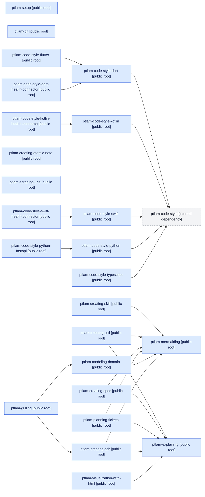

## Available skills

| Skill                                      | Category             | Description                                                                                                                                                                                                                                                                                                                                                                                                                                                                                                                                                                                                                                                                                    | Visibility | Status | Replacement |
| ------------------------------------------ | -------------------- | ---------------------------------------------------------------------------------------------------------------------------------------------------------------------------------------------------------------------------------------------------------------------------------------------------------------------------------------------------------------------------------------------------------------------------------------------------------------------------------------------------------------------------------------------------------------------------------------------------------------------------------------------------------------------------------------------- | ---------- | ------ | ----------- |
| `ptlam-setup`                              | Utilities            | Install or refresh PTLam's general agent instructions for a project.                                                                                                                                                                                                                                                                                                                                                                                                                                                                                                                                                                                                                           | public     | Active | —           |
| `ptlam-git`                                | Engineering          | Carry out repository-local Git commit and worktree workflows without disturbing unrelated work. Use when creating a commit, writing or revising a commit message, creating or managing a worktree, or deciding whether a repository write belongs in the current checkout or a new linked worktree.                                                                                                                                                                                                                                                                                                                                                                                            | public     | Active | —           |
| `ptlam-code-style-dart`                    | Engineering          | Write, review, and fix Dart library and application code against conventions for language mechanics, package layout, the analyzer and formatter toolchain, dartdoc comments, and package:test tests. Use when starting or standardizing a Dart package, changing Dart code or its analysis options, reviewing Dart-specific design, or resolving a dart analyze, dart format, or dart test failure. Apply ptlam-code-style first for the standard these mechanics satisfy. Use as the foundation for Dart framework and project specializations. Do not use for non-Dart code.                                                                                                                 | public     | Active | —           |
| `ptlam-code-style-kotlin`                  | Engineering          | Write, review, and fix Kotlin library and application code against conventions for language mechanics, null safety, coroutines, the Gradle, ktlint, and detekt toolchain, KDoc comments, and JUnit tests. Use when starting or standardizing a Kotlin module, changing Kotlin code or its build and lint configuration, reviewing Kotlin-specific design, or resolving a ktlint, detekt, or JUnit failure. Apply ptlam-code-style first for the standard these mechanics satisfy. Use as the foundation for Kotlin platform and project specializations. Do not use for Java or for another JVM language.                                                                                      | public     | Active | —           |
| `ptlam-code-style-swift`                   | Engineering          | Write, review, and fix Swift library and application code against conventions for language mechanics, optionals, error handling, structured concurrency and actor isolation, the Swift Package Manager, SwiftFormat, and SwiftLint toolchain, documentation comments, and tests. Use when starting or standardizing a Swift package, changing Swift code or its lint and format configuration, reviewing Swift-specific design, or resolving a swift build, SwiftLint, or SwiftFormat failure. Apply ptlam-code-style first for the standard these mechanics satisfy. Use as the foundation for Swift platform and project specializations. Do not use for Objective-C.                        | public     | Active | —           |
| `ptlam-code-style-flutter`                 | Engineering          | Write, review, and fix Flutter application code against conventions for the toolchain, layer boundaries, source tree, widgets, models, networking, storage, localization, logging, widget documentation, and tests. Use when adding or changing Flutter code, choosing between setState, Cubit, and Bloc, placing a new file or feature, wiring get_it or go_router, or fixing a flutter analyze or build_runner failure. Apply ptlam-code-style-dart first for the Dart language, package, and tooling mechanics. Do not use this specialization for Dart outside Flutter or for another stack.                                                                                               | public     | Active | —           |
| `ptlam-code-style-python`                  | Engineering          | Write, review, and fix Python library and application code against conventions for language mechanics, project structure, tooling, and tests. Use when starting or standardizing a Python project, changing Python code or its toolchain, reviewing Python-specific design, or resolving code-quality and test failures. Apply ptlam-code-style first for the standard these mechanics satisfy. Use as the foundation for Python framework specializations. Do not use for non-Python code.                                                                                                                                                                                                    | public     | Active | —           |
| `ptlam-code-style-python-fastapi`          | Engineering          | Write, review, and fix FastAPI application code against conventions for service and feature-package structure, application lifespan, routes, request and response contracts, dependency injection, use cases, feature boundaries, model registration, concurrency, errors, observability, and API tests. Use when starting or reorganizing a FastAPI service or feature, adding or changing endpoints, use cases, dependencies, exception handlers, middleware, schemas, SQLAlchemy registration, background handoffs, or tests, or fixing OpenAPI and runtime failures. Apply ptlam-code-style-python first for the Python mechanics. Do not use for Python services that do not use FastAPI. | public     | Active | —           |
| `ptlam-code-style-typescript`              | Engineering          | Write, review, and fix TypeScript library and application code against conventions for language mechanics, module boundaries, tooling, and tests. Use when starting or standardizing a TypeScript project, changing TypeScript code or its toolchain, reviewing TypeScript-specific design, or resolving type-check, lint, or Vitest failures. Apply ptlam-code-style first for the standard these mechanics satisfy. Use as the foundation for TypeScript framework specializations. Do not use for non-TypeScript code.                                                                                                                                                                      | public     | Active | —           |
| `ptlam-creating-skill`                     | Engineering          | Create, review, or refactor one agent skill so that a human maintainer can read it once and change it later. Use when turning a workflow or reference set into a new skill, revising an existing SKILL.md, splitting a skill that grew too broad, or auditing a package without editing it. Use as the foundation for skills that specialize skill authoring.                                                                                                                                                                                                                                                                                                                                  | public     | Active | —           |
| `ptlam-grilling`                           | Productivity         | Stress-test a plan, decision, or idea through a persistent interview that resolves one user-owned decision at a time, records confirmed understanding for later continuation, sharpens contested business terms, and captures decisions that are expensive to reverse.                                                                                                                                                                                                                                                                                                                                                                                                                         | public     | Active | —           |
| `ptlam-creating-prd`                       | Productivity         | Create one product requirements document from a confirmed grilling record or durable product brief for a new product or large epic. Use when product framing, audience, outcomes, scope, non-goals, and success measures must become a durable handoff before feature specifications. Start an existing-product feature at ptlam-creating-spec; skip this pipeline for a small fix.                                                                                                                                                                                                                                                                                                            | public     | Active | —           |
| `ptlam-creating-spec`                      | Productivity         | Create one buildable feature specification from a confirmed PRD scope item or a feature brief inside an existing product. Use when behavior, boundaries, failure handling, interfaces, data, rollout constraints, and required evidence must be fixed before ticket planning. Start a new product or large epic with ptlam-creating-prd; skip this pipeline for a small fix.                                                                                                                                                                                                                                                                                                                   | public     | Active | —           |
| `ptlam-planning-tickets`                   | Productivity         | Turn one ready feature specification into an ordered set of vertically sliced ticket files with explicit blocking edges. Use after a feature spec is ready for implementation planning. A new product or large epic starts at ptlam-creating-prd, an existing-product feature starts at ptlam-creating-spec, and a small fix skips this pipeline.                                                                                                                                                                                                                                                                                                                                              | public     | Active | —           |
| `ptlam-modeling-domain`                    | Productivity         | Model project business language, context boundaries, and business processes in CONTEXT.md. Use when a business term is contested, overloaded, or newly coined, when two business contexts use one term differently, or when a business process needs a durable map. Do not use for code types, storage schemas, or serialization mechanics.                                                                                                                                                                                                                                                                                                                                                    | public     | Active | —           |
| `ptlam-creating-adr`                       | Engineering          | Decide whether a crystallized architectural choice warrants a durable architecture decision record and write the qualifying ADR. Use when a decision constrains future architecture, is expensive to reverse, affects a published boundary, or carries material rejected alternatives. Do not use for local implementation choices with cheap reversal.                                                                                                                                                                                                                                                                                                                                        | public     | Active | —           |
| `ptlam-creating-atomic-note`               | Productivity         | Create, mature, review, split, or merge durable atomic notes by identifying one knowledge building block, preserving useful context, and following local vault conventions.                                                                                                                                                                                                                                                                                                                                                                                                                                                                                                                    | public     | Active | —           |
| `ptlam-scraping-urls`                      | Utilities            | Batch-scrape URLs supplied in a prompt or input file into cached local Markdown files with configurable output, concurrency, and cache lifetime.                                                                                                                                                                                                                                                                                                                                                                                                                                                                                                                                               | public     | Active | —           |
| `ptlam-explaining`                         | Productivity         | Explain concepts, mechanisms, and systems through a verified literal model and an explanatory device matched to the learner's difficulty. Use when a learner needs an unfamiliar, abstract, or complex concept made usable, and when a request explicitly asks for a real-life analogy with a stable mapping table, a short story, and explicit caveats. Select the analogy device only on that explicit ask; a request to explain, define, simplify, or break down a concept is not that ask.                                                                                                                                                                                                 | public     | Active | —           |
| `ptlam-mermaiding`                         | Productivity         | Create, revise, or review Mermaid diagrams whose type, structure, notation, and layout preserve the source relationships and remain readable in raw Markdown. Use directly or from another skill when the output needs a swimlane, flowchart, class, state, ER, sequence, quadrant, mindmap, kanban, architecture, or tree-view diagram.                                                                                                                                                                                                                                                                                                                                                       | public     | Active | —           |
| `ptlam-visualization-with-html`            | Productivity         | Create or revise one portable HTML explainer that renders a verified explanation as an accessible, optionally interactive artifact using native web technologies and Material 3 Expressive.                                                                                                                                                                                                                                                                                                                                                                                                                                                                                                    | public     | Active | —           |
| `ptlam-code-style-dart-health-connector`   | Health Connector SDK | Write, review, and fix Dart code in the Health Connector Flutter plugin monorepo against its melos workspace layout, package boundaries, sealed record and data-type hierarchies, part-file organization, platform annotations, Pigeon mapper conventions, health_connector_lint rules, and mocktail tests. Use when adding a health data type or record, changing a facade, core, logger, or platform-package Dart file, editing a Pigeon input, or fixing a melos analyze:dart:strict, dart format, or flutter test failure in this repository. Apply ptlam-code-style-dart first for the Dart mechanics. Do not use for another repository or for this plugin's Kotlin or Swift code.       | public     | Active | —           |
| `ptlam-code-style-kotlin-health-connector` | Health Connector SDK | Write, review, and fix Kotlin code in the Health Connector plugin's Android Health Connect package against its plugin entry point, client facade, handler registry, service, mapper, and exception conventions, its detekt and ktlint configuration, and its JUnit 5, MockK, Kotest, and Robolectric tests. Use when adding a health record handler, changing native Android code under health_connector_hc_android, or fixing a melos analyze:kotlin, ktlintCheck, or test:kotlin failure. Apply ptlam-code-style-kotlin first for the Kotlin mechanics. Do not use for another repository or for this plugin's Dart or Swift code.                                                           | public     | Active | —           |
| `ptlam-code-style-swift-health-connector`  | Health Connector SDK | Write, review, and fix Swift code in the Health Connector plugin's iOS HealthKit package against its plugin entry point, actor-based client, handler protocol composition, registry, mapper, and error conventions, its SwiftLint and SwiftFormat configuration, and its Pigeon completion-handler threading rules. Use when adding a health record handler, changing native iOS code under health_connector_hk_ios, or fixing a melos analyze:swift or format:swift failure. Apply ptlam-code-style-swift first for the Swift mechanics. Do not use for another repository or for this plugin's Dart or Kotlin code.                                                                          | public     | Active | —           |

## Skill dependency graph

Arrows point from a dependent skill to the skill it requires.

