## Available Skills

Arrows point from a dependent skill to the skill it requires.

```mermaid
---
config:
  htmlLabels: false
---
flowchart TB
    subgraph SkillCategory0["Deciding"]
        SkillNode0["`
            ptlam-grilling
            (active/public)
        `"]
        SkillNode1["`
            ptlam-architecturing
            (active/public)
        `"]
        SkillNode2["`
            ptlam-creating-adr
            (active/public)
        `"]
        SkillNode3["`
            ptlam-modeling-domain
            (active/public)
        `"]
    end
    subgraph SkillCategory1["Specifying"]
        SkillNode4["`
            ptlam-creating-prd
            (active/public)
        `"]
        SkillNode5["`
            ptlam-creating-spec
            (active/public)
        `"]
        SkillNode6["`
            ptlam-planning-tickets
            (active/public)
        `"]
        SkillNode7["`
            ptlam-creating-atomic-note
            (active/public)
        `"]
    end
    subgraph SkillCategory2["Building"]
        SkillNode8["`
            ptlam-implementing
            (active/public)
        `"]
        SkillNode9["`
            ptlam-reviewing-code
            (active/public)
        `"]
        SkillNode10["`
            ptlam-diagnosing
            (active/public)
        `"]
        SkillNode11["`
            ptlam-prototyping
            (active/public)
        `"]
        SkillNode12["`
            ptlam-git
            (active/public)
        `"]
    end
    subgraph SkillCategory3["Conventions"]
        SkillNode13["`
            ptlam-code-style
            (active/public)
        `"]
        SkillNode14["`
            ptlam-code-style-dart
            (active/public)
        `"]
        SkillNode15["`
            ptlam-code-style-kotlin
            (active/public)
        `"]
        SkillNode16["`
            ptlam-code-style-swift
            (active/public)
        `"]
        SkillNode17["`
            ptlam-code-style-dart-flutter
            (active/public)
        `"]
        SkillNode18["`
            ptlam-code-style-python
            (active/public)
        `"]
        SkillNode19["`
            ptlam-code-style-python-fastapi
            (active/public)
        `"]
        SkillNode20["`
            ptlam-code-style-typescript
            (active/public)
        `"]
        SkillNode21["`
            ptlam-code-style-typescript-nestjs
            (active/public)
        `"]
    end
    subgraph SkillCategory4["Communicating"]
        SkillNode22["`
            ptlam-explaining
            (active/public)
        `"]
        SkillNode23["`
            ptlam-mermaiding
            (active/public)
        `"]
        SkillNode24["`
            ptlam-visualizing-with-html
            (active/public)
        `"]
        SkillNode25["`
            ptlam-researching
            (active/public)
        `"]
    end
    subgraph SkillCategory5["Utilities"]
        SkillNode26["`
            ptlam-setup
            (active/public)
        `"]
        SkillNode27["`
            ptlam-creating-skill
            (active/public)
        `"]
        SkillNode28["`
            ptlam-scraping-urls
            (active/public)
        `"]
    end
    subgraph SkillCategory6["Health Connector SDK"]
        SkillNode29["`
            ptlam-health-connector-architecture
            (active/public)
        `"]
        SkillNode30["`
            ptlam-health-connector-setup
            (active/public)
        `"]
        SkillNode31["`
            ptlam-health-connector-diagnosing
            (active/public)
        `"]
        SkillNode32["`
            ptlam-health-connector-reviewing
            (active/public)
        `"]
        SkillNode33["`
            ptlam-health-connector-adding-data-type
            (active/public)
        `"]
        SkillNode34["`
            ptlam-health-connector-code-style-dart
            (active/public)
        `"]
        SkillNode35["`
            ptlam-health-connector-code-style-kotlin
            (active/public)
        `"]
        SkillNode36["`
            ptlam-health-connector-code-style-swift
            (active/public)
        `"]
    end
    SkillNode0 --> SkillNode3
    SkillNode0 --> SkillNode1
    SkillNode1 --> SkillNode23
    SkillNode2 --> SkillNode22
    SkillNode2 --> SkillNode23
    SkillNode3 --> SkillNode23
    SkillNode4 --> SkillNode22
    SkillNode4 --> SkillNode23
    SkillNode5 --> SkillNode22
    SkillNode5 --> SkillNode23
    SkillNode5 --> SkillNode1
    SkillNode6 --> SkillNode22
    SkillNode6 --> SkillNode23
    SkillNode8 --> SkillNode12
    SkillNode8 --> SkillNode13
    SkillNode8 --> SkillNode9
    SkillNode8 --> SkillNode1
    SkillNode8 --> SkillNode10
    SkillNode9 --> SkillNode13
    SkillNode9 --> SkillNode1
    SkillNode11 --> SkillNode12
    SkillNode14 --> SkillNode13
    SkillNode15 --> SkillNode13
    SkillNode16 --> SkillNode13
    SkillNode17 --> SkillNode14
    SkillNode18 --> SkillNode13
    SkillNode19 --> SkillNode18
    SkillNode20 --> SkillNode13
    SkillNode21 --> SkillNode20
    SkillNode24 --> SkillNode22
    SkillNode25 --> SkillNode12
    SkillNode25 --> SkillNode28
    SkillNode25 --> SkillNode24
    SkillNode27 --> SkillNode23
    SkillNode29 --> SkillNode1
    SkillNode31 --> SkillNode10
    SkillNode31 --> SkillNode29
    SkillNode32 --> SkillNode9
    SkillNode32 --> SkillNode29
    SkillNode32 --> SkillNode34
    SkillNode32 --> SkillNode35
    SkillNode32 --> SkillNode36
    SkillNode33 --> SkillNode29
    SkillNode33 --> SkillNode34
    SkillNode33 --> SkillNode35
    SkillNode33 --> SkillNode36
    SkillNode34 --> SkillNode14
    SkillNode35 --> SkillNode15
    SkillNode36 --> SkillNode16
    classDef publicSkill fill:#dbeafe,stroke:#1d4ed8,color:#172554
    classDef internalSkill fill:#f3f4f6,stroke:#4b5563,color:#111827,stroke-dasharray:5 5
    classDef deprecatedSkill fill:#fef3c7,stroke:#b45309,color:#78350f
    class SkillNode0 publicSkill
    class SkillNode1 publicSkill
    class SkillNode2 publicSkill
    class SkillNode3 publicSkill
    class SkillNode4 publicSkill
    class SkillNode5 publicSkill
    class SkillNode6 publicSkill
    class SkillNode7 publicSkill
    class SkillNode8 publicSkill
    class SkillNode9 publicSkill
    class SkillNode10 publicSkill
    class SkillNode11 publicSkill
    class SkillNode12 publicSkill
    class SkillNode13 publicSkill
    class SkillNode14 publicSkill
    class SkillNode15 publicSkill
    class SkillNode16 publicSkill
    class SkillNode17 publicSkill
    class SkillNode18 publicSkill
    class SkillNode19 publicSkill
    class SkillNode20 publicSkill
    class SkillNode21 publicSkill
    class SkillNode22 publicSkill
    class SkillNode23 publicSkill
    class SkillNode24 publicSkill
    class SkillNode25 publicSkill
    class SkillNode26 publicSkill
    class SkillNode27 publicSkill
    class SkillNode28 publicSkill
    class SkillNode29 publicSkill
    class SkillNode30 publicSkill
    class SkillNode31 publicSkill
    class SkillNode32 publicSkill
    class SkillNode33 publicSkill
    class SkillNode34 publicSkill
    class SkillNode35 publicSkill
    class SkillNode36 publicSkill
```

| Skill                                      | Category             | Description                                                                                                                                                                                                                                                                                                                                                                                                                                                                                                                                                                                                                                                                                                                                                                                                                                                                                                                                           | Visibility | Status | Replacement |
| ------------------------------------------ | -------------------- | ----------------------------------------------------------------------------------------------------------------------------------------------------------------------------------------------------------------------------------------------------------------------------------------------------------------------------------------------------------------------------------------------------------------------------------------------------------------------------------------------------------------------------------------------------------------------------------------------------------------------------------------------------------------------------------------------------------------------------------------------------------------------------------------------------------------------------------------------------------------------------------------------------------------------------------------------------- | ---------- | ------ | ----------- |
| `ptlam-grilling`                           | Deciding             | Stress-test a plan, decision, or idea by asking the user one consequential question at a time, saving a resumable session record, sharpening contested business terms, and capturing decisions that are expensive to reverse. This is the only skill that interviews the user.                                                                                                                                                                                                                                                                                                                                                                                                                                                                                                                                                                                                                                                                        | public     | Active | —           |
| `ptlam-architecturing`                     | Deciding             | Answer one system-level architecture question with a suitability judgment that frames the solution space, positions the options, sizes the recommendation for the next order of magnitude, and names its trade-offs, assumptions, and redesign trigger. Works for any kind of system, from backend and web frontend to mobile, SDK, CLI, data pipeline, desktop, embedded, and internal platform. Use when choosing component, runtime, data-store, deployment, or integration structure; when designing a published surface such as an API, SDK, CLI, schema, or file format; when deciding where the true copy of state lives; when a platform limit shapes the design; when a debate is stuck on technology names; or when judging an existing architecture. Compose it from any skill that meets a structure expensive to reverse. Do not use for code structure one team changes in one release, business vocabulary, or diagnosing one failure. | public     | Active | —           |
| `ptlam-creating-adr`                       | Deciding             | Decide whether one confirmed architecture choice deserves a durable architecture decision record, and write the record when it does. Use when a confirmed decision splits a component, runtime, or data store, publishes a surface such as an API, SDK, CLI, schema, or file format, moves where the true copy of state lives, commits to a platform, or rejects a plausible alternative for a non-obvious reason. Compose this skill from any workflow that needs the record-or-not verdict. Do not use for a local implementation choice that is cheap to reverse.                                                                                                                                                                                                                                                                                                                                                                                  | public     | Active | —           |
| `ptlam-modeling-domain`                    | Deciding             | Model a project's business words, context boundaries, and business processes in CONTEXT.md. Use when a business term is contested, overloaded, or new, when two contexts use one word differently, or when a business process needs a durable map. Compose this skill when an interview or an architecture judgment meets a contested business term. Do not use for code types, storage schemas, or serialization mechanics.                                                                                                                                                                                                                                                                                                                                                                                                                                                                                                                          | public     | Active | —           |
| `ptlam-creating-prd`                       | Specifying           | Create one product requirements document from a confirmed grilling record or product brief, for a new product or a large epic. Use when product framing, audience, outcomes, scope, non-goals, and success measures must become a durable handoff before feature specifications. Start a feature inside an existing product at ptlam-creating-spec; skip this pipeline for a small fix.                                                                                                                                                                                                                                                                                                                                                                                                                                                                                                                                                               | public     | Active | —           |
| `ptlam-creating-spec`                      | Specifying           | Create one buildable feature specification from a confirmed product scope item or feature brief inside an existing product. Use when behavior, boundaries, failure handling, interfaces, data, rollout constraints, and required evidence must be fixed before ticket planning. Start a new product or large epic with ptlam-creating-prd; skip this pipeline for a small fix.                                                                                                                                                                                                                                                                                                                                                                                                                                                                                                                                                                        | public     | Active | —           |
| `ptlam-planning-tickets`                   | Specifying           | Turn one ready feature specification into an ordered set of vertically sliced ticket files with explicit blocking edges. Use after a feature specification is ready for implementation planning. A new product or large epic starts at ptlam-creating-prd, an existing-product feature starts at ptlam-creating-spec, and a small fix skips this pipeline.                                                                                                                                                                                                                                                                                                                                                                                                                                                                                                                                                                                            | public     | Active | —           |
| `ptlam-creating-atomic-note`               | Specifying           | Create, mature, review, split, or merge durable atomic notes by finding one knowledge building block per note, keeping the context it needs, and following the local vault's conventions.                                                                                                                                                                                                                                                                                                                                                                                                                                                                                                                                                                                                                                                                                                                                                             | public     | Active | —           |
| `ptlam-implementing`                       | Building             | Deliver one bounded software change through task-specific worker agents in isolated Git worktrees and independent reviewer agents on one integration branch. Use when asked to implement from the current prompt or confirmed session context. Use when given a specification, ticket file, issue, or equivalent task link. Do not use for a read-only explanation, plan, diagnosis, or review.                                                                                                                                                                                                                                                                                                                                                                                                                                                                                                                                                       | public     | Active | —           |
| `ptlam-reviewing-code`                     | Building             | Review one bounded code changeset and return an evidence-backed, prioritized findings report and readiness verdict. Use when reviewing a pull request, branch, commit range, or explicit revision comparison. Use when reviewing staged, unstaged, or untracked working-tree changes. Use when judging an implementation against a task, issue, or specification. Compose this skill when a stack or project review needs the general review standard.                                                                                                                                                                                                                                                                                                                                                                                                                                                                                                | public     | Active | —           |
| `ptlam-diagnosing`                         | Building             | Diagnose one failing software behavior and return a cause whose mechanism at the first failing boundary is shown by named observations or a deciding check, with every remaining supported alternative ruled out, or an exact evidence blocker and one deciding next check. Use when software throws, returns the wrong result, hangs, crashes, regresses, or behaves differently across environments and the request is for a diagnosis. Compose this skill when a stack or project specialization adds diagnosis mechanics, or when a fix workflow first needs the cause.                                                                                                                                                                                                                                                                                                                                                                           | public     | Active | —           |
| `ptlam-prototyping`                        | Building             | Build one throwaway prototype to answer one design question. Use when a user wants to test a state model, business logic, or data shape through a shareable HTML demo, or explore a UI through structurally different variants on one route. Works from scratch or beside an existing module or page. Do not use for an MVP, production feature, benchmark, or durable demo.                                                                                                                                                                                                                                                                                                                                                                                                                                                                                                                                                                          | public     | Active | —           |
| `ptlam-git`                                | Building             | Carry out repository-local Git commit, worktree, and conflict-resolution workflows without disturbing unrelated work. Use when creating a commit, writing or revising a commit message, creating, using, or removing a worktree, deciding whether a repository write belongs in the current checkout or a new linked worktree, or resolving an in-progress merge, rebase, or cherry-pick conflict. Compose this skill from an authorized workflow for explicitly delegated local branches, worktrees, commits, or cherry-picks into a dedicated integration branch.                                                                                                                                                                                                                                                                                                                                                                                   | public     | Active | —           |
| `ptlam-code-style`                         | Conventions          | Hold source and test code to one language-neutral standard for complexity, source structure, boundaries, naming, readability, domain modeling, cross-boundary contracts, failure design, asynchronous lifetime, documentation, logging, evolution, and testing. Use when no stack specialization matches the project, and as the foundation every stack specialization composes. Use ptlam-modeling-domain instead for business terms and context boundaries, and ptlam-architecturing instead for a component, runtime, or data-store split, a published surface, state ownership, or a platform commitment.                                                                                                                                                                                                                                                                                                                                         | public     | Active | —           |
| `ptlam-code-style-dart`                    | Conventions          | Write, review, and fix Dart library and application code against conventions for language mechanics, package layout, the analyzer and formatter toolchain, dartdoc comments, and package:test tests. Use when starting or standardizing a Dart package, changing Dart code or its analysis options, reviewing Dart-specific design, or resolving a dart analyze, dart format, or dart test failure. Use as the foundation for Dart framework and project specializations. Do not use for non-Dart code.                                                                                                                                                                                                                                                                                                                                                                                                                                               | public     | Active | —           |
| `ptlam-code-style-kotlin`                  | Conventions          | Write, review, and fix Kotlin library and application code against conventions for language mechanics, null safety, coroutines, the Gradle, ktlint, and detekt toolchain, KDoc comments, and JUnit tests. Use when starting or standardizing a Kotlin module, changing Kotlin code or its build and lint configuration, reviewing Kotlin-specific design, or resolving a ktlint, detekt, or JUnit failure. Use as the foundation for Kotlin platform and project specializations. Do not use for Java or another JVM language.                                                                                                                                                                                                                                                                                                                                                                                                                        | public     | Active | —           |
| `ptlam-code-style-swift`                   | Conventions          | Write, review, and fix Swift library and application code against conventions for language mechanics, optionals, error handling, structured concurrency and actor isolation, the Swift Package Manager, SwiftFormat, and SwiftLint toolchain, documentation comments, and tests. Use when starting or standardizing a Swift package, changing Swift code or its lint and format configuration, reviewing Swift-specific design, or resolving a swift build, SwiftLint, or SwiftFormat failure. Use as the foundation for Swift platform and project specializations. Do not use for Objective-C.                                                                                                                                                                                                                                                                                                                                                      | public     | Active | —           |
| `ptlam-code-style-dart-flutter`            | Conventions          | Write, review, and fix Flutter application code against conventions for the toolchain, four-layer feature structure, presentation-layer BLoC and Cubit state, widgets, routes, models, networking, storage, localization, logging, widget documentation, and tests. Use when adding or changing Flutter code, choosing between setState, Cubit, and Bloc, placing a new file or feature, wiring get_it or go_router, or fixing a flutter analyze or build_runner failure. Do not use for Dart outside Flutter or for another stack.                                                                                                                                                                                                                                                                                                                                                                                                                   | public     | Active | —           |
| `ptlam-code-style-python`                  | Conventions          | Write, review, and fix Python library and application code against conventions for language mechanics, project structure, tooling, and tests. Use when starting or standardizing a Python project, changing Python code or its toolchain, reviewing Python-specific design, or resolving code-quality and test failures. Use as the foundation for Python framework specializations. Do not use for non-Python code.                                                                                                                                                                                                                                                                                                                                                                                                                                                                                                                                  | public     | Active | —           |
| `ptlam-code-style-python-fastapi`          | Conventions          | Write, review, and fix FastAPI application code against conventions for service and four-layer feature-package structure, application lifespan, routes, request and response contracts, dependency injection, use cases, feature boundaries, model registration, concurrency, errors, observability, and API tests. Use when starting or reorganizing a FastAPI service or feature, adding or changing endpoints, use cases, dependencies, exception handlers, middleware, schemas, SQLAlchemy registration, background handoffs, or tests, or fixing OpenAPI and runtime failures. Do not use for Python services that do not use FastAPI.                                                                                                                                                                                                                                                                                                           | public     | Active | —           |
| `ptlam-code-style-typescript`              | Conventions          | Write, review, and fix TypeScript library and application code against conventions for language mechanics, module boundaries, tooling, and tests. Use when starting or standardizing a TypeScript project, changing TypeScript code or its toolchain, reviewing TypeScript-specific design, or resolving type-check, lint, or Vitest failures. Use as the foundation for TypeScript framework specializations. Do not use for non-TypeScript code.                                                                                                                                                                                                                                                                                                                                                                                                                                                                                                    | public     | Active | —           |
| `ptlam-code-style-typescript-nestjs`       | Conventions          | Write, review, and fix NestJS TypeScript backend code against conventions for feature-first structure, use cases, integrations, modules, dependency injection, application lifecycle, entry points, persistence handoffs, observability, health, and Nest testing. Use when starting or reorganizing a NestJS backend or feature, changing use cases, controllers, providers, processors, schedules, commands, global enhancers, DTO pipes, adapters, transports, transactions, shutdown, or tests, or resolving Nest module and runtime failures. Do not use for TypeScript applications that do not use NestJS.                                                                                                                                                                                                                                                                                                                                     | public     | Active | —           |
| `ptlam-explaining`                         | Communicating        | Explain a concept, mechanism, or system through a verified literal model and a teaching device matched to what the learner cannot do. Use when a learner needs an unfamiliar, abstract, or complex concept made usable, and when a request explicitly asks for a real-life analogy with a stable mapping table, a short story, and explicit caveats. Select the analogy device only on that explicit ask; a request to explain, define, simplify, or break down a concept is not that ask. Compose this skill from any workflow whose output a reader must understand.                                                                                                                                                                                                                                                                                                                                                                                | public     | Active | —           |
| `ptlam-mermaiding`                         | Communicating        | Create, revise, or review Mermaid diagrams whose type, structure, notation, and layout keep the source relationships and stay readable in raw Markdown. Use directly, or from another skill, when the output needs a swimlane, flowchart, class, state, ER, sequence, quadrant, mindmap, kanban, architecture, or tree-view diagram.                                                                                                                                                                                                                                                                                                                                                                                                                                                                                                                                                                                                                  | public     | Active | —           |
| `ptlam-visualizing-with-html`              | Communicating        | Create or revise one portable HTML explainer that renders a verified explanation as an accessible, optionally interactive page using native web technologies and Material 3 Expressive. Use when a learner needs to see or operate a system rather than read about it. Compose this skill from any workflow that delivers a rendered report or explainer.                                                                                                                                                                                                                                                                                                                                                                                                                                                                                                                                                                                             | public     | Active | —           |
| `ptlam-researching`                        | Communicating        | Research one bounded question against high-trust primary sources and deliver a traceable portable HTML evidence report. Use when a material question needs evidence-led findings, conflict reconciliation, or an explicitly inconclusive result.                                                                                                                                                                                                                                                                                                                                                                                                                                                                                                                                                                                                                                                                                                      | public     | Active | —           |
| `ptlam-setup`                              | Utilities            | Install or refresh PTLam's general agent instructions in one project.                                                                                                                                                                                                                                                                                                                                                                                                                                                                                                                                                                                                                                                                                                                                                                                                                                                                                 | public     | Active | —           |
| `ptlam-creating-skill`                     | Utilities            | Create, review, or refactor one agent skill so a human maintainer can read it once and change it later. Use when turning a workflow or reference set into a new skill, revising an existing SKILL.md, splitting a skill that grew too broad, or auditing a package without editing it. Use as the foundation for skills that specialize skill authoring.                                                                                                                                                                                                                                                                                                                                                                                                                                                                                                                                                                                              | public     | Active | —           |
| `ptlam-scraping-urls`                      | Utilities            | Batch-scrape URLs supplied in a prompt or an input file into cached local Markdown files with configurable output, concurrency, and cache lifetime. Compose this skill from any workflow that needs accounted local copies of many pages.                                                                                                                                                                                                                                                                                                                                                                                                                                                                                                                                                                                                                                                                                                             | public     | Active | —           |
| `ptlam-health-connector-architecture`      | Health Connector SDK | Explain and judge the Health Connector SDK's structure across its Melos packages, Dart API surfaces, Pigeon contracts, Android Health Connect layers, iOS HealthKit layers, failure boundaries, concurrency, and platform limits. Use when tracing a call, deciding where behavior belongs, evaluating a boundary or public API change, or answering how the SDK works internally. Compose this skill from any Health Connector workflow that must respect those boundaries. Do not use for diagnosing one failure, setting up a checkout, reviewing a whole diff, or adding a health data type.                                                                                                                                                                                                                                                                                                                                                      | public     | Active | —           |
| `ptlam-health-connector-setup`             | Health Connector SDK | Set up or repair a local Health Connector SDK checkout with its pinned Flutter, Java, and Ruby toolchains, Melos workspace links, Android tools, and macOS-only Swift tools, then prove the available development lanes. Runs only when explicitly requested. Use when bootstrapping a clone, repairing missing dependencies, or preparing a machine to contribute. Do not use for a runtime defect or a lint failure in a working checkout.                                                                                                                                                                                                                                                                                                                                                                                                                                                                                                          | public     | Active | —           |
| `ptlam-health-connector-diagnosing`        | Health Connector SDK | Gather Health Connector SDK diagnosis evidence by reproducing the narrowest Dart, Pigeon, Android Health Connect, or iOS HealthKit path and tracing logs, error codes, generated contracts, handlers, permissions, and platform prerequisites. Use when a call throws, returns the wrong record or status, hangs, crashes, loses native logs, or behaves differently across platforms. Do not use for toolchain bootstrap, style checks, or a review of an otherwise-working changeset.                                                                                                                                                                                                                                                                                                                                                                                                                                                               | public     | Active | —           |
| `ptlam-health-connector-reviewing`         | Health Connector SDK | Review one Health Connector SDK changeset for project-specific public API, cross-platform, generated-code, privacy, language-convention, test, documentation, and release risks. Use when a code review reaches Health Connector packages, Pigeon contracts, Android Health Connect, or iOS HealthKit. Do not use for fixing findings or diagnosing one failing run.                                                                                                                                                                                                                                                                                                                                                                                                                                                                                                                                                                                  | public     | Active | —           |
| `ptlam-health-connector-adding-data-type`  | Health Connector SDK | Add or extend one Health Connector health data type and record across the core Dart model, public exports, platform annotations, Pigeon contracts, Dart mappers, Android Health Connect handlers, iOS HealthKit handlers, and applicable tests. Use when introducing a record type, adding one platform to an existing type, changing its capabilities, or repairing an incomplete end-to-end registration. Do not use for an unrelated SDK feature or a language-only refactor.                                                                                                                                                                                                                                                                                                                                                                                                                                                                      | public     | Active | —           |
| `ptlam-health-connector-code-style-dart`   | Health Connector SDK | Write, review, and fix Dart source and tests in the Health Connector SDK against its analyzer rules, formatter contract, imports, visibility, documentation shape, structured logging syntax, and package-specific test layout. Use when editing Dart code, changing the shared lint package, or fixing a Dart format, analysis, documentation, or test-convention failure. Compose this skill from any Health Connector workflow that changes Dart files. Do not use for workspace architecture, public API design, Pigeon ownership, platform support, or an end-to-end health data type change.                                                                                                                                                                                                                                                                                                                                                    | public     | Active | —           |
| `ptlam-health-connector-code-style-kotlin` | Health Connector SDK | Write, review, and fix Kotlin source and tests in Health Connector's Android package against its visibility, file and declaration shape, import order, structured logging syntax, ktlint and detekt configuration, and JUnit 5, MockK, Kotest, and coroutine-test conventions. Use when editing Kotlin code or fixing a Kotlin formatting, analysis, or test-convention failure. Compose this skill from any Health Connector workflow that changes Kotlin files. Do not use for Android architecture, Health Connect behavior, Pigeon ownership, or end-to-end handler registration.                                                                                                                                                                                                                                                                                                                                                                 | public     | Active | —           |
| `ptlam-health-connector-code-style-swift`  | Health Connector SDK | Write, review, and fix Swift source in Health Connector's iOS package against its access, declaration and extension shape, structured logging syntax, SwiftLint baseline, and SwiftFormat configuration. Use when editing Swift code or fixing a Swift analysis, formatting, or native logging convention failure. Compose this skill from any Health Connector workflow that changes Swift files. Do not use for iOS architecture, HealthKit behavior, Pigeon threading, failure translation, or end-to-end handler registration.                                                                                                                                                                                                                                                                                                                                                                                                                    | public     | Active | —           |
