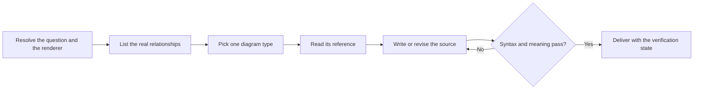

# PTLam Mermaiding

Create, revise, or review Mermaid diagrams. Each diagram answers one visual
question, keeps the real relationships, reads as plain text, has valid syntax,
and renders on its target. This skill owns diagram choice and source; the
surrounding document owns its argument, prose, and placement.

A review is read-only. Change a file only with the user's permission; otherwise
return a fenced `mermaid` block.

## How does one visual question become a verified diagram?

| Concern                            | Owner                                      |
| ---------------------------------- | ------------------------------------------ |
| Facts and relationships            | The supplied source or domain evidence     |
| Type, notation, and Mermaid source | This skill and the selected type reference |
| Feature and version support        | The target Mermaid renderer                |
| Explanation and document structure | The user or the calling skill              |

## 1. Resolve the question and the target

State the one question the diagram must answer. Then find out who reads it and
how much detail they need, what evidence it draws on, where it goes and whether
you may write that file, the type the user asked for if any, and the target
renderer with its Mermaid version.

When the target is unknown, prefer long-established syntax. When it lacks a
requested type, keep the question in the closest supported type and name the
substitution. The type reference owns the exact version boundary.

Done when the question, audience, evidence, destination, permission, and version
boundary are known or safely bounded.

## 2. List the real relationships

List only the objects and relationships the question needs.

| Dimension     | Capture when it matters                                   |
| ------------- | --------------------------------------------------------- |
| Flow          | Order, cause, branches, loops, parallel work              |
| Structure     | Ownership, handoffs, boundaries, containment, hierarchy   |
| Interaction   | Messages, direction, sync or async, participant lifetimes |
| Lifecycle     | States, events, guards, entry, end conditions             |
| Type and data | Members, associations, cardinality, identity              |
| Work          | Stages, status, assignee, priority, ticket id             |
| Plot          | Axes, scale, coordinates, placement evidence              |

Keep verified facts, user assumptions, and simplifications apart. Leave out or
flag a missing fact; never invent a relationship to balance the picture.

Done when every node, edge, group, coordinate, and note has a source or a stated
assumption.

## 3. Pick one type and read its reference

Use the requested type when it answers the question faithfully and this catalog
supports it. Otherwise pick from this table, then read the reference before
writing or judging source. Each reference owns its type's meaning, syntax,
layout, compatibility, and completion check.

| Visual question                                                         | Type and reference                         |
| ----------------------------------------------------------------------- | ------------------------------------------ |
| Who owns each step and handoff?                                         | [Swimlanes](references/swimlanes.md)       |
| What happens next, branches, depends, or nests, without timed messages? | [Flowchart](references/flowchart.md)       |
| What static types, members, and UML relationships exist?                | [Class](references/class.md)               |
| How does one thing change state on events or conditions?                | [State](references/state.md)               |
| What data entities, attributes, keys, and cardinalities exist?          | [ERD](references/erd.md)                   |
| Who sends what to whom, in what order?                                  | [Sequence](references/sequence.md)         |
| Where do items sit on two independent dimensions?                       | [Quadrant](references/quadrant.md)         |
| How do ideas radiate from one central concept?                          | [Mindmap](references/mindmap.md)           |
| What work sits in each workflow stage right now?                        | [Kanban](references/kanban.md)             |
| Which deployed services and resources connect across boundaries?        | [Architecture](references/architecture.md) |
| What nests inside what, like folders?                                   | [Tree view](references/treeview.md)        |

When two types could fit: messages over time are a sequence; one thing's
lifecycle is a state diagram; changing owners is a swimlane; deployment topology
is an architecture diagram, and a process with labels is a flowchart. For a
Mermaid type outside this catalog, use the closest supported type and name the
substitution, or report that this skill has no contract for it.

Split independent questions, abstraction levels, or unreadable paths into
separate diagrams, each with its own question.

Done when one type owns each question and its reference has been read.

## 4. Write the source

Apply the type reference, then these shared rules:

| Concern     | Rule                                                                                                |
| ----------- | --------------------------------------------------------------------------------------------------- |
| Ids         | Descriptive and stable, no unexplained abbreviations; keep ids separate from labels                 |
| Order       | Declare important objects before relationships; one statement per line                              |
| Text        | Four-space nesting; quote labels with punctuation; comment only to explain what you left out        |
| Notation    | Give shape, line, arrow, cardinality, group, and position only the meaning the reference allows     |
| Labels      | Label relationships or conditions the endpoints do not make clear; keep node labels short           |
| Direction   | Left-to-right for pipelines and time; top-to-bottom for hierarchy, unless the domain says otherwise |
| Grouping    | Group only real boundaries, owners, namespaces, or containment                                      |
| Density     | Split before using invisible edges, decorative nodes, or styling to force layout                    |
| Styling     | Use the renderer theme; mark a semantic difference with a reusable class and more than color        |
| Icons       | Prefer built-ins; use an external pack only after confirming it is registered                       |
| Interaction | Add links, callbacks, or animation only when asked and allowed by the target                        |

Raw source must be understandable without rendering. Move prose that does not
express a relationship into the surrounding document.

Done when the source expresses the listed model, follows the reference, and
reads as text.

## 5. Check syntax, meaning, and rendering

Run the strongest available check: the destination's Mermaid version, then a
compatible tool installed in the project, then a static read of the source. Fix
every syntax error and rerun. Never claim rendering passed after only a static
read.

| Check           | Passes when                                                                                        |
| --------------- | -------------------------------------------------------------------------------------------------- |
| Rendered layout | No clipping, overlap, false closeness, heavy crossing, unreadable density, or misleading direction |
| Objects         | Every required object appears once unless repetition is intended                                   |
| Relationships   | Endpoints, direction, notation, and labels match the listed model                                  |
| Semantics       | Boundaries, branches, states, cardinalities, coordinates, and statuses match the evidence          |
| Styling         | Adds no unsupported meaning                                                                        |
| Type-specific   | The reference's completion check passes                                                            |

For a review, report findings by severity with the affected line and the
smallest fix. Say when nothing was found and whether rendering was checked.

Done when syntax and meaning pass, rendering passes where a renderer exists, and
any unavailable check is named.

## 6. Deliver

Put each diagram under a heading that states its visual question. Add only the
prose needed for assumptions, substitutions, or verification limits. Keep
existing Markdown and Mermaid front matter when editing.

For changed files, report what changed, where, which checks ran, and what stays
unverified. Finish when every diagram traces to its source, reads as text,
passes the strongest available check, and fits its question.
