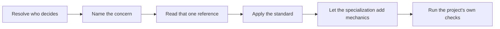

# PTLam Code Style

Hold source and test code to one set of conventions, so the same standard
applies in every language. This foundation owns the standard and the vocabulary;
a stack specialization owns the mechanics that satisfy it.

## At a glance

## Who decides what

For any mechanic these conventions leave open, take the first source that
answers it:

| Order | Source | Owns |
| --- | --- | --- |
| 1 | Current user instructions | Anything the user states for this task |
| 2 | Applicable `AGENTS.md` | Project requirements and permitted exceptions |
| 3 | Current repository files | Established commands, configuration, and layout |
| 4 | The active stack specialization | Stack mechanics the repository leaves open |
| 5 | This skill | The conventions below, and the fallbacks they point to |

Report an unresolved conflict instead of choosing silently. Repository files are
evidence, not a second store of preferences.

No source may remove a rule the references below state.

## Pick a reference

Read the one reference for the concern you are touching. Each sits one hop away
and owns its rules, its examples, and its caveats.

| Concern | Reference |
| --- | --- |
| Deciding what is public, what is internal, and where a symbol lives | [visibility.md](references/visibility.md) |
| Writing a doc comment, or explaining why code is the way it is | [documentation.md](references/documentation.md) |
| Emitting a log record, naming a logger, or picking a level | [logging.md](references/logging.md) |
| Deciding what a test must prove before any tool is chosen | [behavior-contract.md](references/behavior-contract.md) |
| Working test-first after the user explicitly requests TDD or Red-Green-Refactor | [test-first-workflow.md](references/test-first-workflow.md) |
| Choosing one test level for a risk | [local-unit.md](references/test-levels/local-unit.md), [local-integration.md](references/test-levels/local-integration.md), [ui-golden.md](references/test-levels/ui-golden.md), [e2e.md](references/test-levels/e2e.md) |
| Placing a new test file, or relocating a misplaced one | [test-placement.md](references/test-placement.md) |
| Introducing, naming, or placing a test double | [test-doubles.md](references/test-doubles.md) |

## Apply it

1. Resolve the target project, then read the current user instructions and every
   applicable `AGENTS.md` from the project root down to the files in scope.
2. Name the concern in front of you and read its one reference.
3. Select the active stack specialization. When none of the available ones
   matches the project, say so rather than inventing a toolchain.
4. Apply the standard, then let the specialization supply the mechanics.
5. Run the project's own formatter, linter, type check, and tests. Report the
   exact commands, their results, and every check you did not run.

A review changes no files. Fixing what a review found needs separate authority.

## Finish

Finish when every touched file satisfies the conventions for its concern, every
open mechanic traces to a named owner in the precedence table, and the handoff
never implies that an unrun check passed.
