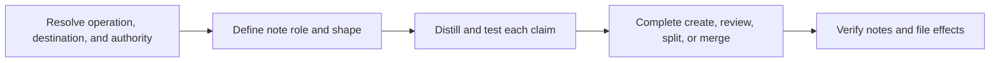

# PTLam Creating Atomic Notes

Turn an idea, source, or existing note into durable notes that each express one
reusable claim. This skill owns note meaning and connections. The user's
knowledge system owns storage, filenames, metadata, and link syntax.

## At a glance



| Operation | Result | Default file effect |
| --- | --- | --- |
| Create | One complete note per independent claim | Return Markdown drafts |
| Review | A verdict with evidence and corrections | Read-only |
| Split | Several self-contained notes with distinct link purposes | Return Markdown drafts |
| Merge | One complete note that preserves unique evidence and sources | Return a Markdown draft |

Change files only when the user explicitly requests it. Treat deletion,
archiving, redirects, and backlink rewrites as separate effects that need their
own authority.

## 1. Resolve the request and destination

Identify the requested operation, input, output, and note role. The input may be
an idea, source, quotation, highlight, rough capture, or existing note.

When the user supplies a vault, note directory, or target file, inspect the
nearby notes and configuration needed to learn its conventions. Follow verified
local rules for filenames, frontmatter, headings, tags, links, and citations.
Keep authority over each destination and related file effect explicit.

Ask only when a missing choice would materially change the knowledge captured
or its destination. Otherwise, make reversible presentation choices and
continue. Return Markdown in the response unless the user requested file
changes. If a requested file has no naming convention, derive a short,
lowercase, hyphenated slug from the claim and use `.md`; do not invent a folder
taxonomy or metadata schema.

Complete this step when the operation, input, output, destination, local
conventions, and file authority are known.

## 2. Define the note contract

An atomic note develops exactly one independently addressable idea. Length is a
diagnostic, not the definition.

Use the note's role to decide how durable and self-contained it should be:

| Role | Purpose | Treatment |
| --- | --- | --- |
| Fleeting capture | Preserve a thought before it disappears | Keep visibly provisional; process or discard later. |
| Literature note | Record what a source contributes | Paraphrase faithfully and retain source context. |
| Permanent note | Add one reusable idea to the knowledge network | Make it atomic, self-contained, and meaningfully connected. |

Unless the user requests another role, treat an atomic-note request as a draft
permanent note. “Permanent” means designed for durable use, not frozen forever.

When no verified local shape exists, use this portable fallback:

```markdown
# <Declarative claim or precise concept>

> <One-sentence canonical claim.>

<Enough explanation, mechanism, evidence, or boundary to make the claim
self-contained.>

## Suggested connections

- <Note title> — <why this relationship matters>.

## Source

- <Source or attribution, when one exists.>
```

Omit empty sections. Keep connection suggestions as plain titles until both the
target note and local link syntax are verified. Then use `Connections` and the
verified local syntax.

Complete this step when the role, atomicity standard, and output shape are
explicit.

## 3. Distill each claim

Apply three tests to every proposed note:

1. **Title test:** Can one sharp declarative title or precise concept name the
   note?
2. **Completeness test:** Would removing any remaining passage make the idea
   incomplete, and is any required context still missing?
3. **Independent-link test:** Would readers reasonably link to two parts for
   different reasons? If so, those parts probably belong in separate notes.

A title containing `and` or `with` is a warning, not proof of two ideas. One
relational claim can legitimately name two concepts. Split when two claims can
stand alone and develop different connection profiles. Keep a coherent idea
together when splitting would only make it shorter. Merge only when notes state
the same claim or maintain redundant connections; topic overlap is not enough.

### Write for future understanding

1. Separate the user's idea from source wording, examples, supporting evidence,
   and adjacent claims.
2. Preserve attribution and citations separately from the paraphrased claim.
   Express the idea in language the user understands. Distinguish the source's
   position, the user's interpretation, and established fact when that
   distinction changes the meaning.
3. State the idea as one sharp declarative title or precise concept.
4. Apply all three tests. If the input contains several claims, produce separate
   drafts when plural notes are authorized; otherwise present the proposed
   titles before changing files.
5. Add enough mechanism, implication, evidence, or boundary for the note to make
   sense without the conversation or source. Remove material that belongs to
   another claim.

Use a deliberate quotation only when its exact wording matters. Mark and
attribute it, retain its source, and explain the idea in fresh words as well.

### Use titles that expose the claim

Prefer titles such as:

- `Spaced retrieval strengthens long-term recall by interrupting forgetting`
- `Annotated links preserve why two notes are connected`

Avoid topic buckets and vague process labels such as:

- `Spaced repetition`
- `Thoughts about links`
- `Notes from the book`

The title should let another note link to this claim with clear intent.

### Connect notes with meaning

Search the available note collection before claiming that a target exists. Add
links only to verified notes, use the verified local syntax, and state why every
relationship matters. For example:

```markdown
- <verified local link to "Retrieval practice strengthens recall"> — supplies
  the active-recall mechanism used by this scheduling strategy.
```

When no collection is available, use `Suggested connections`, keep targets as
plain titles, and do not imply that they are real files. Aim to give each
permanent note at least one meaningful connection. If none can be verified,
offer one or two annotated suggestions. An honest orphan draft remains valid;
do not invent a target to satisfy a quota.

Use an analogy, diagram, category hierarchy, or fixed length only when it
clarifies the idea or follows the user's established system. Prefer synthesized
knowledge over copied highlights, broad topic buckets, bare links, premature
fragments, or metadata work that replaces thinking about the idea.

Complete this step when every proposed note passes the three tests, makes its
source status clear, stands alone, and distinguishes verified links from
annotated suggestions.

## 4. Complete the selected operation

### Create

Produce one complete note per independent claim. Keep a source summary distinct
from the user's permanent claim when that distinction matters. If the user asks
to save the result, resolve the exact path before writing.

Complete creation when each authorized claim has one self-contained draft or
saved note and every requested file effect is reported.

### Review

Evaluate the note against the final criteria below. Lead with the verdict, give
evidence for every failed criterion, and propose the smallest useful
correction. Rewrite or change the note only when the user requests it.

Complete review when the verdict, evidence, and corrections account for every
criterion.

### Split

Give each resulting claim enough context to remain self-contained. Preserve
sources and distribute existing links by their actual relationship. Update
backlinks only when the user authorized the file changes and the targets are
known.

Complete splitting when every claim, citation, and connection has an explicit
destination and each result is independently useful.

### Merge

Keep the sharper title, unique evidence, source attribution, and distinct link
context. Keep separate notes that merely share a topic.

Return a merged draft unless the user requested file changes. Resolve the
destination before writing and preserve every source note by default. Delete,
archive, redirect, or rewrite backlinks only with separate authority and known
targets.

Complete merging when the merged note is complete and every destination,
source-note disposition, and backlink effect is unambiguous and authorized.

## 5. Verify and hand off

Confirm that every produced or revised note:

- has a title that identifies one claim or precise concept;
- contains everything needed for that idea and no adjacent idea;
- paraphrases source wording unless a deliberate quotation is marked and
  attributed;
- makes sense without the original chat or source;
- explains why every included link matters and follows verified local syntax;
- distinguishes suggestions from verified existing notes;
- preserves local storage and metadata conventions; and
- accounts for every authorized file effect.

For a review, name each failed criterion instead of claiming the note passes.
For changed files, report what changed, where, how it was checked, and what
remains unresolved.

Complete the task when the output passes these criteria or the review identifies
each failure with evidence and a correction.
